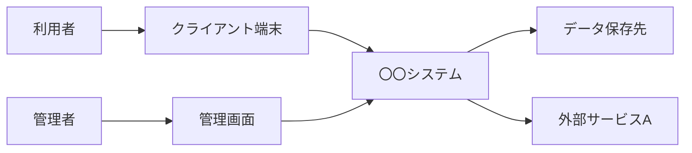

【template-guidance】 
文書区分: 必須 
使う場面: 〇〇システムの全体像、主要構成要素、外部連携、基本処理の流れを定義するときに使う。 
削除条件: システム構成自体を別文書へ完全統合する場合のみ削除する。最終成果物ではこのガイダンスブロックを削除する。 
章構成: 
- 【必須】 1. 文書の目的
- 【必須】 2. 前提
- 【必須】 3. システム概要
- 【必須】 4. システム全体構成
- 【必須】 5. サブシステム構成
- 【必須】 6. 基本処理フロー
- 【任意】 7. 設計上の留意事項

【/template-guidance】 

# システム概要

## 1. 文書の目的
【template-guidance】 
必須: この文書で何を定義し、誰が何の判断に使うかを書く。 
任意: 上位文書名、文書番号、参照関係がある場合は書く。 
書かない: 作成経緯、差分説明、会話ログ。 
【/template-guidance】 

本書は、〇〇システムの全体像を定義し、利用者、主要構成要素、外部連携、基本的な処理の流れを明確にすることを目的とする。

## 2. 前提
【template-guidance】 
必須: システム方式、利用環境、主要技術や運用前提を書く。 
任意: 配置先やネットワーク制約がある場合のみ書く。 
書かない: 未確定案を並列に並べること。 
【/template-guidance】 

- 〇〇システムはWebシステムとして提供する。
- 利用者はクライアント端末からネットワーク経由でアクセスする。
- 外部サービスAとデータ連携を行う。

## 3. システム概要
【template-guidance】 
必須: システムの目的、主利用者、主な価値、主処理を書く。 
任意: 利用形態の表や箇条書きを追加してよい。 
書かない: 詳細な画面操作手順。 
【/template-guidance】 

本システムは、利用者が必要情報を登録、参照、管理できるようにするための〇〇システムである。登録された情報はシステム内部で処理され、必要に応じて外部サービスAと連携したうえで保存および参照に利用される。

## 4. システム全体構成
【template-guidance】 
必須: 利用者、クライアント、サーバ、データ保存先、外部サービスの関係を図示する。 
任意: 管理者や管理画面を分けて記載してよい。 
書かない: 実装クラス名やライブラリ名。 
【/template-guidance】 

## 5. サブシステム構成
【template-guidance】 
必須: サブシステム名、役割、主利用者または主責務を整理する。 
任意: 表を複数に分けてよい。 
書かない: テーブル定義やAPI詳細。 
【/template-guidance】 

| サブシステム | 役割 | 主な利用者または責務 |
| --- | --- | --- |
| 利用者向け機能 | 主要な登録、参照、操作を提供する | 利用者 |
| 管理機能 | 管理者向けの保守、設定、監視を行う | 管理者 |
| 外部連携機能 | 外部サービスAとの通信、データ変換を行う | システム内部 |
| データ管理機能 | 登録情報、履歴、設定を保持する | システム内部 |

## 6. 基本処理フロー
【template-guidance】 
必須: 代表的な業務シナリオ1つを選び、処理の流れを段階で示す。 
任意: 複数フローがある場合は代表例に絞り、詳細は業務設計へ委ねる。 
書かない: 全例外をここへ詰め込むこと。 
【/template-guidance】 

1. 利用者が必要情報を入力または参照要求する。
2. 〇〇システムが入力内容を受け付け、必要な業務処理を実行する。
3. 必要に応じて外部サービスAと連携する。
4. 処理結果をデータ保存先へ反映し、利用者へ応答する。

## 7. 設計上の留意事項
【template-guidance】 
必須: この文書全体に関わる制約や重要方針を書く。 
任意: 性能や運用上の補足を簡潔に書いてよい。 
書かない: 実装手順、試験項目。 
【/template-guidance】 

- 詳細な業務手順は業務設計で定義する。
- 詳細な入出力仕様は外部インターフェース設計で定義する。
