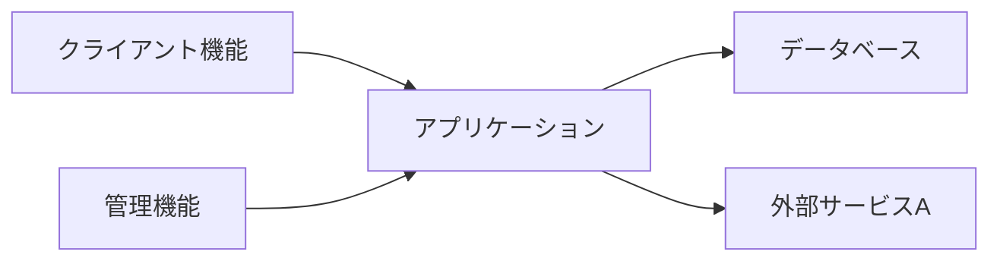

【template-guidance】 
文書区分: 必須 
使う場面: OS、実行基盤、アプリケーション、ミドルウェア、外部サービスを含むソフトウェア構成を定義するときに使う。 
削除条件: ソフトウェア構成を別文書へ完全統合する場合のみ削除する。最終成果物ではこのガイダンスブロックを削除する。 
章構成: 
- 【必須】 1. 文書の目的
- 【必須】 2. 前提
- 【必須】 3. ソフトウェア全体構成
- 【必須】 4. ソフトウェア構成一覧
- 【必須】 5. 論理コンポーネント
- 【任意】 6. 留意事項

【/template-guidance】 

# ソフトウェア構成

## 1. 文書の目的
【template-guidance】 
必須: 主要ソフトウェア要素と役割、実行形態を定義する目的を書く。 
任意: 運用や保守判断に使う旨を書いてよい。 
書かない: ライブラリ単位の列挙。 
【/template-guidance】 

本書は、〇〇システムを構成する主要ソフトウェア要素、役割、実行形態を定義することを目的とする。

## 2. 前提
【template-guidance】 
必須: 実行方式、配備方式、外部サービス利用前提を書く。 
任意: 同一オリジン、認証方式など関連前提を書いてよい。 
書かない: 未決定候補の比較。 
【/template-guidance】 

- 〇〇システムはサーバ上で稼働する。
- 利用者向け機能と管理機能を提供する。
- 外部サービスAと連携する。

## 3. ソフトウェア全体構成
【template-guidance】 
必須: クライアント、アプリケーション、DB、外部サービスの関係を示す。 
任意: ビルド成果物や管理機能を分けて書いてよい。 
書かない: 実装クラスやモジュール名。 
【/template-guidance】 

## 4. ソフトウェア構成一覧
【template-guidance】 
必須: 区分、ソフトウェア要素、配置先、役割を書く。 
任意: 管理主体や更新方法を追加してよい。 
書かない: バージョン未確定の候補列挙。 
【/template-guidance】 

| 区分 | ソフトウェア要素 | 配置先 | 役割 |
| --- | --- | --- | --- |
| OS | 〇〇 | サーバ | 実行基盤 |
| アプリケーション | 〇〇 | サーバ | 業務処理、画面提供 |
| データベース | 〇〇 | サーバ | データ保持 |
| 外部サービス | 外部サービスA | 外部 | 外部連携 |

## 5. 論理コンポーネント
【template-guidance】 
必須: 主要コンポーネントと責務を書く。 
任意: 認証、連携、データ管理などへ分けてよい。 
書かない: 実装関数一覧。 
【/template-guidance】 

| コンポーネント | 主な責務 |
| --- | --- |
| 認証機能 | 利用者認証、権限制御 |
| 業務処理機能 | 登録、参照、更新、削除などの主要処理 |
| 外部連携機能 | 外部サービスAとの通信、結果整形 |
| データ管理機能 | 永続化、参照、整合性管理 |

## 6. 留意事項
【template-guidance】 
必須: 実行形態や構成上の制約を書く。 
任意: 配備時の前提や監視対象を簡潔に書いてよい。 
書かない: 詳細な運用手順。 
【/template-guidance】 

- 詳細な入出力仕様は外部インターフェース設計で定義する。
- 詳細な容量や性能目標は非機能設計で定義する。
