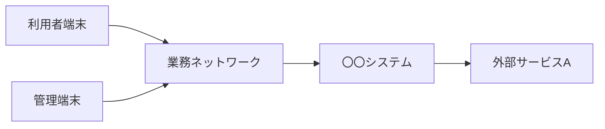

【template-guidance】 
文書区分: 必須 
使う場面: 利用者端末、サーバ、外部サービス間の通信経路、境界、ポート方針を定義するときに使う。 
削除条件: ネットワーク構成を別文書へ完全統合する場合のみ削除する。最終成果物ではこのガイダンスブロックを削除する。 
章構成: 
- 【必須】 1. 文書の目的
- 【必須】 2. 前提
- 【必須】 3. ネットワーク構成図
- 【必須】 4. 通信一覧
- 【必須】 5. 利用ポート方針
- 【任意】 6. 留意事項

【/template-guidance】 

# ネットワーク構成

## 1. 文書の目的
【template-guidance】 
必須: 通信経路、接続範囲、境界、利用ポートを定義する目的を書く。 
任意: セキュリティ境界や接続制約を書く。 
書かない: 物理サーバの詳細スペック。 
【/template-guidance】 

本書は、〇〇システムのネットワーク構成、通信経路、利用ポート、接続上の制約を定義することを目的とする。

## 2. 前提
【template-guidance】 
必須: 利用ネットワーク、公開範囲、通信方式の前提を書く。 
任意: VPN、プロキシ、閉域網などがある場合は書く。 
書かない: 未決定の候補比較。 
【/template-guidance】 

- 利用者は定められたネットワーク経路からアクセスする。
- 外部サービスAとは外向き通信を行う。

## 3. ネットワーク構成図
【template-guidance】 
必須: 端末、ネットワーク境界、システム、外部サービスの関係を図示する。 
任意: サブネットやセグメントが必要なら追記する。 
書かない: 画面遷移や業務手順。 
【/template-guidance】 

## 4. 通信一覧
【template-guidance】 
必須: 通信元、通信先、方式、用途を書く。 
任意: 暗号化有無、方向、接続条件を書いてよい。 
書かない: 実装APIの詳細本文。 
【/template-guidance】 

| 通信区分 | 通信元 | 通信先 | プロトコル | 用途 |
| --- | --- | --- | --- | --- |
| 利用者画面通信 | 利用者端末 | 〇〇システム | 〇〇 | 画面表示、操作 |
| 管理通信 | 管理端末 | 〇〇システム | 〇〇 | 管理操作 |
| 外部連携通信 | 〇〇システム | 外部サービスA | 〇〇 | 外部データ連携 |

## 5. 利用ポート方針
【template-guidance】 
必須: 主要な接続先ごとのポート方針を書く。 
任意: 内部専用、外部公開の区別を書いてよい。 
書かない: OSの細かなネットワーク設定手順。 
【/template-guidance】 

| 接続先 | ポート | 備考 |
| --- | --- | --- |
| 〇〇システム | 〇〇 | 利用者向け接続 |
| データベース | 〇〇 | システム内部接続 |
| 外部サービスA | 〇〇 | 外向き接続 |

## 6. 留意事項
【template-guidance】 
必須: 公開範囲、通信制約、障害時影響などを書く。 
任意: セキュリティ上の前提を簡潔に追記してよい。 
書かない: 詳細なFW設定コマンド。 
【/template-guidance】 

- 公開範囲と接続許可条件を明確にする。
- 外部サービスAとの通信断時の影響は非機能設計でも扱う。
