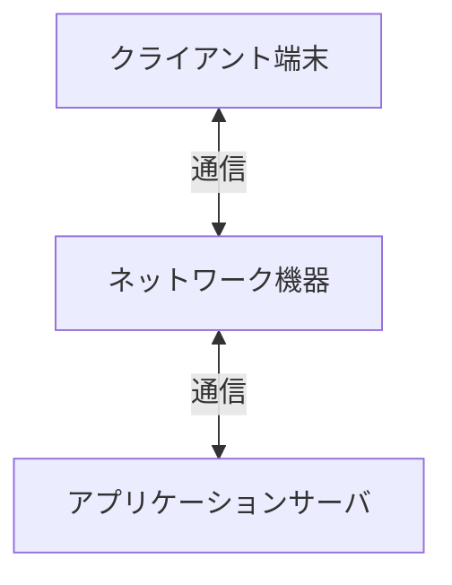

【template-guidance】 
文書区分: 必須 
使う場面: 端末、サーバ、ネットワーク機器などの物理構成や台数、容量前提を定義するときに使う。 
削除条件: ハードウェア構成を別文書へ完全統合する場合のみ削除する。最終成果物ではこのガイダンスブロックを削除する。 
章構成: 
- 【必須】 1. 文書の目的
- 【必須】 2. 前提
- 【必須】 3. 構成概要
- 【必須】 4. ハードウェア構成一覧
- 【必須】 5. 容量見積もり前提
- 【任意】 6. 留意事項

【/template-guidance】 

# ハードウェア構成

## 1. 文書の目的
【template-guidance】 
必須: 物理構成、台数、想定スペック、容量前提を定義する目的を書く。 
任意: 調達や運用判断への利用目的を加えてよい。 
書かない: 製品選定の議論履歴。 
【/template-guidance】 

本書は、〇〇システムに必要なハードウェア構成、想定スペック、容量前提を定義することを目的とする。

## 2. 前提
【template-guidance】 
必須: 利用者数、データ量、保持期間など容量見積もりの前提を書く。 
任意: 冗長化や設置場所の制約があれば書く。 
書かない: 未決定の数値候補を列挙すること。 
【/template-guidance】 

- 利用者数は〇名を想定する。
- データ保持期間は〇年を想定する。
- 主要処理はサーバ側で実行する。

## 3. 構成概要
【template-guidance】 
必須: 端末、ネットワーク機器、サーバの接続関係を示す。 
任意: 拠点やセグメントが複数ある場合は分けて書く。 
書かない: ソフトウェア構成の説明。 
【/template-guidance】 

## 4. ハードウェア構成一覧
【template-guidance】 
必須: 機器区分、台数、想定仕様、用途を書く。 
任意: 設置場所や冗長化有無を列へ追加してよい。 
書かない: ソフトウェア製品名。 
【/template-guidance】 

| 機器区分 | 台数 | 想定仕様 | 用途 |
| --- | --- | --- | --- |
| クライアント端末 | 〇台以上 | 〇〇 | 利用者操作 |
| アプリケーションサーバ | 〇台 | 〇〇 | 業務処理、データ管理 |
| ネットワーク機器 | 〇台 | 〇〇 | 通信制御 |

## 5. 容量見積もり前提
【template-guidance】 
必須: 主要な容量見積もりの前提値を書く。 
任意: 算出式やピーク値を追加してよい。 
書かない: 詳細な試験結果。 
【/template-guidance】 

| 項目 | 前提値 |
| --- | --- |
| 利用者数 | 〇 |
| 1日あたり処理件数 | 〇 |
| 年間データ量 | 〇 |
| 保持期間 | 〇 |

## 6. 留意事項
【template-guidance】 
必須: 単一障害点、容量監視、運用制約などを書く。 
任意: 冗長化方針や拡張方針を簡潔に書いてよい。 
書かない: 実装ロジック。 
【/template-guidance】 

- 容量逼迫の監視対象を明確にする。
- 冗長化を行わない場合は、その前提を明記する。
