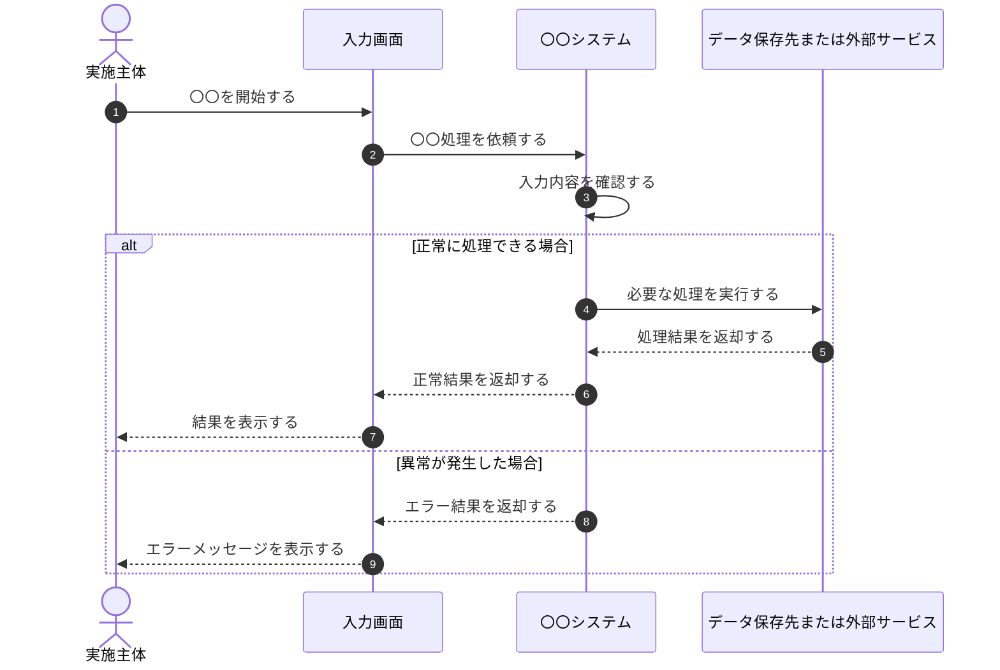

【template-guidance】 
文書区分: 汎用ひな型 
使う場面: 個別業務の手順と例外を具体的に定義するときに、具体名へ複製して使う。業務フロー概要は原則 `sequenceDiagram` で記述する。 
削除条件: assets 上にのみ保持し、最終成果物へは具体名へ複製したものだけを残す。最終成果物ではこのガイダンスブロックを削除する。 
章構成: 
- 【必須】 1. 文書の目的
- 【必須】 2. 前提
- 【必須】 3. 業務フロー概要
- 【必須】 4. 手順詳細
- 【必須】 5. 例外処理

【/template-guidance】 

# 〇〇フロー

## 1. 文書の目的
【template-guidance】 
必須: 対象業務の手順と判断分岐を定義する目的を書く。 
任意: 関連する業務IDや機能IDを書いてよい。 
書かない: 実装方式やAPIの詳細。 
【/template-guidance】 

本書は、〇〇業務の処理手順と例外を定義することを目的とする。

## 2. 前提
【template-guidance】 
必須: 認証、入力済み情報、権限などの前提を書く。 
任意: 外部サービスや他システム前提を書いてよい。 
書かない: 未決定候補の比較。 
【/template-guidance】 

- 実施主体は必要な権限を持つ。

## 3. 業務フロー概要
【template-guidance】 
必須: 原則 `sequenceDiagram` で主体間の時系列を図示し、図の先頭に `autonumber` を入れる。`actor` と `participant` を明示し、参加者は利用者または管理者、画面、アプリ、DB、外部サービスなどの責務単位で分ける。やり取り、内部処理、分岐は `->>`、自己メッセージ、`alt` / `else`、必要に応じて `Note` で表す。図の参加者名、メッセージ、分岐条件は `4. 手順詳細` と `5. 例外処理` の語彙に合わせる。 
任意: 1図で視点が混ざる場合のみ `3.1` `3.2` のように節を分けて複数のシーケンス図を書く。時系列の主体間やり取りとして表せない場合に限り `flowchart` を使ってよい。ラベル改行には ` ` を使う。 
書かない: 全データ項目の説明、画面遷移図やサイトマップのような図、`\n` を使った改行。 
【/template-guidance】 

## 4. 手順詳細
【template-guidance】 
必須: 手順番号、実施主体、内容を書く。`3. 業務フロー概要` の参加者名、メッセージ、分岐条件と整合する語彙で記述する。 
任意: 入力、出力、利用画面を列追加してよい。 
書かない: 画面レイアウト詳細。 
【/template-guidance】 

| 手順 | 実施主体 | 内容 |
| --- | --- | --- |
| 1 | 実施主体 | 〇〇を行う |
| 2 | 〇〇システム | 〇〇を処理する |

## 5. 例外処理
【template-guidance】 
必須: 代表的な異常系と業務上の扱いを書く。 
任意: 回復方法や再実行条件を追記してよい。 
書かない: ログ出力レベルの詳細。 
【/template-guidance】 

| 事象 | 業務上の扱い |
| --- | --- |
| 入力不備 | 再入力を求める |
| 外部連携失敗 | 失敗通知を行い処理を終了する |
