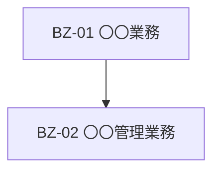

【template-guidance】 
文書区分: 必須 
使う場面: 利用者業務や管理業務を一覧化し、主体、開始契機、終了条件を整理するときに使う。 
削除条件: 業務設計を別文書へ完全統合する場合のみ削除する。最終成果物ではこのガイダンスブロックを削除する。 
章構成: 
- 【必須】 1. 文書の目的
- 【必須】 2. 前提
- 【必須】 3. 業務一覧
- 【必須】 4. 業務関連図
- 【任意】 5. 共通ルール

【/template-guidance】 

# 業務一覧

## 1. 文書の目的
【template-guidance】 
必須: 業務の全体像と業務単位を整理する目的を書く。 
任意: 後続の業務フローや機能設計との対応を書いてよい。 
書かない: 個別画面の詳細操作。 
【/template-guidance】 

本書は、〇〇システムで取り扱う業務を一覧化し、主体、開始契機、終了条件を明確にすることを目的とする。

## 2. 前提
【template-guidance】 
必須: 業務実施の前提条件を書く。 
任意: 認証済みや権限前提などを書いてよい。 
書かない: 未確定案の列挙。 
【/template-guidance】 

- 利用者および管理者は所定の権限を持つ。

## 3. 業務一覧
【template-guidance】 
必須: 業務ID、業務名、主体、開始契機、終了条件を整理する。 
任意: 関連画面や関連機能を列追加してよい。 
書かない: 業務フロー本文。 
【/template-guidance】 

| 業務ID | 業務名 | 実施主体 | 開始契機 | 終了条件 |
| --- | --- | --- | --- | --- |
| BZ-01 | 〇〇業務 | 利用者 | 〇〇 | 〇〇 |
| BZ-02 | 〇〇管理業務 | 管理者 | 〇〇 | 〇〇 |

## 4. 業務関連図
【template-guidance】 
必須: 業務同士の関係や流れのつながりを示す。 
任意: 分岐が多い場合は簡略化してよい。 
書かない: 例外処理の詳細。 
【/template-guidance】 

## 5. 共通ルール
【template-guidance】 
必須: 業務全体に共通する制約や前提を書く。 
任意: 権限制御や保存条件などを追記してよい。 
書かない: 画面部品レベルの説明。 
【/template-guidance】 

- 詳細手順は個別の業務フローで定義する。
