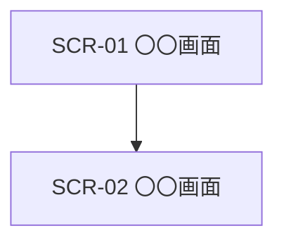

【template-guidance】 
文書区分: 必須 
使う場面: 画面ID、画面名、用途、遷移関係を整理するときに使う。 
削除条件: 画面設計を別文書へ完全統合する場合のみ削除する。最終成果物ではこのガイダンスブロックを削除する。 
章構成: 
- 【必須】 1. 文書の目的
- 【必須】 2. 前提
- 【必須】 3. 画面一覧
- 【必須】 4. 画面遷移図
- 【任意】 5. 共通方針

【/template-guidance】 

# 画面一覧

## 1. 文書の目的
【template-guidance】 
必須: 画面全体を一覧化し、遷移と個別画面設計の起点にする目的を書く。 
任意: 画面ID体系や対象利用者を補足してよい。 
書かない: 画面部品の詳細説明。 
【/template-guidance】 

本書は、〇〇システムで提供する画面を一覧化し、用途と遷移関係を明確にすることを目的とする。

## 2. 前提
【template-guidance】 
必須: 画面一覧の整理単位や命名規則を書く。 
任意: SPA、サーバレンダリングなど表示方式を書いてよい。 
書かない: 実装ライブラリ名。 
【/template-guidance】 

- 各画面は個別画面設計と対応付ける。

## 3. 画面一覧
【template-guidance】 
必須: 画面ID、画面名、利用者、目的、主な遷移元、主な遷移先を書く。 
任意: 備考列を追加してよい。 
書かない: API詳細。 
【/template-guidance】 

| 画面ID | 画面名 | 利用者 | 目的 | 主な遷移元 | 主な遷移先 |
| --- | --- | --- | --- | --- | --- |
| SCR-01 | 〇〇画面 | 利用者 | 〇〇を行う | 〇〇 | 〇〇 |

## 4. 画面遷移図
【template-guidance】 
必須: 主要画面の遷移関係を図示する。 
任意: 管理画面を別系統で示してよい。 
書かない: 条件分岐の細部を詰め込みすぎること。 
【/template-guidance】 

## 5. 共通方針
【template-guidance】 
必須: 認証前提、エラー表示、共通ナビゲーションなどを書く。 
任意: 表示端末前提やアクセシビリティ方針を追記してよい。 
書かない: CSSやUI実装詳細。 
【/template-guidance】 

- 画面ごとの詳細は個別画面設計で定義する。
