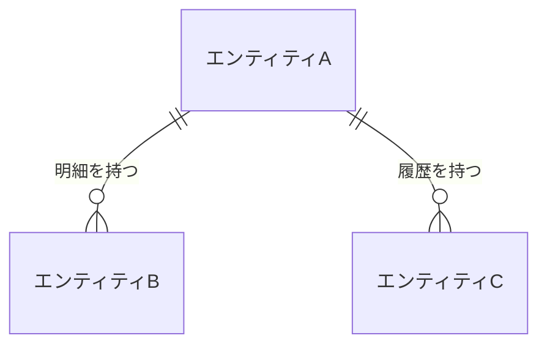

【template-guidance】 
文書区分: 必須 
使う場面: エンティティ、主要属性、主キー、関連、保持方針を定義するときに使う。 
削除条件: 論理データ設計を別文書へ完全統合する場合のみ削除する。最終成果物ではこのガイダンスブロックを削除する。 
章構成: 
- 【必須】 1. 文書の目的
- 【必須】 2. 前提
- 【必須】 3. エンティティ一覧
- 【必須】 4. ER図
- 【必須】 5. エンティティ定義
    - 【必須】 5.1. エンティティA
- 【必須】 6. 保持方針

【/template-guidance】 

# 論理データ設計

## 1. 文書の目的
【template-guidance】 
必須: データの論理構造と文書間の共通理解を定義する目的を書く。 
任意: 後続の物理設計や実装との関係を書いてよい。 
書かない: 物理DB固有のDDL。 
【/template-guidance】 

本書は、〇〇システムで扱う主要データの論理構造、関連、保持方針を定義することを目的とする。

## 2. 前提
【template-guidance】 
必須: 論理設計段階での粒度、命名、保持前提を書く。現行要件の業務、機能、画面、外部IF、非機能要件から利用目的を説明できるデータだけを設計対象にする前提を書く。 
任意: 1対多や一意性の大きな前提を書いてよい。 
書かない: 実装都合の一時項目。`将来使う可能性がある`、`あると便利`、`一般的には持つ` だけのデータを設計対象に含める前提。 
【/template-guidance】 

- データは業務上の意味単位で整理する。
- 現行要件で利用目的を説明できないデータは保持対象にしない。

## 3. エンティティ一覧

【template-guidance】 
必須: エンティティ名と概要を一覧表で整理する。エンティティ名は日本語の論理名で書く。各エンティティは、どの業務、機能、画面、外部IF、非機能要件で使うかを説明できるものだけにする。 
任意: 主要な業務上の役割や分類を補足してよい。 
書かない: 物理テーブル名や主キー列の一覧。現行要件で利用箇所を説明できない将来用エンティティ。 
【/template-guidance】 

| エンティティ | 概要 |
| --- | --- |
| エンティティA | 主要データ |
| エンティティB | 明細データ |
| エンティティC | 履歴データ |

## 4. ER図
【template-guidance】 
必須: 主要エンティティと関連を `erDiagram` で図示する。エンティティ名は日本語の論理名で書く。 
任意: 関連名や多重度を補足してよい。 
書かない: 全属性の詰め込み。 
【/template-guidance】 

## 5. エンティティ定義
【template-guidance】 
必須: 各エンティティの属性、意味、型、主キー、外部キー、必須を整理する。属性は現行要件の入力、表示、判定、検索、連携、保持、削除、監査、セキュリティで使うものに絞る。備考にはER図で表現できない制約や補足だけを書く。 
任意: 桁数や制約、補足事項は備考に書いてよい。 
書かない: インデックス戦略や物理制約名。利用目的が未確定の属性、将来拡張用の予備項目、用途を説明できないメタ情報。 
【/template-guidance】 

### 5.1. エンティティA

【template-guidance】 
必須: 属性名は日本語の論理名で書き、型は実装型ではなく `整数` `少数` `文字列` `日時` `真偽値` などの論理型で書く。状態値を持つ属性は `状態A / 状態B / 状態C` のように取り得る状態をすべて列挙する。備考にはER図で分かる関連ではなく、ER図だけでは分からない制約や補足を書く。各属性は現行要件上の利用目的を説明できるものだけにする。 
任意: 桁数や制約、補助説明は備考に書いてよい。 
書かない: `int` `float` `varchar` などの実装型。将来利用の可能性だけで追加する属性。 
【/template-guidance】 

| 属性名 | 説明 | 型 | 主キー | 外部キー | 必須 | 備考 |
| --- | --- | --- | --- | --- | --- | --- |
| エンティティAID | エンティティAを一意に識別するID | 整数 | 〇 |  | 〇 |  |
| 状態 | エンティティAの状態 | 状態A / 状態B / 状態C |  |  | 〇 |  |
| 作成日時 | 作成された日時 | 日時 |  |  | 〇 |  |
| 更新者ID | 更新を行った利用者のID | 整数 |  | 〇 |  | 桁数が決まっている場合はここに記載する |

## 6. 保持方針
【template-guidance】 
必須: 保存期間、削除条件、更新方針などを書く。保持するデータは、現行要件で保存が必要な理由を説明できるものに限定する。 
任意: アーカイブや集計更新の扱いを書いてよい。ただし、現行要件で必要性を説明できる場合に限る。 
書かない: バックアップ手順の詳細。将来分析、将来連携、念のための保持を理由にした保存方針。 
【/template-guidance】 

| 項目 | 方針 |
| --- | --- |
| 保存期間 | 〇〇 |
| 削除条件 | 〇〇 |
