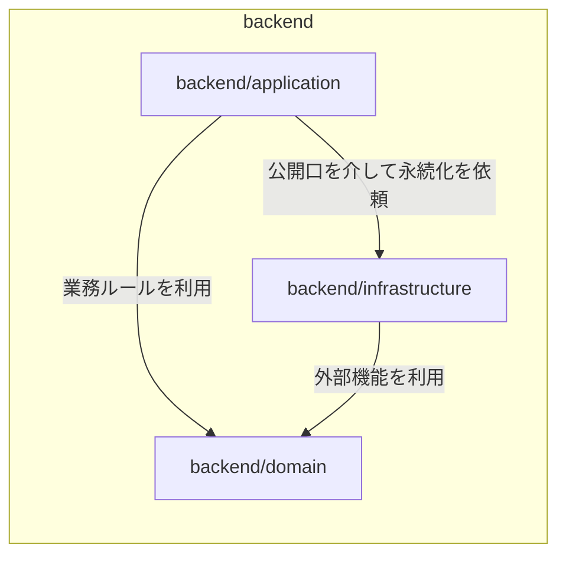
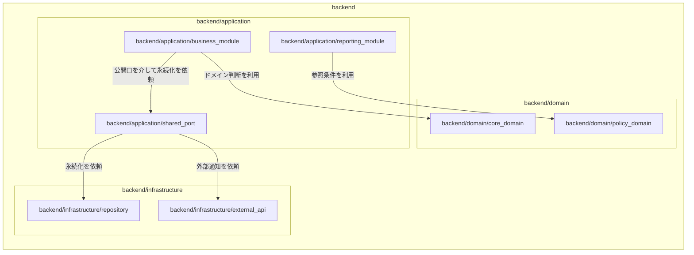
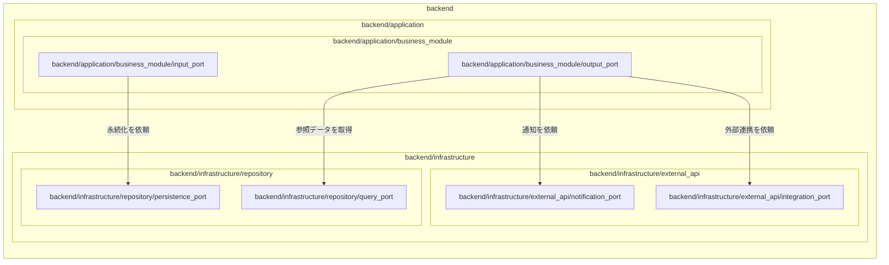

【template-guidance】 
- 文書区分: 必須
- 使う場面: すべての内部設計で、内部実装としての構成要素の責務分割と構成要素同士の関係を定義するとき
- 削除条件: 最終成果物へ仕上げる際に、このガイダンスブロックを削除する
- 章構成:
  - 【必須】 1. 文書の目的
  - 【必須】 2. 前提
  - 【必須】 3. 構成要素一覧
  - 【必須】 4. 構成要素関連図
  - 【任意】 5. 留意事項

【/template-guidance】 

# アーキテクチャ設計

## 1. 文書の目的
【template-guidance】 
- ここには、本書が内部実装として何を決める文書かを書く。
- 外部設計のソフトウェア構成やシステム構成の再掲にはしない。
- 必要なら対象機能群や対象サブシステムを補足してよい。
- 「どの構成要素をどう分け、どう関係付けるか」を定義する文書であることが読めるようにする。

【/template-guidance】 

本書は、〇〇システムの内部設計における構成要素の責務分割と、構成要素同士の関係を定義することを目的とする。

## 2. 前提
【template-guidance】 
- ここには、参照する要件定義書、外部設計書、ユーザ合意事項を書く。
- 採用前提の技術やランタイム構成は、内部実装判断に必要な範囲だけを最小限で補足する。
- 実装手順や環境構築手順は書かない。
- 本文で扱う構成要素は、最小構成要素を除く単位であることを必要に応じてここで補足してよい。

【/template-guidance】 

- 要件定義書: `docs/01_要件定義/...`
- 外部設計書: `docs/02_外部設計/...`
- 本書は外部設計で確定した利用者向け仕様を前提とし、内部実装として追加で必要な判断だけを扱う。

## 3. 構成要素一覧
【template-guidance】 
- ここでは、パッケージ、層、モジュール、サブモジュールなど、最小構成要素以外の階層構造を表にする。
- 構成要素名は `backend` `backend/application` `backend/application/business_module` のように、階層が読めるパス風表記で書く。
- 表は `構成要素` と `責務` の 2 列にし、`レベル` `親構成要素` `種類` などの補助列は作らない。
- 上位要素だけでなく、定義した全階層を表へ載せる。
- `第1階層関連図` `第2階層関連図` `第3階層関連図` に出る構成要素だけでなく、それらを構成する親階層や下位階層も一覧へ含める。
- この一覧は関連図群の元データとして扱い、関連図に出てくる構成要素名と一致させる。
- 表の並びも親子関係が追える順にし、親の直後にその配下要素を並べる。
- 外部設計のソフトウェア構成や機能一覧の転記にはせず、内部実装として追加で決める責務だけを書く。
- 副作用を持つ構成要素か、純粋ロジックを中心に持つ構成要素かが責務から読めるようにする。
- オブジェクト指向ならクラスはここへ含めない。

【/template-guidance】 

| 構成要素 | 責務 |
| --- | --- |
| `backend` | サーバ側機能全体を提供する |
| `backend/application` | 業務ユースケースの調停とトランザクション制御を担う |
| `backend/application/business_module` | 特定の業務領域に関する処理をまとめる |
| `backend/application/business_module/input_port` | 入力起点の受付口を提供する |
| `backend/application/business_module/output_port` | 出力起点の依頼口を提供する |
| `backend/application/reporting_module` | 参照系の業務処理をまとめる |
| `backend/application/shared_port` | application 配下の公開口を集約する |
| `backend/domain` | ドメイン判断と不変条件を管理する |
| `backend/domain/core_domain` | 中核となる業務ルールを提供する |
| `backend/domain/policy_domain` | 条件判定や方針判断を提供する |
| `backend/infrastructure` | DB、外部API、ファイル操作など副作用を伴う実装を担う |
| `backend/infrastructure/repository` | 永続化と参照データ取得を担う |
| `backend/infrastructure/repository/persistence_port` | 永続化の入口を提供する |
| `backend/infrastructure/repository/query_port` | 参照取得の入口を提供する |
| `backend/infrastructure/external_api` | 外部通知や外部連携を担う |
| `backend/infrastructure/external_api/notification_port` | 通知機能の入口を提供する |
| `backend/infrastructure/external_api/integration_port` | 外部連携機能の入口を提供する |

## 4. 構成要素関連図
【template-guidance】 
- ここでは、構成要素同士の関係だけを Mermaid で図示する。
- 図は `4.1. 第1階層関連図` `4.2. 第2階層関連図` `4.3. 第3階層関連図` のように、階層の深さごとに分ける。
- `第1階層関連図` は `backend/*` 相当、`第2階層関連図` は `backend/*/*` 相当、`第3階層関連図` は `backend/*/*/*` 相当の関係を書く。
- より深い階層が必要な場合は、同じ規則で `第4階層関連図` 以降を追加する。
- 各階層図では、その深さで見える関係性を省略せず示す。
- `第N階層関連図` では、対象階層に至るすべての親階層をルートから順に `subgraph` で含める。
- 親子関係や所属関係は矢印ではなく `subgraph` で表し、矢印は依存、呼び出し、公開口を介した利用、通知、実装提供などの関係だけに使う。
- すべての矢印に「どんな関係か」が分かるラベルを付ける。
- `subgraph` には明示 ID を付ける。
- 依存方向、公開口、契約境界、副作用境界が図から読めるようにする。
- テスト容易性を意識し、純粋ロジックと副作用の境界、差し替え境界が読み取れるようにする。
- 画面遷移図やシステム構成図にはしない。

【/template-guidance】 

### 4.1. 第1階層関連図
【template-guidance】 
- ここでは、最上位直下の構成要素どうし、つまり `backend/*` 相当の関係を書く。
- 最初にこの図を見れば、最上位の分割方針と主な依存方向が把握できるようにする。
- より深い階層の詳細関係は次の階層図へ委ねる。

【/template-guidance】 

### 4.2. 第2階層関連図
【template-guidance】 
- ここでは、`backend/*/*` 相当の構成要素どうしの関係を書く。
- 第1階層で登場した要素のうち、この階層深さにある要素を図示対象にする。
- この階層で見える公開口、契約境界、副作用境界、差し替え境界が読めるようにする。
- 第3階層以降の詳細へ踏み込みすぎず、この階層の関係に集中する。
- `backend` のような親階層はルートから順に `subgraph` で残し、その内側に第2階層の要素を置く。

【/template-guidance】 

### 4.3. 第3階層関連図
【template-guidance】 
- ここでは、`backend/*/*/*` 相当の構成要素どうしの関係を書く。
- 第2階層で登場した要素のさらに内側にある構成要素を対象にする。
- この階層で見える公開口、差し替え境界、副作用の担い手を省略せず書く。
- `backend` から対象階層直前までの親階層を、ルートから順に `subgraph` で残す。

【/template-guidance】 

## 5. 留意事項
【template-guidance】 
- ここには、採用しなかった分割案、制約上の注意、後続文書へ委ねる判断を書く。
- 検討メモや会話ログは書かず、完成済み文書として必要な注意だけを残す。

【/template-guidance】 

- 〇〇
