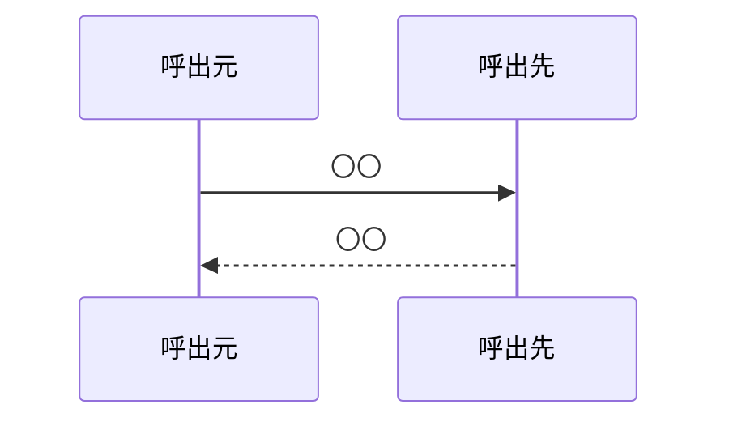

【template-guidance】 
- 文書区分: 汎用ひな型
- 使う場面: 個別の内部IF契約を定義するとき
- 削除条件: 具体名へ複製して採用する。`〇〇` を残したまま成果物へ置かない
- 章構成:
  - 【必須】 1. 文書の目的
  - 【必須】 2. 前提
  - 【必須】 3. IF概要
  - 【必須】 4. 呼出シーケンス
  - 【必須】 5. 事前条件 / 事後条件 / 不変条件
  - 【必須】 6. 入出力とデータ項目
  - 【必須】 7. 例外処理
  - 【任意】 8. 留意事項

【/template-guidance】 

# 〇〇IF

## 1. 文書の目的
【template-guidance】 
- 必須: どの内部境界の契約を定義する文書かを書く
- 任意: 対象とする呼出元 / 呼出先を補足する
- 書かない: 外部IF設計の再掲

【/template-guidance】 

本書は、〇〇と〇〇の間で利用する内部IFの契約を定義することを目的とする。

## 2. 前提
【template-guidance】 
- 必須: 同期 / 非同期、1 回の呼出単位、呼出主体を明記する
- 任意: 関連する外部設計書や処理設計書を補足する
- 書かない: 実装コードやフレームワーク設定

【/template-guidance】 

- 呼出方式: 〇〇
- 呼出主体: 〇〇

## 3. IF概要
【template-guidance】 
- 必須: IF の目的、呼出元、呼出先、主な責務を整理する
- 任意: 冪等性、再試行方針、相関ID の扱いを補足する
- 書かない: データ項目の詳細をここで重複記載すること

【/template-guidance】 

| 項目 | 内容 |
| --- | --- |
| IF名 | 〇〇 |
| 呼出元 | 〇〇 |
| 呼出先 | 〇〇 |
| 目的 | 〇〇 |

## 4. 呼出シーケンス
【template-guidance】 
- 必須: 呼出の前後関係、応答、失敗分岐を簡潔に示す
- 任意: Mermaid 図で補足する
- 書かない: 実装コード

【/template-guidance】 

## 5. 事前条件 / 事後条件 / 不変条件
【template-guidance】 
- 必須: 呼出時点の条件、成功時の保証、処理中に破ってはならない条件を書く
- 任意: 冪等性や整合条件を補足する
- 書かない: 例外時の応答詳細をここへ混ぜること

【/template-guidance】 

### 5.1. 事前条件

- 〇〇

### 5.2. 事後条件

- 〇〇

### 5.3. 不変条件

- 〇〇

## 6. 入出力とデータ項目
【template-guidance】 
- 必須: 主要な入力、出力、データ項目を定義する
- 任意: 型、必須可否、既定値、列挙値を補足する
- 書かない: 外部向け公開仕様の全文

【/template-guidance】 

### 6.1. 入力

| 項目 | 内容 |
| --- | --- |
| 〇〇 | 〇〇 |

### 6.2. 出力

| 項目 | 内容 |
| --- | --- |
| 〇〇 | 〇〇 |

## 7. 例外処理
【template-guidance】 
- 必須: 失敗条件、呼出元への返し方、再試行可否を書く
- 任意: タイムアウト、部分成功禁止、ロールバック方針を補足する
- 書かない: 契約条件との重複説明

【/template-guidance】 

| 条件 | 扱い |
| --- | --- |
| 〇〇 | 〇〇 |

## 8. 留意事項
【template-guidance】 
- 必須: なし
- 任意: 将来拡張、制約、他文書との整合上の注意を書く
- 書かない: 会話ログや検討経緯

【/template-guidance】 

- 〇〇
