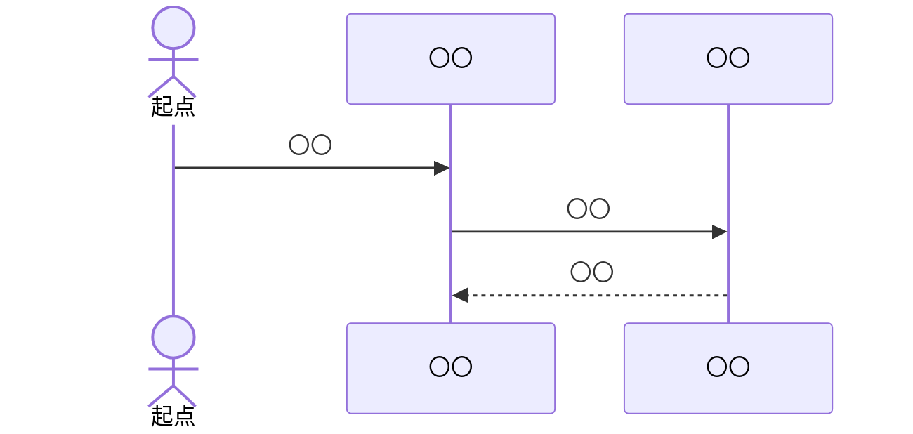

【template-guidance】 
- 文書区分: 汎用ひな型
- 使う場面: 個別処理の手順、副作用、例外、トランザクションを定義するとき
- 削除条件: 具体名へ複製して採用する。`〇〇` を残したまま成果物へ置かない
- 章構成:
  - 【必須】 1. 文書の目的
  - 【必須】 2. 前提
  - 【必須】 3. 処理概要
  - 【必須】 4. 関連要素
  - 【必須】 5. 処理シーケンス
  - 【必須】 6. 事前条件 / 事後条件 / 不変条件
  - 【必須】 7. 副作用
  - 【必須】 8. 例外処理
  - 【必須】 9. ログ出力
  - 【必須】 10. トランザクション

【/template-guidance】 

# 〇〇処理設計

## 1. 文書の目的
【template-guidance】 
- 必須: どの処理の内部手順を定義する文書かを書く
- 任意: 関連する機能ID、画面ID、IF名を補足する
- 書かない: 画面仕様や外部IF仕様の再掲

【/template-guidance】 

本書は、〇〇処理の内部手順、副作用、例外、トランザクション境界を定義することを目的とする。

## 2. 前提
【template-guidance】 
- 必須: 呼出契機、対象利用者、関連文書を明記する
- 任意: 先行処理や後続処理を補足する
- 書かない: 実装コード

【/template-guidance】 

- 呼出契機: 〇〇
- 関連文書: `〇〇`

## 3. 処理概要
【template-guidance】 
- 必須: この処理が達成する結果を簡潔に書く
- 任意: 処理の開始点と終了点を補足する
- 書かない: 詳細手順の重複

【/template-guidance】 

- 〇〇

## 4. 関連要素
【template-guidance】 
- 必須: 関連する主要モジュール、クラス、内部IF、データを整理する
- 任意: 呼出順序上の依存を補足する
- 書かない: 全クラス一覧の再掲

【/template-guidance】 

| 要素 | 役割 |
| --- | --- |
| 〇〇 | 〇〇 |

## 5. 処理シーケンス
【template-guidance】 
- 必須: 成功系と主要失敗分岐を含めて処理順序を書く
- 任意: Mermaid 図や手順表で補足する
- 書かない: 画面遷移だけの説明

【/template-guidance】 

## 6. 事前条件 / 事後条件 / 不変条件
【template-guidance】 
- 必須: 処理開始条件、成功時の保証、処理中に破ってはならない条件を書く
- 任意: 0 件時、部分成功禁止、再試行境界を補足する
- 書かない: 個別クラスの公開責務をここへ書きすぎること

【/template-guidance】 

### 6.1. 事前条件

- 〇〇

### 6.2. 事後条件

- 〇〇

### 6.3. 不変条件

- 〇〇

## 7. 副作用
【template-guidance】 
- 必須: DB 書込、外部API 呼出、ファイル操作、通知、時刻取得などの副作用を列挙する
- 任意: 副作用を隔離する境界を補足する
- 書かない: 副作用のない純粋ロジックだけの説明

【/template-guidance】 

| 副作用 | 発生箇所 | 補足 |
| --- | --- | --- |
| 〇〇 | 〇〇 | 〇〇 |

## 8. 例外処理
【template-guidance】 
- 必須: 想定する異常条件、戻り方、再試行可否、ロールバック可否を書く
- 任意: 監視対象や警告条件を補足する
- 書かない: 契約条件との重複説明

【/template-guidance】 

| 条件 | 扱い |
| --- | --- |
| 〇〇 | 〇〇 |

## 9. ログ出力
【template-guidance】 
- 必須: どの段階で何を記録するかを書く
- 任意: 相関ID、監査項目、個人情報マスキングを補足する
- 書かない: ログ設計書の全文再掲

【/template-guidance】 

| タイミング | ログ内容 |
| --- | --- |
| 〇〇 | 〇〇 |

## 10. トランザクション
【template-guidance】 
- 必須: トランザクション開始点、終了点、ロールバック条件を書く
- 任意: 分散トランザクション非採用理由や冪等性を補足する
- 書かない: DB 設定値の詳細

【/template-guidance】 

| 項目 | 内容 |
| --- | --- |
| 開始点 | 〇〇 |
| 終了点 | 〇〇 |
| ロールバック条件 | 〇〇 |
