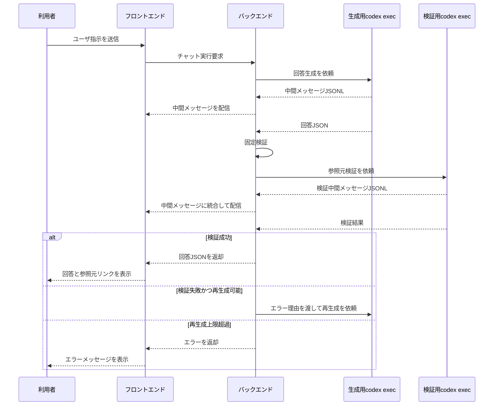

# 回答検証と実行制御・エラー処理

## 目的

本メモは、内部設計で具体化する回答検証、再生成制御、JSONLイベント処理、トレースログ保存候補を整理する。

利用者向け状態、画面表示、ログの正本は外部設計を参照し、本メモでは実装判断に必要な詳細だけを扱う。

## 検証シーケンス



## 固定検証

固定検証では、少なくとも次を確認する。

- JSONとしてパースできること。
- `codex.output_schema` が指すJSON Schemaに適合していること。
- 回答本文が空でないこと。
- 参照元配列の構造が、指定スキーマに定義された必須項目を満たしていること。
- `source_type` が指定スキーマの `const` に一致していること。
- PDFページ番号や行番号などの数値範囲が不正でないこと。
- ファイルパスが許可された範囲内を指していること。
- HTML表示データに危険なタグや属性が含まれていないこと。

固定検証エラーの例:

```json
{
  "error_type": "schema_validation_error",
  "message": "source_type は 'pdf' である必要があります。",
  "path": "$.answers[0].references[1].source_type"
}
```

この場合、バックエンドは生成用codex execへ次のような修正依頼を送る。

```text
前回の回答JSONは検証に失敗しました。
理由: source_type は 'pdf' である必要があります。
codex.output_schema で指定されたスキーマに適合するJSONを再出力してください。
```

## 検証用codex execによる参照元検証

検証用codex execは、回答を改善するのではなく、回答JSONの参照元が妥当かを判定するために使う。

検証用resumeでは過去の検証や再生成の文脈が残る可能性があるため、検証指示では今回渡した回答候補と参照元情報を検証対象の正とする。過去の判定内容は、今回の参照元妥当性を判断する根拠にはしない。

検証観点:

- 回答本文の主張が、提示された参照元に実際に記載されているか。
- 参照元ページや参照元範囲がずれていないか。
- 回答の一部に参照元が不足していないか。
- 参照元の抜粋が、回答内容と矛盾していないか。
- 複数の参照元を組み合わせた推論が過剰でないか。

検証用codex execの出力は、検証結果JSONとして受け取る。検証結果JSONは処理中の一時出力として扱い、永続化対象にしない。検証成功時は回答の採用へ進み、検証失敗時は再生成指示またはエラー状態確定に使う。

検証成功の例:

```json
{
  "valid": true,
  "comment": ""
}
```

検証失敗の例:

```json
{
  "valid": false,
  "comment": "回答では優先順位付けについて述べているが、参照元であるPDF p.42-45には該当する記述が確認できません。"
}
```

検証失敗時、バックエンドは検証結果JSONの `comment` を生成用codex execへ渡し、回答JSONの修正を依頼する。上限超過時は、検証失敗理由や `comment` をトレースログへ記録する。

## 再生成制御

再生成の流れ:

1. 初回生成を行う。
2. 固定検証または参照元検証で失敗する。
3. エラー理由を生成用codex execへ渡す。
4. 同一セッションに修正依頼を送り、回答JSONを再生成させる。
5. 再度、固定検証と参照元検証を行う。
6. 設定上限まで失敗した場合、回答表示を中止する。

再生成上限の判定は処理中カウンタで行う。DBの論理データとして再生成回数は保持しない。

## トレースログ保存候補

トレースログへ保存する候補:

- 実行ID
- チャットID
- 利用者ID
- 発生段階
- エラー分類
- 例外種別
- スタックトレース
- codex exec終了状態
- Runner種別
- OS名
- プロセス終了結果
- 再生成回数
- 検証失敗理由
- 検証用codex execの `valid=false` の `comment`
- キャンセル状態
- タイムアウト状態

保存しない、またはマスクする情報:

- APIキー
- 環境変数全文
- 絶対パス
- 秘密情報
- 不要な内部ディレクトリ
- Codexの生JSONL全文
- 巨大な回答全文
- 個人情報や業務上の機密情報を含む可能性がある全文データ

マスキング実装、ログローテーション、ファイル分割単位は後続設計で決める。

## JSONLイベントの扱い

バックエンドは、`codex exec --json --output-schema <schema>` が標準出力へ出すJSONLを逐次読み取る。

技術検証では、`--output-schema` 指定時の最終回答JSONは、`item.completed` の `agent_message.text` に文字列化されたJSONとして出力された。`--output-last-message` を併用した場合は、同じ最終メッセージが指定ファイルにも保存された。

最終回答の抽出ルールは次の通りとする。

- `turn.completed` までに受信した `item.completed` のうち、`item.type` が `agent_message` の最後のものを最終回答候補とする。
- `--output-last-message` を併用する場合は、指定ファイルの内容も最終回答候補として読み取り、標準出力JSONLから得た最後の `agent_message.text` と整合することを確認する。
- 最終回答候補はJSONとしてパースし、`codex.output_schema` が指すJSON Schemaで固定検証する。
- `turn.failed` またはプロセス異常終了の場合、受信済みの `agent_message` は最終回答として採用しない。

`--output-schema` 指定時は、途中の `agent_message` も同じスキーマ形のJSONになることがある。プロンプトや `AGENTS.md` で途中メッセージの内容を指示すると、スキーマ内の表示本文には自然文の中間メッセージを出させることができた。ただし、JSONL上は最終回答と同じ `agent_message.text` として流れるため、最後のエージェントメッセージと区別する必要がある。

画面に表示する中間メッセージは、次の方針で作る。

- `turn.started`、`item.started`、`item.completed`、`turn.completed` などのイベント種別を、バックエンド側の処理段階に対応する定型メッセージへ変換する。
- `command_execution` のコマンド文字列、標準出力、絶対パスは、そのまま利用者画面へ表示しない。
- `agent_message` は一時保持し、後続イベントが到着して最終回答ではないことが分かった過去分だけを中間メッセージ候補にする。
- 中間メッセージ候補が回答スキーマに適合し、表示本文に相当する項目を持つ場合は、その本文だけを抽出して画面表示に使える。
- `turn.completed` 時点で保持している最後の `agent_message` は最終回答候補として扱い、中間メッセージとしては表示しない。
- 回答スキーマから安全に表示本文を抽出できない場合は、Codexが出した本文ではなく定型メッセージを使う。
- `type` が `error` のJSONLイベントは、利用者向けには再接続中、回答生成失敗などの定型メッセージへ変換する。

データベースには、画面表示に採用した整形・マスク済みの中間メッセージ本文だけを保存する。標準出力の各行、表示対象外の通知、内部パス、コマンド出力は中間メッセージとして保存しない。

中間メッセージの例:

- `検索キーワードを整理します。`
- `関連資料を検索します。`
- `候補ページの本文を確認します。`
- `回答と参照元の対応を検証します。`
- `検証結果をもとに回答を修正します。`

## メッセージ判定アルゴリズム

`agent_message` は、受信時点では中間メッセージか最終回答かを確定しない。バックエンドは未分類の `agent_message` を1件だけ保持し、次のイベントで分類する。

| 次に来たイベント | 未分類 `agent_message` の扱い |
| --- | --- |
| 別の `agent_message` | 直前の未分類メッセージを中間メッセージ候補にし、新しいメッセージを未分類として保持する。 |
| `command_execution` の開始または完了 | 未分類メッセージを中間メッセージ候補にする。 |
| その他の処理継続イベント | 未分類メッセージを中間メッセージ候補にする。 |
| `turn.completed` | 未分類メッセージを最終回答候補にする。 |
| `turn.failed` | 未分類メッセージを破棄する。 |
| 一時的な `error` | 未分類メッセージをまだ確定しない。 |
| キャンセル要求後のイベント | 未分類メッセージを破棄し、以後のメッセージを最終回答として採用しない。 |
| プロセス異常終了 | 未分類メッセージを破棄する。 |

最終回答として採用する条件は次の通りである。

- `turn.completed` を受信している。
- 未分類の `agent_message` が存在する。
- `agent_message.text` がJSONとしてパースできる。
- パース結果が `codex.output_schema` に適合する。
- キャンセル要求中、タイムアウト、プロセス異常終了ではない。
- チャット実行処理の状態が、状態条件付き更新により完了へ更新できる。
- `--output-last-message` を併用する場合、ファイル内容と `agent_message.text` が一致または同等である。

キャンセル要求と最終回答採用が近いタイミングで発生した場合は、チャット実行処理の状態条件付き更新で競合を制御する。キャンセル要求は、現在状態が受付、実行中、検証中のいずれかである場合だけキャンセル要求中へ更新する。最終回答採用は、現在状態が受付、実行中、検証中のいずれかである場合だけ完了へ更新し、回答、参照元、Codex成果物情報を保存する。先に成立した更新を正とし、後から到着した回答候補、参照元、Codex成果物は保存しない。

中間メッセージとして採用する条件は次の通りである。

- 後続イベントにより、保持中の `agent_message` が最終回答ではないと判断できる。
- `agent_message.text` がJSONとしてパースできる。
- 回答スキーマから表示本文を安全に抽出できる。
- 表示本文に絶対パス、コマンド、標準出力、秘密情報、APIキー、実行環境の詳細が含まれていない。

中間メッセージ候補から表示本文を抽出できない場合は、利用者画面へ出さず、処理段階に応じた定型文を表示する。この方式では中間メッセージ表示が次イベント到着まで最大1イベント分遅延するが、最終回答の誤表示を防ぐため許容する。

擬似コード:

```text
pending_agent_message = null

on_agent_message(message):
  if cancel_requested:
    discard(message)
    return
  if pending_agent_message exists:
    emit_intermediate_if_safe(pending_agent_message)
  pending_agent_message = message

on_processing_continues(event):
  if pending_agent_message exists:
    emit_intermediate_if_safe(pending_agent_message)
    pending_agent_message = null
  handle_internal_event(event)

on_turn_completed():
  if pending_agent_message does not exist:
    mark_error("final answer missing")
    return
  final_candidate = pending_agent_message
  pending_agent_message = null
  validate_and_adopt_final_answer(final_candidate)

on_turn_failed_or_process_error():
  pending_agent_message = null
  mark_error()

on_cancel_requested():
  cancel_requested = true
  pending_agent_message = null
```

## 中間メッセージ領域の折りたたみ

最終回答が表示された後、中間メッセージ領域は折りたたみ、次のような見出しだけを表示する。

```text
Thought for 16s
```

`16s` は、ユーザ指示送信から最終回答の検証完了までの経過時間を表す。

利用者が `Thought for <秒数>` をクリックすると、中間メッセージ領域を再展開し、生成用codex execと検証用codex execの中間メッセージを時系列で表示する。
