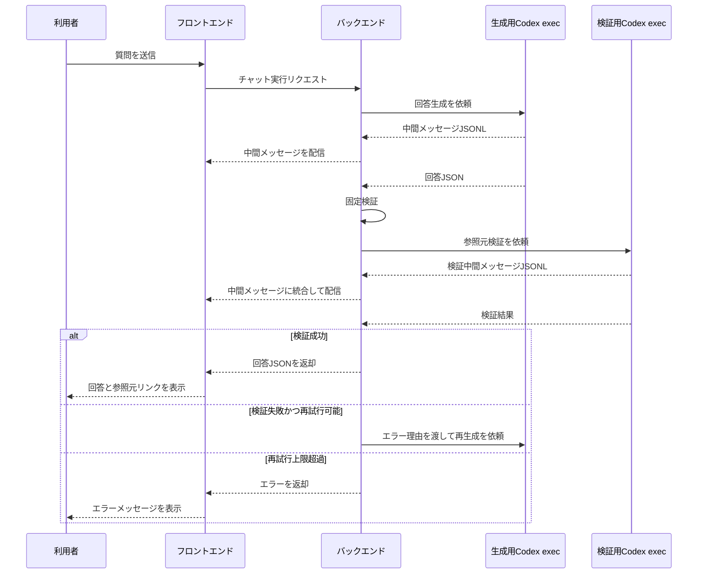

# 検証フローとエラー処理

## 目的

本メモは、要件定義から分離した回答検証、JSONLイベント処理、再試行、エラー処理の詳細を整理する。

## 検証の基本方針

回答JSONは、検証に成功するまで画面に表示しない。

検証は次の2段階で行う。

1. 固定検証
2. 検証用Codex execによる参照元検証

固定検証は、アプリケーション側で決定的に判定できる内容を確認する。検証用Codex execは、参照元情報が回答内容を本当に支えているかを確認する。

## 検証シーケンス



## 固定検証

固定検証では、少なくとも次を確認する。

- JSONとしてパースできること。
- `codex.output_schema` が指すJSON Schemaに適合していること。
- 回答本文が空でないこと。
- 参照元配列の構造が、指定スキーマに定義された必須項目を満たしていること。
- `source_type` が指定スキーマの `const` に一致していること。
- PDFページ番号や行番号などの数値範囲が不正でないこと。
- ファイルパスが許可された作業ディレクトリの範囲内を指していること。
- HTML表示データに危険なタグや属性が含まれていないこと。

固定検証エラーの例:

```json
{
  "error_type": "schema_validation_error",
  "message": "source_type は 'pdf' である必要があります。",
  "path": "$.answers[0].references[1].source_type"
}
```

この場合、バックエンドは生成用Codex execへ次のような修正依頼を送る。

```text
前回の回答JSONは検証に失敗しました。
理由: source_type は 'pdf' である必要があります。
codex.output_schema で指定されたスキーマに適合するJSONを再出力してください。
```

## 検証用Codex execによる参照元検証

検証用Codex execは、生成用Codex execとは別の `AGENTS.md` とSkillsを使う。

検証用 `AGENTS.md` は、回答を改善するのではなく、回答JSONの参照元が妥当かを判定するための指示を持つ。

検証観点:

- 回答本文の主張が、提示された参照元に実際に記載されているか。
- 参照元ページや参照元範囲がずれていないか。
- 回答の一部に参照元が不足していないか。
- 参照元の抜粋が、回答内容と矛盾していないか。
- 複数の参照元を組み合わせた推論が過剰でないか。

検証用Codex execの出力は、検証結果JSONとして受け取る。

検証成功の例:

```json
{
  "valid": true,
  "findings": []
}
```

検証失敗の例:

```json
{
  "valid": false,
  "findings": [
    {
      "severity": "error",
      "answer_path": "$.answers[0]",
      "message": "回答では優先順位付けについて述べているが、参照元であるPDF p.42-45には該当する記述が確認できません。"
    }
  ]
}
```

検証失敗時、バックエンドは検証結果を生成用Codex execへ渡し、回答JSONの修正を依頼する。

## 再試行方針

検証失敗時の再試行回数は、設定ファイルで指定する。

標準値は2回とする。

再試行の流れ:

1. 初回生成を行う。
2. 固定検証または参照元検証で失敗する。
3. エラー理由を生成用Codex execへ渡す。
4. 同一セッションに修正依頼を送り、回答JSONを再生成させる。
5. 再度、固定検証と参照元検証を行う。
6. 設定上限まで失敗した場合、回答表示を中止する。

利用者へ表示するエラー例:

```text
回答の参照元確認に失敗したため、回答を表示できませんでした。
質問を具体化して再度お試しください。
```

内部ログには、検証失敗理由、再試行回数、失敗した検証段階を保存する。

## キャンセル方針

利用者が回答生成中にキャンセルした場合、バックエンドは対象実行へキャンセル要求を記録し、実行中のCodex exec連携処理を終了させる。

状態遷移の考え方:

1. 利用者が質問を送信する。
2. 実行状態を実行中にする。
3. 利用者がキャンセルする。
4. 実行状態をキャンセル要求中にする。
5. バックエンドが実行中プロセスへ終了要求を送る。
6. プロセス終了を確認する。
7. 実行状態をキャンセル済みにする。

キャンセル要求は、生成中、固定検証中、参照元検証中、再生成中のいずれの段階でも受け付ける。キャンセル済み実行では、部分回答、未検証回答、途中artifactを最終回答として表示しない。履歴表示でも、キャンセル前に作成された途中artifactを回答表示用artifactとして採用しない。

キャンセル要求と正常完了が競合した場合は、最終回答を表示する前にキャンセル要求の有無を確認する。キャンセル要求後に到着した回答JSONや検証結果は、最終回答として採用しない。

内部処理としてはOSプロセスの終了を伴う。Windows/Linuxの具体的な終了方法はRunnerのOS別実装に閉じ込め、検証フロー側ではキャンセル要求、キャンセル済み、部分結果不採用という状態だけを扱う。

## JSONLイベントの扱い

バックエンドは、`codex exec --json` が標準出力へ出すJSONLを逐次読み取る。

中間メッセージとして画面に表示する対象は、次の条件を満たすイベントである。

- `type` が `item.completed`
- `item.type` が `agent_message`

表示対象外のイベントは、画面には表示しない。ただし、障害調査に必要な範囲でサーバログに保存してよい。

中間メッセージの表示では、システム内部のファイル構成、絶対パス、秘密情報、APIキー、実行環境の詳細を出さない。これは `AGENTS.md` でも指示し、バックエンド側でも必要に応じてマスクする。

中間メッセージの例:

- `検索キーワードを整理します。`
- `関連資料を検索します。`
- `候補ページの本文を確認します。`
- `回答と参照元の対応を検証します。`
- `検証結果をもとに回答を修正します。`

## 中間メッセージ領域の折りたたみ

回答生成中は、中間メッセージ領域を展開して表示する。

最終回答が表示された後、中間メッセージ領域は折りたたみ、次のような見出しだけを表示する。

```text
Thought for 16s
```

`16s` は、質問送信から最終回答の検証完了までの経過時間を表す。

利用者が `Thought for <秒数>` をクリックすると、中間メッセージ領域を再展開し、生成用Codex execと検証用Codex execの中間メッセージを時系列で表示する。

## 検証中の中間表示

検証用Codex execが出力した中間メッセージも、生成用Codex execの中間メッセージと同じ領域に表示する。

表示例:

```text
検索キーワードを整理します。
関連資料を検索します。
候補ページの本文を確認します。
回答JSONの形式を確認します。
参照元ページに回答内容が記載されているか検証します。
検証結果をもとに回答を修正します。
```

利用者には、生成と検証が一連の処理として見えること。検証用Codex execの内部構成やファイルパスは表示しない。

## エラー分類

MVPでは、少なくとも次のエラーを扱う。

| エラー | 説明 | 利用者表示 |
| --- | --- | --- |
| 入力エラー | 質問が空、長すぎるなど | 入力内容の修正を促す |
| Codex exec起動失敗 | コマンド起動、設定、権限の問題 | 回答生成に失敗したことを表示 |
| Codex execタイムアウト | 実行時間が上限を超過 | 時間を置くか質問を絞るよう促す |
| キャンセル | 利用者が実行中処理をキャンセル | 回答生成をキャンセルしたことを表示 |
| JSON解析エラー | 最終出力がJSONとして不正 | 再生成し、上限超過時はエラー表示 |
| 固定検証エラー | スキーマ不一致、未対応参照元種別など | 再生成し、上限超過時はエラー表示 |
| 参照元検証エラー | 参照元が回答を支えていない | 再生成し、上限超過時はエラー表示 |
| ビューア表示エラー | PDFや参照元ファイルを開けない | 参照元表示に失敗したことを表示 |

## 利用者向けメッセージ

利用者向けエラーメッセージは、内部構成を含めない。

表示してよい情報:

- 何ができなかったか。
- 利用者が次に取れる行動。
- 再試行可能か。

表示しない情報:

- 絶対パス
- コマンドライン全文
- 環境変数
- APIキー
- 内部スタックトレース
- `AGENTS.md` やSkillsの具体的な内部パス
