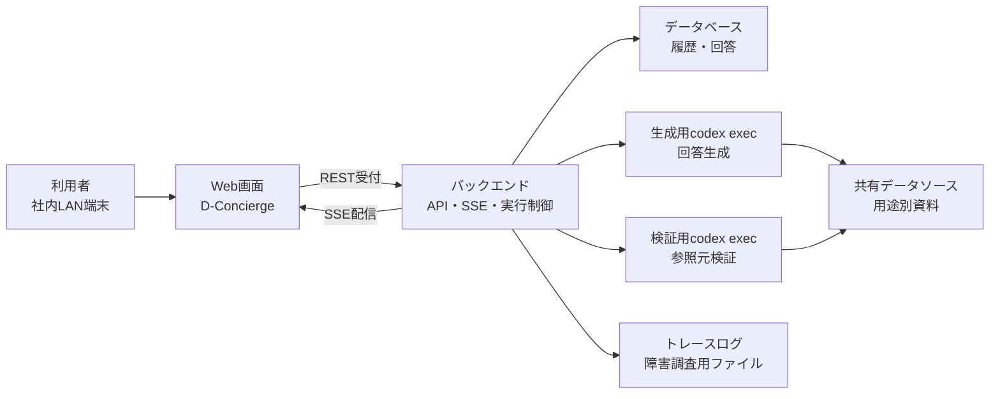

# システム概要

## 1. 文書の目的

本書は、D-Concierge MVPの外部設計におけるシステム全体像、利用者、主要構成要素、外部連携の関係を定義することを目的とする。

## 2. 前提

- D-Conciergeは、汎用的なユーザ指示応答・分析チャットアプリである。
- MVPでは、設定済みのデータソース、生成用・検証用ホームディレクトリ、出力契約、画面実装に組み込まれた参照元ビューアに従って回答を生成する。
- 本番・社内配布構成は、単一ホスト上にアプリケーションとデータベースを同居させる構成とする。
- 利用者は社内LANからWeb画面へアクセスする。
- ログイン画面は設けず、DBに事前登録された1ユーザでログイン済みとして扱う。
- PDF検索は用途例の一つであり、システム本体は特定のデータソース種別に依存しない。

## 3. システム概要

D-Conciergeは、利用者が自然文でユーザ指示を送信し、システムが設定済みデータソースを検索・分析して、参照元付きの回答を返すチャットアプリである。

回答生成は生成用codex execが行い、回答表示前に形式検証と参照元検証を行う。参照元検証には検証用codex execを用いる。画面には回答生成中の状態、中間メッセージ、検証済み回答、参照元リンク、履歴を表示する。

## 4. 利用者区分

| 区分 | 役割 | MVPでの扱い |
| --- | --- | --- |
| 利用者 | ユーザ指示を送信し、回答、参照元、中間メッセージ、過去履歴を確認する。 | 社内LANからWeb画面を利用する。 |
| 開発者 | 用途別アプリに必要な設定、生成用・検証用ホームディレクトリ、出力契約、参照元ビューア実装を用意する。 | 管理画面は提供しない。 |
| 運用者 | 実行環境、データ配置、トレースログ、バックアップを扱う。 | 開発者と兼務してよい。 |

## 5. 主要構成要素

| 構成要素 | 役割 |
| --- | --- |
| Web画面 | 開始画面、チャット画面、参照元ビューアを提供する。 |
| バックエンド | REST受付、SSE配信、チャット履歴保存、codex exec制御、検証、参照元データ配信、Codex成果物配信を行う。 |
| データベース | 共有1ユーザ、チャット、ユーザ指示、チャット実行処理、中間メッセージ、回答、参照元、Codex成果物メタ情報を保持する。 |
| 生成用codex exec | 生成用ホームディレクトリの `AGENTS.md` とSkillsに従い、回答候補と参照元を生成する。 |
| 検証用codex exec | 検証用ホームディレクトリの `AGENTS.md` とSkillsに従い、参照元が回答内容を支えているか確認する。 |
| 共有データソース | 用途別アプリが検索・分析対象とする読み取り用データである。 |
| トレースログ | 障害調査用にエラー分類、発生段階、実行情報を保存するファイルである。 |

## 6. 外部連携概要

| 連携 | 方式 | 概要 |
| --- | --- | --- |
| Web画面とバックエンド | REST、SSE | ユーザ指示受付、履歴取得、キャンセル、参照元データ取得、Codex成果物取得、実行状況配信を行う。 |
| バックエンドとcodex exec | プロセス実行 | 生成用と検証用を分けて起動し、用途別のホームディレクトリを適用する。 |
| バックエンドとデータベース | 永続化接続 | 履歴、ユーザ指示、実行状態、中間メッセージ、回答、参照元、Codex成果物メタ情報を保存する。 |
| バックエンドとCodex成果物保存領域 | ファイル入出力 | 検証済み回答が参照するCodex成果物本体を保存し、画面へ配信する。 |
| バックエンドと共有データソース | ファイル参照 | 設定された許可範囲内のデータだけを検索・参照対象にする。 |

## 7. MVP対象外

- 利用者によるデータソース追加。
- ログイン画面と権限管理。
- 管理画面による設定変更。
- 複数アプリケーション間の履歴共有。
- 過去チャットの検索。
- 自動削除または手動削除機能。
