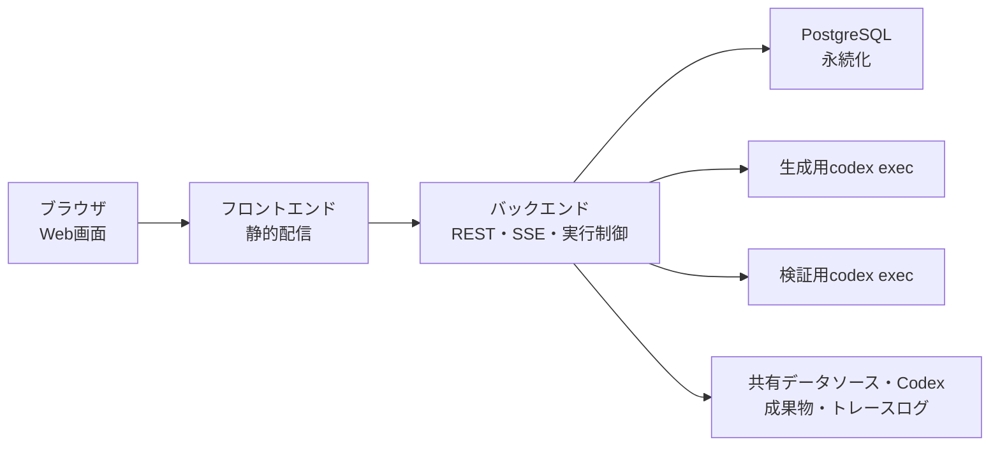

# ソフトウェア構成

## 1. 文書の目的

本書は、D-Conciergeを構成するソフトウェア要素、実行基盤、主要な役割分担を定義することを目的とする。

## 2. 前提

- 開発環境では、画面、バックエンド、データ保存先を個別に起動して確認できる。
- 本番・社内配布構成では、単一ホスト上でアプリケーションとデータベースを同居させる。
- WindowsとLinuxの両方で利用できるよう、OS差異はバックエンド内部に閉じ込める。
- 回答生成と参照元検証はcodex exec連携で実現する。

## 3. ソフトウェア構成概要

## 4. ソフトウェア構成一覧

| 区分 | 採用要素 | 役割 |
| --- | --- | --- |
| フロントエンド | React、TypeScript、Vite | 開始画面、チャット画面、参照元ビューアを構築する。 |
| UI基盤 | Tailwind CSS、shadcn/ui | 画面部品とレイアウトを構成する。 |
| バックエンド | FastAPI | REST受付、SSE配信、codex exec制御、検証、履歴保存を担当する。 |
| データベース | PostgreSQL | チャット履歴、ユーザ指示、チャット実行処理、中間メッセージ、回答、参照元、Codex成果物メタ情報を保存する。 |
| Codex成果物保存領域 | ファイルシステム | 検証済み回答が参照するCodex成果物本体を保存する。 |
| DBアクセス | SQLAlchemy、Alembic | DBアクセスとスキーマ変更管理を担う。 |
| 回答生成・検証 | codex exec | 生成用と検証用を分離して実行する。 |
| PDF表示例 | PDF.js | PDF参照元ビューアを構成する場合に利用する。 |
| Markdown表示 | react-markdown | 回答ブロック本文をMarkdownとして表示する。 |
| Mermaid表示 | mermaid | 回答中のMermaidブロックを図として表示する。 |
| HTML安全化 | DOMPurify | サニタイズ済みHTMLとして表示する。 |
| Python依存管理 | uv | Python仮想環境と依存関係を管理する。 |
| 配布・運用 | Docker Compose | 単一ホスト上でアプリケーションとDBを起動する。 |

## 5. 実行時の役割分担

| 処理 | 担当 |
| --- | --- |
| 画面表示 | フロントエンド |
| ユーザ指示受付 | バックエンド |
| 実行状態配信 | バックエンドのSSE |
| 回答生成 | 生成用codex exec |
| 形式検証 | バックエンド |
| 参照元検証 | 検証用codex exec |
| 履歴保存 | バックエンドとデータベース |
| 参照元表示 | フロントエンドとバックエンドの参照元データ配信 |
| キャンセル | フロントエンド、バックエンド、codex exec実行制御 |
| トレースログ保存 | バックエンド |

## 6. Windows/Linux両対応方針

- 利用者操作、画面表示、API契約、SSE契約はOS差異を持たない。
- codex execの起動、キャンセル、パス正規化はバックエンド内部の実行制御で吸収する。
- 参照元path、成果物リンク、DB保存パス、API/SSEで公開する参照先はPOSIX相対形式へ標準化し、Windows絶対パスやUNCは参照先として解釈しない。
- 回答、履歴、参照元、Codex成果物ではOS依存の絶対パスを利用者へ表示しない。
