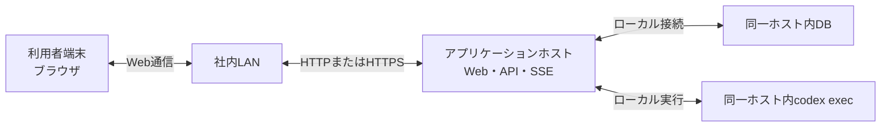

# ネットワーク構成

## 1. 文書の目的

本書は、D-Concierge MVPの接続形態、通信経路、通信方式、ネットワーク境界を定義することを目的とする。

## 2. 前提

- 利用者は社内LANからD-Conciergeへ接続する。
- 外部公開はMVPの前提にしない。
- 本番・社内配布構成では、Web画面、REST API、SSE配信を同一アプリケーションホストから提供する。
- データベースは同一ホスト上に配置し、利用者端末から直接接続しない。

## 3. ネットワーク全体像

## 4. 通信経路一覧

| 経路ID | 送信元 | 送信先 | 方式 | 用途 |
| --- | --- | --- | --- | --- |
| NW-01 | 利用者ブラウザ | バックエンド | HTTPまたはHTTPS REST | app-config取得、ユーザ指示送信、履歴取得、キャンセル、参照元データ取得、Codex成果物取得 |
| NW-02 | バックエンド | 利用者ブラウザ | SSE | 実行状態、中間メッセージ、最終回答、エラー、キャンセル結果の配信 |
| NW-03 | バックエンド | データベース | ローカル接続 | 履歴、ユーザ指示、実行状態、中間メッセージ、回答、参照元の保存 |
| NW-04 | バックエンド | codex exec | ローカルプロセス実行 | 回答生成、参照元検証 |
| NW-05 | バックエンド | 共有データソース | ローカルファイル参照 | 検索・分析対象データの参照 |

## 5. 利用ポート

| 区分 | 公開範囲 | 用途 |
| --- | --- | --- |
| Web/API/SSEポート | 社内LAN | Web画面、REST API、SSE配信 |
| DBポート | ホスト内部 | バックエンドからのDB接続 |

DBポートは利用者端末へ公開しない。

## 6. セキュリティ境界

- 社内LAN外からの直接利用はMVPの対象外である。
- ブラウザはバックエンドAPIを通じて参照元とCodex成果物を取得し、共有データソースやセッションディレクトリへ直接アクセスしない。
- 絶対パス、内部ディレクトリ、秘密情報はAPI応答、SSE、画面表示に含めない。
- 表示中チャットで意図せずSSEが切断された場合は、利用者向けエラーを表示する。
- 利用者操作による画面遷移や別履歴表示でSSE購読を解除した場合は、エラー扱いにしない。
