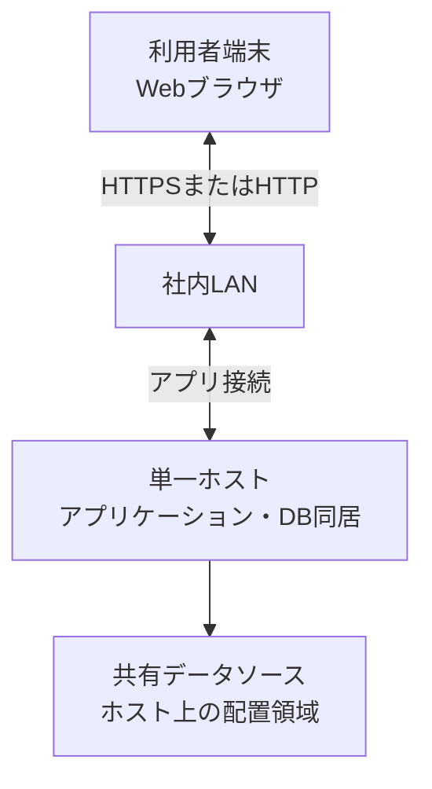

# ハードウェア構成

## 1. 文書の目的

本書は、D-Conciergeを社内LANで利用するための端末、サーバ、ネットワーク機器の物理構成と容量前提を定義することを目的とする。

## 2. 前提

- 本番・社内配布構成は単一ホスト構成とし、アプリケーションとデータベースを同じホスト上で動作させる。
- 画面利用者は10人程度を想定する。
- 回答生成の同時実行は3件程度を想定する。
- チャット履歴、ユーザ指示、中間メッセージ、回答、参照元、Codex成果物は本システムでは無期限保持とする。トレースログは標準で90日保持し、アプリケーション起動ごとの同日最大保存件数を1000件とする。
- 利用者端末は社内LANからWeb画面へアクセスできること。

## 3. 構成概要

## 4. ハードウェア構成一覧

| 機器区分 | 台数 | 想定仕様 | 用途 |
| --- | --- | --- | --- |
| 利用者端末 | 10台程度 | モダンブラウザが動作するPC | ユーザ指示送信、回答確認、参照元確認 |
| アプリケーションホスト | 1台 | 小規模利用に必要なCPU、メモリ、ストレージを持つサーバまたはPC | Web画面配信、API、SSE、codex exec、データベース |
| ネットワーク機器 | 既存設備 | 社内LAN通信を提供する機器 | 利用者端末とアプリケーションホスト間の通信 |

## 5. 容量見積もり前提

| 項目 | 前提値 |
| --- | --- |
| 画面利用者数 | 10人程度 |
| 回答生成の同時実行数 | 3件程度 |
| 1日あたりユーザ指示数 | 小規模社内利用の範囲 |
| 履歴保持 | 無期限 |
| トレースログ保持 | 90日 |
| トレースログ同日上限 | アプリケーション起動ごとに1000件 |
| 削除機能 | チャット一式の手動削除を対象とする。チャット履歴とCodex成果物の自動削除、Codex成果物ファイル本体の削除は提供しない。トレースログは期限超過分を起動時に削除する。 |

## 6. 留意事項

- 単一ホスト構成のため、ホスト停止時はWeb画面、API、SSE、履歴保存、回答生成がすべて利用できない。
- チャット履歴とCodex成果物の無期限保持を前提とするため、データベース領域とCodex成果物保存領域の容量確認が必要である。
- トレースログ領域は保存期間と同日上限で抑制するが、容量確認は必要である。
