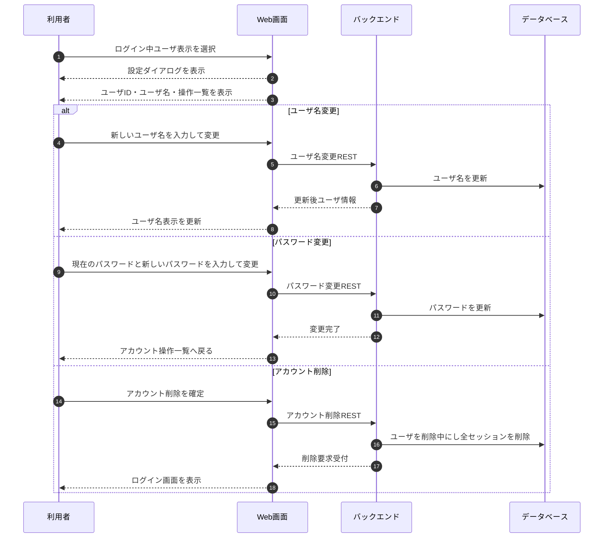

# アカウント管理フロー

## 1. 文書の目的

本書は、ログイン中の利用者が設定ダイアログからユーザ情報の確認、ユーザ名変更、パスワード変更、アカウント削除を行う業務フローを定義することを目的とする。

## 2. 前提

- アカウント管理はログイン中の利用者本人だけが行う。
- ユーザIDは表示のみとし、登録後に変更できない。
- ユーザ名とパスワードは設定ダイアログ内の個別フォームで変更する。
- 成功時は画面遷移、表示更新、ダイアログ終了で結果を示し、成功メッセージは表示しない。
- アカウント削除要求を受け付けたユーザはログイン不可、通常操作不可とする。
- アカウント削除の内部処理詳細は内部設計で定義する。

## 3. フロー概要

## 4. 業務手順

| 手順 | 主体 | 内容 |
| --- | --- | --- |
| 1 | 利用者 | 開始画面またはチャット画面のログイン中ユーザ表示を選択する。 |
| 2 | システム | 設定ダイアログを表示し、ユーザID、ユーザ名、パスワード変更、ログアウト、アカウント削除を表示する。 |
| 3 | 利用者 | ユーザ名を変更する場合、ユーザ名変更フォームへ進み、新しいユーザ名を入力して変更する。 |
| 4 | システム | `PATCH /api/account/name` でユーザ名を更新し、画面上のログイン中ユーザ表示を更新する。 |
| 5 | 利用者 | パスワードを変更する場合、パスワード変更フォームへ進み、現在のパスワードと新しいパスワードを入力して変更する。 |
| 6 | システム | `PATCH /api/account/password` でパスワードを更新し、ログイン状態を維持したままアカウント操作一覧へ戻す。 |
| 7 | 利用者 | アカウントを削除する場合、アカウント削除確認ダイアログで削除を確定する。 |
| 8 | システム | `DELETE /api/account` で削除要求を受け付け、対象ユーザを削除中にして全ログインセッションを削除する。 |
| 9 | システム | 操作中の画面をログイン画面へ遷移させ、対象ユーザに紐づくデータを削除対象にする。 |

## 5. 異常時の扱い

| 異常事象 | システムの扱い | 利用者への表示 | アカウントの扱い |
| --- | --- | --- | --- |
| 未ログインまたはセッション切れ | アカウント操作を受け付けず、未ログイン応答を返す。 | ログイン画面を表示する。 | 変更しない。 |
| ユーザ名の入力不正 | ユーザ名変更を受け付けず、項目別エラーを返す。 | ユーザ名入力欄近くにエラーを表示する。 | 変更しない。 |
| 現在のパスワード不一致 | パスワード変更を受け付けず、項目別エラーを返す。 | 現在のパスワード入力欄近くにエラーを表示する。 | 変更しない。 |
| 新しいパスワードの入力不正 | パスワード変更を受け付けず、項目別エラーを返す。 | 新しいパスワード入力欄近くにエラーを表示する。 | 変更しない。 |
| パスワード確認不一致 | パスワード変更を受け付けず、項目別エラーを返す。 | パスワード確認入力欄近くにエラーを表示する。 | 変更しない。 |
| アカウント削除受付失敗 | 削除要求を受け付けず、利用者向けエラーを返す。 | アカウントを削除できないことを表示する。 | 通常利用可能な状態を維持する。 |
| アカウント物理削除失敗 | 削除中のユーザとして通常操作対象外を維持し、トレースログを保存する。 | 既に削除受付済みのため通常画面には戻さない。 | 通常利用可能な状態へ戻さない。 |

## 6. 終了条件

- ユーザ名変更後、ログイン中ユーザ表示が更新される。
- パスワード変更後、ログイン状態を維持したままアカウント操作一覧へ戻る。
- アカウント削除受付後、対象ユーザがログイン不可、通常操作不可になり、操作中の画面はログイン画面へ遷移する。
