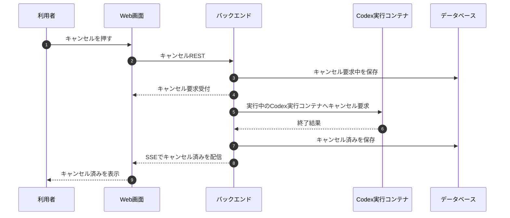

# キャンセルフロー

## 1. 文書の目的

本書は、利用者が回答生成中の自分の実行をキャンセルする業務フローを定義することを目的とする。

## 2. 前提

- キャンセルできる対象は、利用者が画面で実行中として扱っているチャット実行処理である。
- 受付、回答候補の生成中、または検証中にキャンセル要求を受け付ける。
- キャンセルされたチャット実行処理の部分回答、未検証回答、途中Codex成果物は最終回答として表示しない。
- キャンセル済みのチャット実行処理は状態付きで履歴に残す。

## 3. フロー概要

## 4. 業務手順

| 手順 | 主体 | 内容 |
| --- | --- | --- |
| 1 | 利用者 | 回答生成中にキャンセル操作を行う。 |
| 2 | システム | 対象のチャット実行処理IDの状態が受付、実行中、検証中のいずれかである場合に、状態条件付き更新でキャンセル要求中にする。 |
| 3 | システム | 実行中のCodex実行コンテナへキャンセル要求を行う。一定時間後もコンテナが残る場合は削除対象として扱う。 |
| 4 | システム | 終了を確認し、チャット実行処理の状態がキャンセル要求中である場合に、状態条件付き更新でキャンセル済みにする。 |
| 5 | システム | SSEでキャンセル済み状態を画面へ配信する。 |
| 6 | 利用者 | 画面でキャンセル済み表示を確認する。 |

## 5. 異常時の扱い

| 異常事象 | システムの扱い | 利用者への表示 | 履歴の扱い |
| --- | --- | --- | --- |
| 対象チャット実行処理が存在しない | キャンセルを受け付けない。 | 対象処理を確認できないことを表示する。 | 変更しない。 |
| すでに完了済み | キャンセルを受け付けない。 | 処理が完了済みであることを表示する。 | 完了状態を維持する。 |
| キャンセル要求と完了が競合 | チャット実行処理の状態条件付き更新により、先に成立した終了処理を正とする。キャンセル要求中にした後に到着した回答候補、参照元、Codex成果物は最終結果に採用しない。 | 保存済みの確定状態に対応する利用者向けメッセージまたは回答を表示する。 | 先に確定した状態と保存済み表示内容を維持する。 |
| キャンセル処理失敗 | チャット実行処理の状態をエラーにし、トレースログを保存する。 | キャンセルに失敗したことを表示する。 | 状態付きで残す。 |

## 6. 終了条件

- チャット実行処理の状態がキャンセル済みとして保存される。
- 画面にキャンセル済みが表示される。
- 履歴詳細でユーザ指示本文、中間メッセージ、終了状態、利用者向けメッセージを確認できる。
