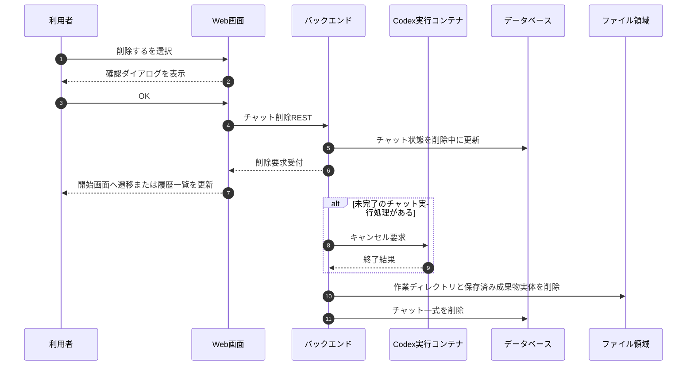

# チャット削除フロー

## 1. 文書の目的

本書は、利用者がチャット画面または履歴項目メニューから過去チャットを削除する業務フローを定義することを目的とする。

## 2. 前提

- チャット削除はチャット単位で行う。
- 削除対象は、DB上のチャット一式、当該セッションの生成用・検証用作業ディレクトリ、保存済みCodex成果物実体とする。
- 削除要求を受け付けたチャットは `deleting` とし、履歴一覧、履歴再表示、継続指示、参照元表示、Codex成果物配信の対象外にする。
- `deleting` はチャット全体の状態である。
- チャット実行処理状態には含めない。
- 実行中チャットを削除する場合、システムはキャンセル要求を行い、実行終了後に削除処理を進める。
- トレースログはチャット削除の対象外とし、ログ設計の保存期間に従って保持する。

## 3. フロー概要

## 4. 業務手順

| 手順 | 主体 | 内容 |
| --- | --- | --- |
| 1 | 利用者 | チャット画面右上メニューまたは履歴項目メニューで `削除する` を選択する。 |
| 2 | システム | 削除確認ダイアログを表示する。 |
| 3 | 利用者 | OKを選択する。 |
| 4 | システム | `DELETE /api/chats/{chat_id}` で削除要求を送信する。 |
| 5 | システム | 対象チャットを `deleting` にし、以後の利用者操作対象外にする。 |
| 6 | システム | 削除要求受付結果を画面へ返す。 |
| 7 | システム | 表示中チャットが削除対象の場合、SSE購読を利用者操作による解除として扱い、開始画面へ遷移する。 |
| 8 | システム | 表示中ではない履歴項目を削除した場合、現在表示中チャットを維持し、履歴一覧を再取得する。 |
| 9 | システム | 未完了のチャット実行処理がある場合、キャンセル要求を行い、終了後に削除処理を進める。 |
| 10 | システム | 当該セッション作業領域、保存済みCodex成果物実体、DB上のチャット一式を削除する。 |

## 5. 異常時の扱い

| 異常事象 | システムの扱い | 利用者への表示 | 履歴の扱い |
| --- | --- | --- | --- |
| 削除要求受付失敗 | 削除要求を受け付けず、利用者向けエラーを返す。 | チャットを削除できないことを表示する。 | 変更しない。 |
| 対象チャットが削除中 | 削除要求の再送であれば削除受付済みとして扱う。その他の操作は削除中エラーを返す。 | このチャットは削除中のため操作できないことを表示する。 | 履歴一覧と履歴再表示の対象外にする。 |
| 対象チャットが削除済み | 対象なしとして扱う。 | このチャットは削除されたことを表示する。 | 履歴一覧と履歴再表示の対象外にする。 |
| 別ブラウザで表示中のチャットが削除された | 次のREST操作、ストリーム再接続、履歴一覧再取得で操作不可または対象なしを返す。 | 削除中または削除済みのメッセージを表示し、開始画面へ戻す。 | 履歴一覧を再取得する。 |
| 物理削除失敗 | 削除中のチャットとして利用者操作対象外を維持し、トレースログを保存する。 | 既に削除受付済みのため通常画面には戻さない。 | 履歴一覧と履歴再表示の対象外を維持する。 |

## 6. 終了条件

- 削除要求受付後、対象チャットが履歴一覧と履歴再表示の対象外になる。
- 表示中チャットを削除した画面は開始画面へ戻る。
- 当該セッション作業領域、保存済みCodex成果物実体、DB上のチャット一式が削除対象として処理される。
