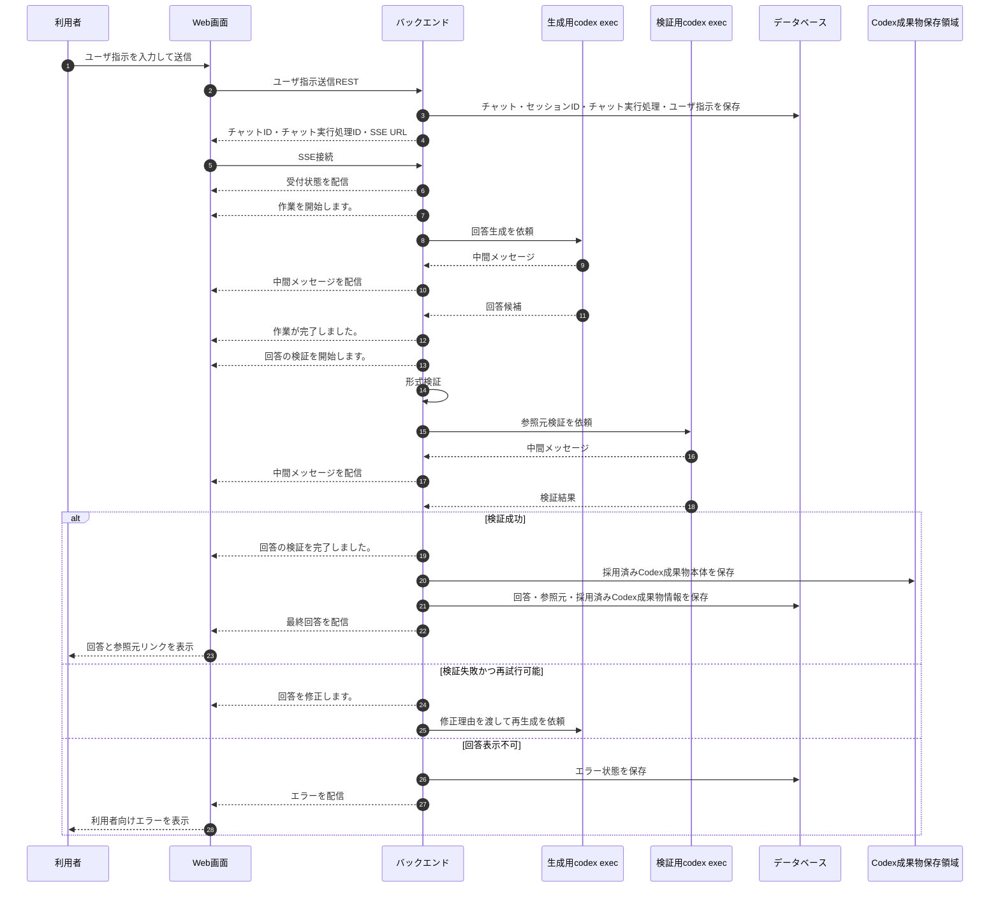

# チャット実行処理フロー

## 1. 文書の目的

本書は、利用者がユーザ指示を送信してから、検証済み回答または利用者向けエラーが表示されるまでの業務フローを定義することを目的とする。

## 2. 前提

- 新規チャットでは `POST /api/chats/start` によりチャット作成と最初のユーザ指示送信を同時に行う。
- 既存チャットへの継続指示では `POST /api/chats/{chat_id}/runs` を使う。
- 新規チャット作成時にバックエンドがセッションIDを採番し、チャットに保存する。
- 継続指示ではチャットIDから保存済みセッションIDを取得し、同じ作業領域を再利用する。
- 新規チャットの初回ユーザ指示では通常の生成用codex execを起動し、継続指示では保存済みの生成用Codex側の会話継続IDを使って生成用codex execを再開する。
- 同一チャットの初回参照元検証では通常の検証用codex execを起動し、以後の参照元検証では保存済みの検証用Codex側の会話継続IDを使って検証用codex execを再開する。
- 検証用codex execは、生成用と同じ利用者ID・セッションIDに対応する検証用作業領域で実行する。
- 検証指示は、今回の回答候補と参照元情報を対象に判定する前提で渡す。
- 同一チャットに未完了のチャット実行処理がある場合、継続指示は送信できない。
- REST受付後、画面は `GET /api/chats/{chat_id}/runs/{run_id}/sse` へ接続する。
- 表示中チャットの意図しないSSE切断時は利用者向けエラーを表示する。
- 回答は検証に成功するまで最終回答として表示しない。
- 履歴タイトル、履歴一覧更新、SSE購読解除・再接続の共通ルールは「チャット履歴・実行中表示設計」に従う。

## 3. フロー概要

## 4. 正常時の業務手順

| 手順 | 主体 | 内容 |
| --- | --- | --- |
| 1 | 利用者 | 開始画面またはチャット画面でユーザ指示を入力する。 |
| 2 | 利用者 | ユーザ指示を送信する。 |
| 3 | システム | ユーザ指示を受け付け、新規チャットではセッションIDを採番し、チャット実行処理の状態を受付にする。 |
| 4 | システム | 初回の生成用codex exec起動前に `作業を開始します。` を中間メッセージとして即時配信し、履歴再表示用に保存する。 |
| 5 | システム | 新規チャット初回ユーザ指示では採番したセッションIDの作業領域で生成用codex execを起動し、継続指示では保存済みセッションIDの作業領域と生成用Codex側の会話継続IDで生成用codex execを再開して回答候補を生成する。 |
| 6 | システム | 生成用または検証用codex execから受け取った中間メッセージを画面へ配信する。 |
| 7 | システム | 生成用codex execが最終回答候補を返したら `作業が完了しました。` を中間メッセージとして即時配信し、履歴再表示用に保存する。 |
| 8 | システム | 回答候補の検証開始前に `回答の検証を開始します。` を中間メッセージとして即時配信し、回答候補を形式検証する。 |
| 9 | システム | 初回参照元検証では検証用codex execを起動し、以後の参照元検証では検証用Codex側の会話継続IDで検証用codex execを再開して検証する。検証中に中間メッセージを受け取った場合は、画面表示用に整形・マスク済みの本文だけを配信し、履歴再表示用に保存する。 |
| 10 | システム | 検証に合格した場合は `回答の検証を完了しました。` を中間メッセージとして即時配信し、チャット実行処理の状態が受付、実行中、検証中のいずれかである場合に、状態条件付き更新で完了にし、検証済み回答が参照するCodex成果物本体、検証済み回答、参照元、Codex成果物情報を保存する。 |
| 11 | システム | 検証に不合格で再生成可能な場合は、次の生成用codex exec起動前に `回答を修正します。` を中間メッセージとして即時配信し、修正理由を加えたプロンプトで再生成する。 |
| 12 | 利用者 | 回答と参照元を確認する。 |

## 5. 異常時の扱い

| 異常事象 | システムの扱い | 利用者への表示 | 履歴の扱い |
| --- | --- | --- | --- |
| 空のユーザ指示 | 受付しない。 | 入力修正を促す。 | 保存しない。 |
| 生成用codex exec起動失敗 | チャット実行処理の状態をエラーにし、トレースログを保存する。 | 回答生成に失敗したことを表示する。 | 状態付きで残す。 |
| 検証失敗 | 設定上限まで再生成を試みる。 | 上限超過時は回答を表示できないことを示す。 | 状態付きで残す。 |
| タイムアウト | チャット実行処理の状態をタイムアウトにし、トレースログを保存する。 | 処理が時間内に完了しなかったことを表示する。 | 状態付きで残す。 |
| 意図しないSSE切断 | 画面でエラー表示する。 | 接続が切れたことを示す。 | 保存済み状態に従う。 |
| 未完了処理中の継続指示 | 受付しない。 | 現在の処理が終了状態になった後に送信できることを示す。 | 保存しない。 |
| キャンセル要求との競合 | チャット実行処理の状態条件付き更新により、先に成立した終了処理を正とする。キャンセル要求中またはキャンセル済みの場合、回答候補、参照元、Codex成果物は保存しない。 | 保存済みの確定状態に対応する利用者向けメッセージまたは回答を表示する。 | 先に確定した状態と保存済み表示内容を維持する。 |

## 6. 終了条件

- 検証済み回答が保存され、画面へ配信される。
- エラーまたはタイムアウトが保存され、画面へ配信される。
- 利用者がキャンセルし、キャンセル済み状態になる。
