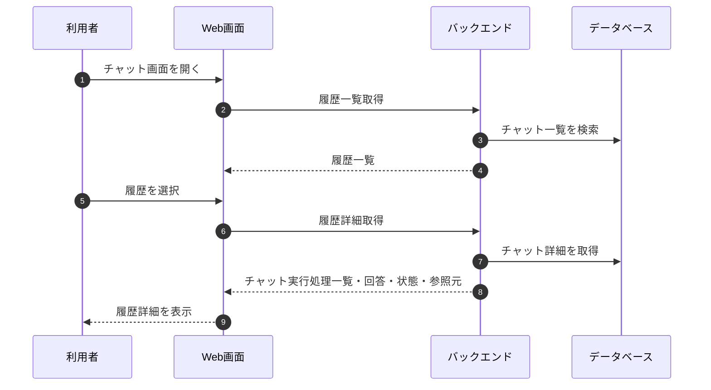

# 履歴再表示フロー

## 1. 文書の目的

本書は、利用者がチャット履歴一覧から過去チャットを選択し、保存済み内容を再表示する業務フローを定義することを目的とする。

## 2. 前提

- チャット履歴一覧は `GET /api/chat-histories` で取得する。
- チャット履歴詳細は `GET /api/chats/{chat_id}` で取得する。
- 履歴表示では、保存済み回答と保存済みCodex成果物を使用する。
- キャンセル、エラー、タイムアウトの実行も状態付きで履歴に残す。
- 履歴を開いたチャットに対して継続指示できる。
- 回答中のチャットを開いた場合、保存済み状態を復元し、対象チャット実行処理が継続中ならSSEへ再接続する。
- 履歴タイトル、履歴一覧更新、SSE購読解除・再接続の共通ルールは「チャット履歴・実行中表示設計」に従う。

## 3. フロー概要

## 4. 業務手順

| 手順 | 主体 | 内容 |
| --- | --- | --- |
| 1 | 利用者 | チャット画面を開く。 |
| 2 | システム | 履歴一覧を取得し、サイドバーに表示する。 |
| 3 | 利用者 | 履歴一覧からチャットを選択する。 |
| 4 | システム | チャット詳細を取得する。 |
| 5 | システム | 保存済みのユーザ指示、回答、参照元、状態を再表示する。 |
| 6 | 利用者 | 必要に応じて参照元を開く。 |
| 7 | 利用者 | 必要に応じて同じチャットへ継続指示する。 |

## 5. 状態別表示

| 実行状態 | 表示内容 |
| --- | --- |
| 受付 | ユーザ指示、受付状態、中間メッセージを表示し、実行が継続中ならSSEへ再接続する。 |
| 実行中 | ユーザ指示、実行中状態、中間メッセージを表示し、SSEへ再接続する。 |
| 検証中 | ユーザ指示、検証中状態、中間メッセージを表示し、SSEへ再接続する。 |
| キャンセル要求中 | ユーザ指示、中間メッセージ、キャンセル要求中状態を表示し、SSEへ再接続する。 |
| 完了 | ユーザ指示、検証済み回答、中間メッセージ、参照元、回答内のCodex成果物を表示する。 |
| キャンセル済み | ユーザ指示、中間メッセージ、キャンセル済み状態、利用者向けメッセージを表示する。 |
| エラー | ユーザ指示、中間メッセージ、エラー状態、利用者向けメッセージを表示する。 |
| タイムアウト | ユーザ指示、中間メッセージ、タイムアウト状態、利用者向けメッセージを表示する。 |

## 6. 異常時の扱い

| 異常事象 | システムの扱い | 利用者への表示 |
| --- | --- | --- |
| 履歴一覧取得失敗 | エラーを返す。 | 履歴を読み込めないことを表示する。 |
| 履歴詳細取得失敗 | エラーを返す。 | チャットを読み込めないことを表示する。 |
| Codex成果物取得失敗 | 回答本文の表示を継続し、該当要素だけ失敗表示にする。 | Codex成果物を表示できないことを表示する。 |
| 参照元表示失敗 | 内部パスを表示せず、失敗メッセージを表示する。 | 参照元を開けないことを表示する。 |
