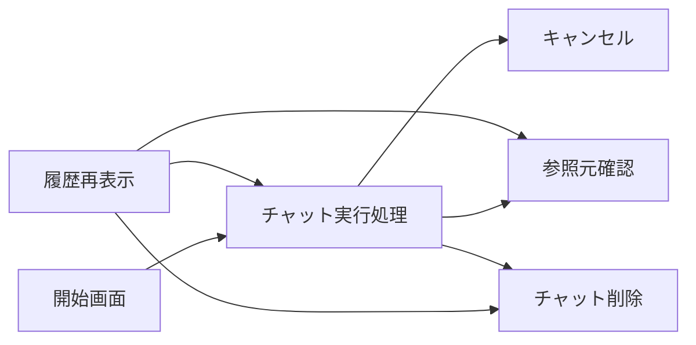

# 業務一覧

## 1. 文書の目的

本書は、D-Conciergeで利用者が行う業務と、その開始契機、終了条件、関連画面、関連機能を定義することを目的とする。

## 2. 前提

- 本システムの業務一覧は利用者操作に限定する。
- 開発者または運用者が行う設定、データ配置、バックアップ、トレースログ確認は業務一覧の対象にしない。
- 利用者はDBに事前登録された1ユーザでログイン済みとして扱われる。

## 3. 業務一覧

| 業務ID | 業務名 | 主体 | 開始契機 | 終了条件 | 関連画面 | 関連機能 |
| --- | --- | --- | --- | --- | --- | --- |
| BIZ-01 | チャット実行処理 | 利用者 | 開始画面またはチャット画面でユーザ指示を送信する。 | 検証済み回答、エラー、キャンセル済み、タイムアウトのいずれかになる。 | 開始画面、チャット画面、参照元ビューア | チャット実行処理、回答生成、回答検証、回答表示、参照元表示 |
| BIZ-02 | キャンセル | 利用者 | 回答生成中にキャンセル操作を行う。 | チャット実行処理の状態がキャンセル済みになる。 | チャット画面 | キャンセル、状態管理、履歴保存 |
| BIZ-03 | 履歴再表示 | 利用者 | チャット履歴一覧から過去チャットを選択する。 | 保存済みのユーザ指示、回答、状態、参照元を再表示できる。 | チャット画面、参照元ビューア | チャット履歴、回答表示、参照元表示 |
| BIZ-04 | チャット削除 | 利用者 | チャット画面または履歴項目メニューで削除操作を行う。 | 対象チャットが削除中になり、履歴一覧と履歴再表示の対象外になる。 | チャット画面 | チャット削除、履歴一覧表示、キャンセル |

## 4. 業務関連図

## 5. 業務上の制約

- 利用者はデータソースを画面から追加または切り替えない。
- 回答生成中は同じチャットへの追加送信を制御し、送信操作をキャンセル操作へ切り替える。
- 検証に成功していない回答は最終回答として表示しない。
- キャンセル、エラー、タイムアウトになったチャット実行処理は状態付きで履歴に残す。
- 履歴再表示では、保存済み回答と保存済みCodex成果物を使い、codex execの作業ディレクトリ内のファイルを直接参照しない。
- 削除中または削除済みのチャットは履歴一覧、履歴再表示、継続指示、参照元表示、Codex成果物配信の対象外にする。
