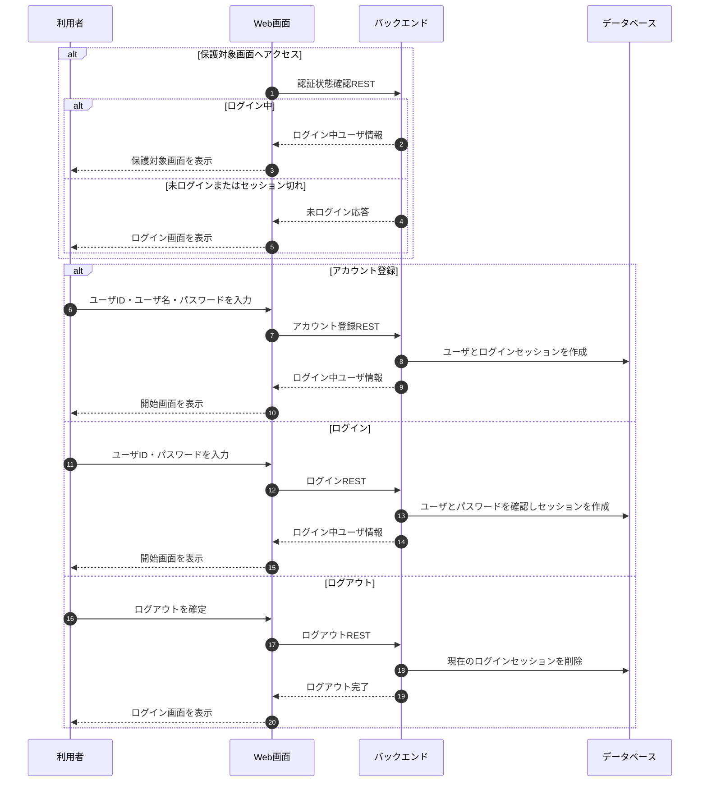

# 認証フロー

## 1. 文書の目的

本書は、利用者がアカウント登録またはログインによりD-Conciergeを利用可能にし、ログアウトによりログインセッションを終了する業務フローを定義することを目的とする。

## 2. 前提

- ログイン画面とアカウント登録画面は未ログイン状態でも表示できる。
- 保護対象画面と保護対象APIはログイン状態を必要とする。
- `/api/app-config` は保護対象APIとし、ログイン後に取得する。
- ログイン成功後とアカウント登録成功後は開始画面へ遷移する。
- ログイン前にアクセスしようとしていた画面へ戻す制御は行わない。
- ログアウトは現在のログインセッションだけを終了する。

## 3. フロー概要

## 4. 業務手順

| 手順 | 主体 | 内容 |
| --- | --- | --- |
| 1 | 利用者 | 未ログイン状態で保護対象画面へアクセスする、またはログイン画面を表示する。 |
| 2 | システム | 保護対象画面の表示前に `GET /api/auth/me` でログイン状態を確認する。 |
| 3 | システム | 未ログインまたはセッション切れの場合、ログイン画面を表示する。 |
| 4 | 利用者 | アカウント登録またはログインを選択し、必要項目を入力して実行する。 |
| 5 | システム | アカウント登録ではユーザとログインセッションを作成し、ログインではユーザIDとパスワードを確認してログインセッションを作成する。 |
| 6 | システム | ログイン中ユーザ情報を画面へ返し、開始画面を表示する。 |
| 7 | 利用者 | ログアウトする場合、設定ダイアログでログアウトを確定する。 |
| 8 | システム | 現在のログインセッションを削除し、ログイン画面を表示する。 |

## 5. 異常時の扱い

| 異常事象 | システムの扱い | 利用者への表示 | セッションの扱い |
| --- | --- | --- | --- |
| 未ログインまたはセッション切れ | 保護対象機能を実行せず、未ログイン応答を返す。 | ログイン画面を表示する。 | 新しいセッションは作成しない。 |
| アカウント登録の入力不正 | 登録を受け付けず、項目別エラーを返す。 | 入力欄近くにエラーを表示する。 | 新しいセッションは作成しない。 |
| ユーザID重複 | 登録を受け付けず、ユーザID項目のエラーを返す。 | ユーザID入力欄近くにエラーを表示する。 | 新しいセッションは作成しない。 |
| ユーザID不存在 | ログインを受け付けず、ユーザID項目のエラーを返す。 | ユーザID入力欄近くにエラーを表示する。 | 新しいセッションは作成しない。 |
| パスワード不一致 | ログインを受け付けず、パスワード項目のエラーを返す。 | パスワード入力欄近くにエラーを表示する。 | 新しいセッションは作成しない。 |
| ログアウト失敗 | 現在の表示を維持し、利用者向けエラーを返す。 | ログアウトできないことを表示する。 | 現在のセッション状態を維持する。 |

## 6. 終了条件

- アカウント登録またはログインに成功し、開始画面を表示できる。
- ログアウトに成功し、ログイン画面を表示できる。
- 未ログインまたはセッション切れの状態で保護対象機能を実行できない。
