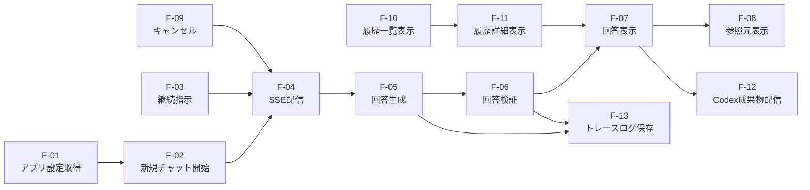

# 機能一覧

## 1. 文書の目的

本書は、D-Concierge MVPで提供する機能の一覧、概要、入出力、関連画面、関連IF、関連データを定義することを目的とする。

## 2. 前提

- MVPは汎用的なユーザ指示応答・分析チャットアプリとして提供する。
- 利用者はDBに事前登録された1ユーザでログイン済みとして扱われる。
- 画面からのデータソース追加、履歴検索、設定変更はMVP対象外である。

## 3. 機能一覧

| 機能ID | 機能名 | 概要 | 主な入力 | 主な出力 | 関連画面 | 関連IF |
| --- | --- | --- | --- | --- | --- | --- |
| F-01 | アプリ設定取得 | ウェルカムメッセージと入力候補チップを取得する。 | なし | 画面設定 | 開始画面 | 画面バックエンドAPI |
| F-02 | 新規チャット開始 | 新規チャットを作成し、最初のユーザ指示を送信する。 | ユーザ指示本文 | チャットID、チャット実行処理ID、SSE URL、受付状態 | 開始画面 | 画面バックエンドAPI |
| F-03 | 継続指示 | 未完了のチャット実行処理がない既存チャットに追加指示を送信する。 | チャットID、ユーザ指示本文 | チャット実行処理ID、SSE URL、受付状態 | チャット画面 | 画面バックエンドAPI |
| F-04 | SSE配信 | 接続時の現在状態と、以後の状態変化、中間メッセージ、最終回答、エラー、キャンセル結果を配信する。 | チャットID、チャット実行処理ID | SSEイベント情報、表示用参照元メタ情報 | チャット画面 | 画面バックエンドAPI |
| F-05 | 回答生成 | 生成用codex execで回答候補を生成する。継続指示時は生成用Codex側の会話継続IDで再開する。 | ユーザ指示本文、生成用Codex側の会話継続ID、設定 | 回答候補、中間メッセージ | チャット画面 | codex exec IF |
| F-06 | 回答検証 | 形式検証と参照元検証を行う。2回目以降の参照元検証では検証用Codex側の会話継続IDで再開する。 | 回答候補、出力契約、参照元、検証用Codex側の会話継続ID | 検証済み回答の採用可否、再生成指示、利用者向けエラー判定 | チャット画面 | codex exec IF |
| F-07 | 回答表示 | 検証済み回答をMarkdown、表、コード、画像、Mermaid、HTMLとして表示する。 | 回答、Codex成果物 | 回答表示 | チャット画面 | 画面バックエンドAPI |
| F-08 | 参照元表示 | 表示用参照元メタ情報から対応ビューアを開き、参照元本体を表示する。 | 表示用参照元メタ情報 | 参照元表示 | 参照元ビューア | 画面バックエンドAPI |
| F-09 | キャンセル | 受付、実行中、検証中のチャット実行処理をキャンセルする。 | チャットID、チャット実行処理ID | キャンセル状態 | チャット画面 | 画面バックエンドAPI、codex exec IF |
| F-10 | 履歴一覧表示 | チャット履歴一覧を表示する。 | なし | 履歴一覧 | チャット画面 | 画面バックエンドAPI |
| F-11 | 履歴詳細表示 | 過去チャットの保存済み内容を再表示する。 | チャットID | チャット実行処理一覧、回答、状態、表示用参照元メタ情報 | チャット画面 | 画面バックエンドAPI |
| F-12 | Codex成果物配信 | 検証済み回答が使用する保存済みCodex成果物を回答内要素として画面へ配信する。 | Codex成果物ID | Codex成果物本体 | チャット画面 | 画面バックエンドAPI |
| F-13 | トレースログ保存 | 障害調査用のトレースログをファイルへ保存する。 | 実行情報、エラー分類 | トレースログ | なし | なし |

## 4. 機能関連図

## 5. 状態管理

| 状態 | 内容 | 画面表示 |
| --- | --- | --- |
| 受付 | ユーザ指示を受け付け、実行を開始する前後の状態。 | 処理開始を示す。 |
| 実行中 | 生成用codex execが回答生成している状態。 | 処理中と中間メッセージを表示する。 |
| 検証中 | 形式検証または参照元検証を行っている状態。 | 検証中であることを表示する。 |
| キャンセル要求中 | 利用者のキャンセル要求を受け付けた状態。 | キャンセル要求中を表示する。 |
| キャンセル済み | 実行がキャンセル済みになった状態。 | キャンセル済みを表示する。 |
| 完了 | 検証済み回答を表示できる状態。 | 最終回答を表示する。 |
| エラー | 回答表示できない失敗が発生した状態。 | 利用者向けエラーを表示する。 |
| タイムアウト | 設定された時間内に完了しなかった状態。 | タイムアウトを表示する。 |

`受付`、`実行中`、`検証中`、`キャンセル要求中` は、未完了のチャット実行処理として扱う。検証失敗後の回答候補再生成は `実行中` の内部処理であり、独立した状態としては扱わない。
