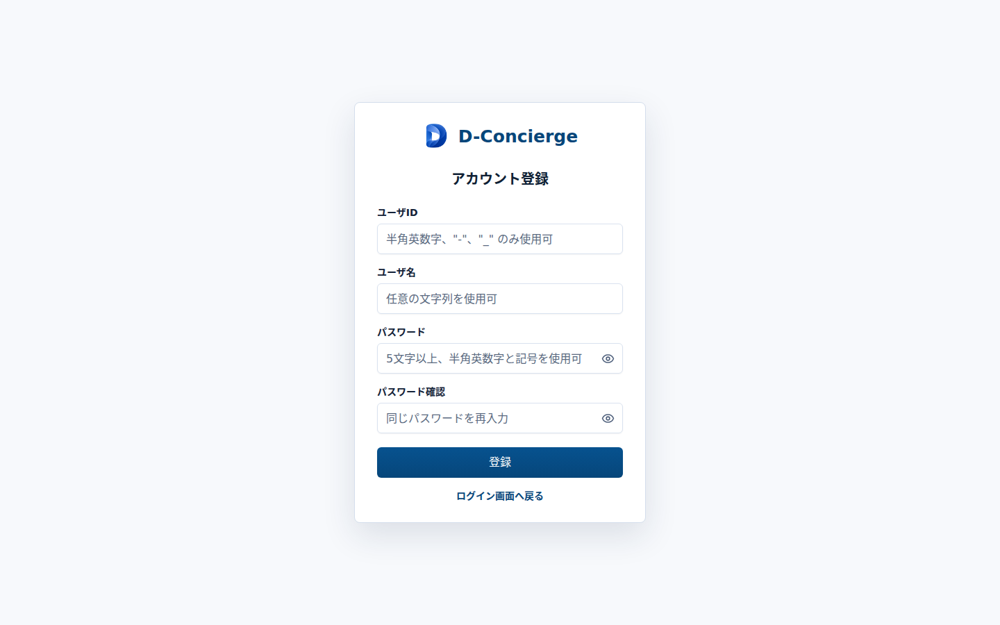

# アカウント登録画面

## 1. 文書の目的

本書は、利用者が自分のアカウントを登録するためのアカウント登録画面の外部仕様を定義することを目的とする。

## 2. 前提

- アカウント登録画面のURLは `/register` とする。
- ログイン状態に関わらず、URL直接指定時はアカウント登録画面を表示する。
- アカウント登録成功後は自動的にログイン状態にし、開始画面へ遷移する。
- 入力中またはフォーカスアウト時のユーザID重複確認は行わない。

## 3. 画面レイアウト

アカウント登録画面のレイアウトを以下に示す。

## 4. 項目一覧

| 項目名 | 機能詳細 | 種別 | 初期値 | 備考 |
| --- | --- | --- | --- | --- |
| ロゴ | D-Conciergeのロゴを表示する。 | 画像 | 表示 | 画面上部に表示する。 |
| アプリ名 | `D-Concierge` を表示する。 | ラベル | `D-Concierge` | 画面上部に表示する。 |
| ユーザID入力欄 | 登録するユーザIDを入力する。 | テキスト入力 | 空 | `autocomplete="username"` を設定する。最大30文字まで入力できる。プレースホルダは `半角英数字、"-"、"_" のみ使用可` とする。 |
| ユーザ名入力欄 | 表示用のユーザ名を入力する。 | テキスト入力 | 空 | `autocomplete="name"` を設定する。最大30文字まで入力できる。プレースホルダは `任意の文字列を使用可` とする。 |
| パスワード入力欄 | 登録するパスワードを入力する。 | パスワード入力 | 空 | `autocomplete="new-password"` を設定する。最大30文字まで入力できる。プレースホルダは `5文字以上、半角英数字と記号を使用可` とする。 |
| パスワード確認入力欄 | パスワード確認値を入力する。 | パスワード入力 | 空 | `autocomplete="new-password"` を設定する。最大30文字まで入力できる。プレースホルダは `同じパスワードを再入力` とする。 |
| パスワード表示切替 | 各パスワード入力欄の表示・非表示を個別に切り替える。 | アイコンボタン | 非表示状態 | 入力値は変更しない。 |
| 登録ボタン | 入力内容をアカウント登録APIへ送信する。 | ボタン | 有効 | ボタン押下時だけ送信する。 |
| ログイン画面リンク | ログイン画面へ戻る。 | リンク | 表示 | 遷移先は `/login` とする。 |
| 入力エラーメッセージ | APIから返された項目別エラーを表示する。 | メッセージ | 非表示 | 入力欄の近くに表示する。 |
| 共通エラーメッセージ | 項目に紐づかないAPIエラーを表示する。 | メッセージ | 非表示 | 内部情報を含めない。 |

## 5. イベント一覧

### 5.1. 初期表示時

1. ロゴ、アプリ名、各入力欄、登録ボタン、ログイン画面リンクを表示する。
2. 入力エラーメッセージと共通エラーメッセージは非表示とする。

### 5.2. 登録時

1. 利用者が登録ボタンを押す。
2. `POST /api/auth/register` を呼び出す。
3. 登録成功時は、返却されたユーザ情報をログイン中ユーザとして保持し、開始画面へ遷移する。
4. 登録失敗時は、API応答の入力項目別エラーまたは共通エラーを表示し、アカウント登録画面に留める。

### 5.3. ログイン画面リンク選択時

1. 利用者がログイン画面リンクを選択する。
2. ログイン画面へ遷移する。
