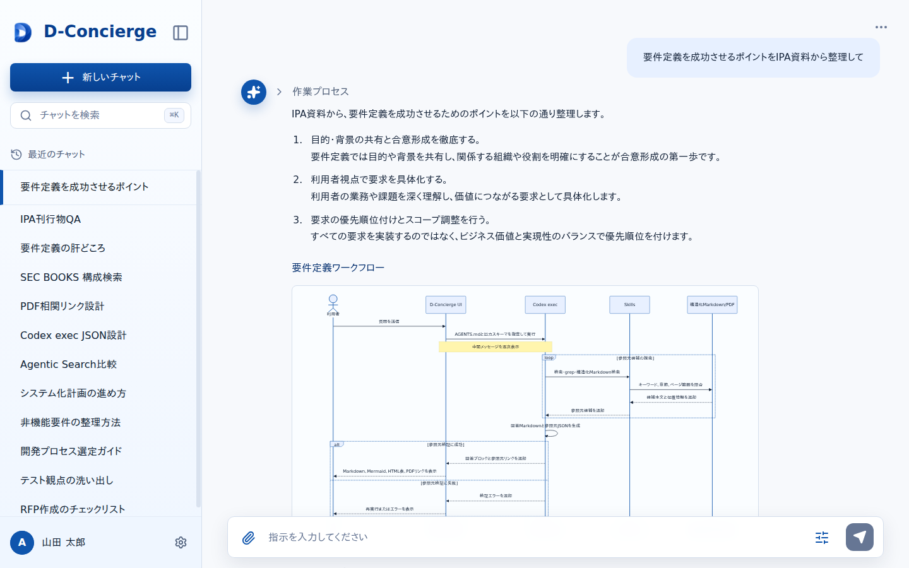

# チャット画面

## 1. 文書の目的

本書は、利用者がユーザ指示、回答、実行状態、中間メッセージ、チャット履歴を確認し、継続指示やキャンセルを行うチャット画面の外部仕様を定義することを目的とする。

## 2. 前提

- チャット画面は、回答中、回答済み、キャンセル済み、エラー、タイムアウトの状態を扱う。
- 履歴一覧はサイドバー内に表示する。
- 回答生成中は送信操作をキャンセル操作へ切り替える。
- 回答生成完了後も、同じチャットへ継続指示できる。
- 同じチャットに未完了のチャット実行処理がある場合、継続指示は送信できない。
- 履歴検索と画面上の設定変更はMVP対象外である。
- 履歴タイトル、履歴一覧更新、SSE購読解除・再接続の共通ルールは「チャット履歴・実行中表示設計」に従う。

## 3. 画面レイアウト

チャット画面のレイアウトを以下に示す。

## 4. 項目一覧

### 4.1. ヘッダー領域

| 項目名 | 機能詳細 | 種別 | 初期値 | 備考 |
| --- | --- | --- | --- | --- |
| アプリ名 | `D-Concierge` を表示する。 | 表示欄 | `D-Concierge` | 全画面共通のアプリ名を表示する。 |
| 新しいチャット操作 | 開始画面へ戻る。 | ボタン | 表示 | 回答生成中でも画面遷移として扱い、SSE購読解除ルールに従う。 |

### 4.2. サイドバー領域

| 項目名 | 機能詳細 | 種別 | 初期値 | 備考 |
| --- | --- | --- | --- | --- |
| サイドバー | 履歴一覧と折りたたみ・展開操作を表示する。 | ナビゲーション | 展開 | 利用者操作で折りたたみと展開を切り替える。 |
| チャット履歴一覧 | `GET /api/chat-histories` の取得結果からチャットタイトルだけを表示する。 | 一覧 | 最終更新日時降順 | 状態や日時はサイドバーに文字表示しない。 |
| 折りたたみ操作 | サイドバーを縮小表示する。 | ボタン | 表示 | 折りたたみ中は展開操作を表示する。 |
| 展開操作 | 縮小表示中のサイドバーを通常表示に戻す。 | ボタン | 非表示 | サイドバー折りたたみ中だけ表示する。 |

### 4.3. スレッド領域

| 項目名 | 機能詳細 | 種別 | 初期値 | 備考 |
| --- | --- | --- | --- | --- |
| 利用者メッセージ | 各チャット実行処理に紐づくユーザ指示本文を表示する。 | 表示欄 | なし | 履歴詳細取得結果の順序で表示する。 |
| 中間メッセージ | 実行中または履歴表示時に、保存済みまたはSSE配信された中間メッセージを表示する。 | 表示欄 | 折りたたみ | 画面表示用に整形・マスク済みの本文だけを表示する。 |
| 回答本文 | 完了時に検証済み回答を表示する。 | 表示欄 | なし | キャンセル済み、エラー、タイムアウトでは未検証回答を表示しない。 |
| 参照元リンク | 回答に参照元がある場合、表示用参照元メタ情報から参照元ビューアを開くリンクを表示する。 | リンク | なし | 参照元本体取得URLを使用する。 |

### 4.4. 回答表示領域

| 項目名 | 機能詳細 | 種別 | 初期値 | 備考 |
| --- | --- | --- | --- | --- |
| Markdown | 見出し、段落、箇条書き、番号付きリスト、引用、リンクを表示する。 | 表示形式 | 有効 | 回答本文の基本表示形式とする。 |
| 表 | Markdown表またはサニタイズ済みHTML表として表示する。 | 表示形式 | 有効 | 表示可能な範囲で整形して表示する。 |
| コードブロック | 等幅表示し、内容を読みやすく表示する。 | 表示形式 | 有効 | コードやコマンド例を本文から分けて表示する。 |
| 画像 | 保存済みCodex成果物として配信された画像を表示する。 | 表示形式 | 有効 | 取得失敗時は該当要素だけ失敗表示にする。 |
| Mermaid | Mermaidブロックを図としてレンダリングする。 | 表示形式 | 有効 | レンダリング失敗時はコードブロックとして表示する。 |
| サニタイズ済みHTML | 許可された要素だけを表示する。 | 表示形式 | 有効 | 危険な要素や属性は実行しない。 |
| 参照元表示文字列 | 表示用参照元メタ情報の表示ラベルと参照位置を結合して表示する。 | 表示形式 | 有効 | PDFの場合、同一ページは `XXXXX p.20`、ページ範囲は `XXXXX p.20-24` と表示する。 |

### 4.5. 入力・操作領域

| 項目名 | 機能詳細 | 種別 | 初期値 | 備考 |
| --- | --- | --- | --- | --- |
| 入力欄 | 新規または継続指示を入力する。 | テキスト入力 | 空 | 同じチャットに未完了のチャット実行処理がある場合は継続指示を送信できない。 |
| 送信ボタン | 実行中でない場合にユーザ指示を送信する。 | ボタン | 有効 | 回答生成中はキャンセル操作に切り替える。 |
| キャンセルボタン | 実行中または検証中のチャット実行処理をキャンセルする。 | ボタン | 非表示 | 表示中チャットの対象チャット実行処理IDに対して表示する。 |

### 4.6. 状態・メッセージ領域

| 項目名 | 機能詳細 | 種別 | 初期値 | 備考 |
| --- | --- | --- | --- | --- |
| キャンセル要求中表示 | キャンセル要求中であることを示す。 | メッセージ | 非表示 | キャンセル要求を受け付けた後、結果確定まで表示する。 |
| キャンセル済み表示 | 実行がキャンセル済みであることを示す。 | メッセージ | 非表示 | 部分回答は表示しない。 |
| エラーメッセージ | エラー、タイムアウト、意図しないSSE切断などを表示する。 | メッセージ | 非表示 | 内部情報を含めない。 |
| Codex成果物表示失敗メッセージ | 回答本文内の該当要素だけ表示失敗を示す。 | メッセージ | 非表示 | 回答本文の閲覧は継続する。 |

## 5. イベント一覧

### 5.1. 初期表示時

1. チャット画面を表示する。
2. `GET /api/chat-histories` で履歴一覧を取得する。
3. 履歴がある場合は、サイドバーにチャットタイトルだけを表示する。
4. 表示対象チャットが指定されている場合は、`GET /api/chats/{chat_id}` で履歴詳細を取得する。
5. 継続中のチャット実行処理がある場合は、保存済み内容を復元し、対象SSEへ再接続する。

### 5.2. 新しいチャット選択時

1. 利用者が新しいチャット操作を選択する。
2. 表示中チャットでSSE購読中の場合は、利用者操作による購読解除として扱う。
3. 購読解除をエラー表示せず、開始画面を表示する。

### 5.3. 継続指示送信時

1. 利用者が入力欄に継続指示を入力する。
2. 画面は入力欄が空でないことを確認する。
3. 同じチャットに未完了のチャット実行処理がないことを確認する。
4. `POST /api/chats/{chat_id}/runs` を呼び出す。
5. 受付成功時は、チャット実行処理IDとSSE URLを保持し、SSE購読を開始する。
6. 受付成功後、`GET /api/chat-histories` で履歴一覧を再取得する。
7. 入力不正または受付失敗時は、利用者向けエラーメッセージを表示し、画面遷移しない。

### 5.4. SSE購読時

1. `GET /api/chats/{chat_id}/runs/{run_id}/sse` へ接続する。
2. 接続成立直後の状態通知を受け取り、該当チャット実行処理の表示状態を更新する。
3. 接続成立直後の状態通知が完了、キャンセル済み、エラー、タイムアウトのいずれかである場合は、`GET /api/chats/{chat_id}` と `GET /api/chat-histories` を再取得する。
4. 接続成立直後の状態通知が継続中である場合は、SSE購読を継続する。
5. 中間メッセージを受け取った場合は、中間メッセージ領域へ追加表示する。
6. 最終回答を受け取った場合は、検証済み回答、参照元、Codex成果物を表示する。
7. キャンセル済み、エラー、タイムアウトを受け取った場合は、利用者向けメッセージを表示する。
8. 完了、キャンセル済み、エラー、タイムアウトのいずれかが確定した後、`GET /api/chat-histories` で履歴一覧を再取得する。
9. 利用者操作によるSSE購読解除はエラー扱いにしない。
10. 表示中チャットで意図せずSSEが切断された場合は、利用者向けエラーを表示する。

### 5.5. キャンセル時

1. 利用者がキャンセルボタンを選択する。
2. `POST /api/chats/{chat_id}/runs/{run_id}/cancel` を呼び出す。
3. キャンセル要求を受け付けた場合は、キャンセル要求中表示へ切り替える。
4. SSEでキャンセル済みを受け取った場合は、キャンセル済み表示に切り替える。
5. キャンセル済みのチャット実行処理では、部分回答や未検証回答を最終回答として表示しない。
6. キャンセル要求に失敗した場合は、利用者向けエラーを表示する。

### 5.6. 履歴選択時

1. 利用者がサイドバーのチャットタイトルを選択する。
2. 表示中チャットでSSE購読中の場合は、利用者操作による購読解除として扱う。
3. `GET /api/chats/{chat_id}` で選択したチャットの履歴詳細を取得する。
4. チャット実行処理を履歴詳細取得結果の順序で表示する。
5. 継続中のチャット実行処理がある場合は、保存済み内容を復元し、対象SSEへ再接続する。
6. 履歴詳細取得に失敗した場合は、利用者向けエラーを表示する。

### 5.7. サイドバー操作時

1. 利用者が折りたたみ操作を選択した場合、サイドバーを縮小表示する。
2. 利用者が展開操作を選択した場合、サイドバーを通常表示へ戻す。
3. サイドバーの表示状態変更では、チャット実行処理の状態を変更しない。

### 5.8. 中間メッセージ開閉時

1. 利用者が中間メッセージ領域を選択する。
2. 折りたたみ中の場合は、中間メッセージ本文を展開表示する。
3. 展開中の場合は、中間メッセージ本文を折りたたみ表示する。
4. 開閉状態は画面表示だけの状態とし、チャット履歴の内容は変更しない。

### 5.9. 参照元を開く時

1. 利用者が回答本文内または参照元一覧の参照元リンクを選択する。
2. 選択した表示用参照元メタ情報を参照元ビューアへ渡す。
3. 参照元ビューア側で参照元本体取得URLから参照元データを取得し、表示する。
