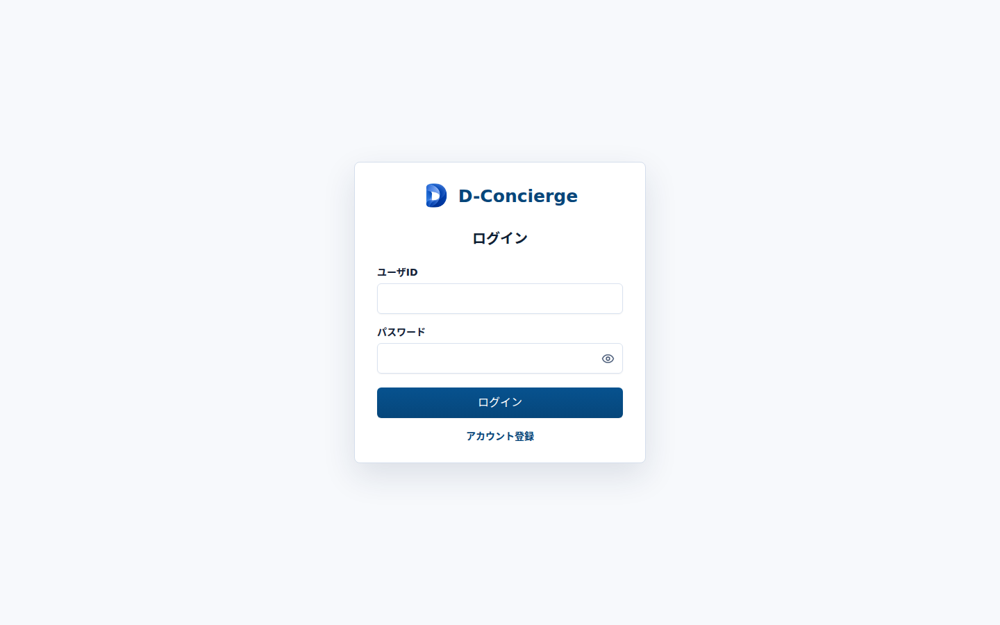

# ログイン画面

## 1. 文書の目的

本書は、利用者が登録済みユーザIDとパスワードでログインするためのログイン画面の外部仕様を定義することを目的とする。

## 2. 前提

- ログイン画面のURLは `/login` とする。
- ログイン状態に関わらず、URL直接指定時はログイン画面を表示する。
- 未ログイン状態で保護対象画面へアクセスした場合は、ログイン画面へ遷移する。
- ログイン成功後は開始画面へ遷移する。
- ログイン前にアクセスしようとしていた画面へ戻す制御は行わない。

## 3. 画面レイアウト

ログイン画面のレイアウトを以下に示す。

## 4. 項目一覧

| 項目名 | 機能詳細 | 種別 | 初期値 | 備考 |
| --- | --- | --- | --- | --- |
| ロゴ | D-Conciergeのロゴを表示する。 | 画像 | 表示 | 画面上部に表示する。 |
| アプリ名 | `D-Concierge` を表示する。 | ラベル | `D-Concierge` | 画面上部に表示する。 |
| ユーザID入力欄 | ログイン対象のユーザIDを入力する。 | テキスト入力 | 空 | `autocomplete="username"` を設定する。最大30文字まで入力できる。 |
| パスワード入力欄 | パスワードを入力する。 | パスワード入力 | 空 | `autocomplete="current-password"` を設定する。最大30文字まで入力できる。 |
| パスワード表示切替 | パスワード欄の表示・非表示を切り替える。 | アイコンボタン | 非表示状態 | 入力値は変更しない。 |
| ログインボタン | 入力内容をログインAPIへ送信する。 | ボタン | 有効 | ボタン押下時だけ送信する。 |
| アカウント登録リンク | アカウント登録画面へ遷移する。 | リンク | 表示 | 遷移先は `/register` とする。 |
| 入力エラーメッセージ | APIから返された項目別エラーを表示する。 | メッセージ | 非表示 | 入力欄の近くに表示する。 |
| 共通エラーメッセージ | 項目に紐づかないAPIエラーを表示する。 | メッセージ | 非表示 | 内部情報を含めない。 |

## 5. イベント一覧

### 5.1. 初期表示時

1. ロゴ、アプリ名、ユーザID入力欄、パスワード入力欄、ログインボタン、アカウント登録リンクを表示する。
2. 入力エラーメッセージと共通エラーメッセージは非表示とする。

### 5.2. ログイン時

1. 利用者がログインボタンを押す。
2. `POST /api/auth/login` を呼び出す。
3. ログイン成功時は、返却されたユーザ情報をログイン中ユーザとして保持し、開始画面へ遷移する。
4. ログイン失敗時は、API応答の入力項目別エラーまたは共通エラーを表示し、ログイン画面に留める。

### 5.3. アカウント登録リンク選択時

1. 利用者がアカウント登録リンクを選択する。
2. アカウント登録画面へ遷移する。
