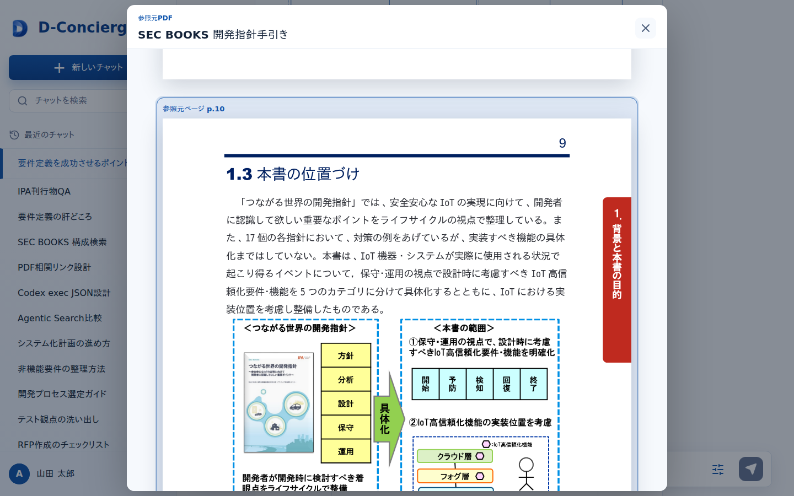

# 参照元ビューア

## 1. 文書の目的

本書は、回答の根拠となる参照元を表示する参照元ビューアの外部仕様を定義することを目的とする。

## 2. 前提

- 参照元ビューアは参照元種別に応じて差し替え可能な画面部品として扱う。
- PDF参照元ビューアは設定例として定義する。
- 参照元ビューアは、チャット画面から表示用参照元メタ情報を受け取る。
- 参照元データはバックエンドAPIを通じて取得し、内部パスを画面に表示しない。
- 参照元取得に失敗した場合は、利用者向けメッセージを表示し、チャット画面へ戻れる状態を維持する。

## 3. 画面レイアウト

参照元ビューアのレイアウトを以下に示す。

## 4. 項目一覧

### 4.1. ヘッダー領域

| 項目名 | 機能詳細 | 種別 | 初期値 | 備考 |
| --- | --- | --- | --- | --- |
| 参照元タイトル | 参照元の表示ラベルを表示する。 | 表示欄 | なし | 表示用参照元メタ情報の `label` を使用する。 |
| 閉じる操作 | ビューアを閉じてチャット画面へ戻る。 | ボタン | 表示 | 表示失敗時も操作可能とする。 |

### 4.2. 参照元表示領域

| 項目名 | 機能詳細 | 種別 | 初期値 | 備考 |
| --- | --- | --- | --- | --- |
| 参照位置 | 表示用参照元メタ情報の参照位置を表示する。 | 表示欄 | なし | PDFの場合はページ番号またはページ範囲を表示する。 |
| 参照元本文または資料 | 対応ビューアで参照元データを表示する。 | 表示欄 | 読み込み中 | 表示用参照元メタ情報の `url` から取得した結果を表示する。 |
| 読み込み失敗メッセージ | 参照元を表示できないことを示す。 | メッセージ | 非表示 | 内部情報を含めない。 |

### 4.3. PDF参照元ビューア領域

| 項目名 | 機能詳細 | 種別 | 初期値 | 備考 |
| --- | --- | --- | --- | --- |
| PDFタイトル | PDFファイルの表示ラベルを表示する。 | 表示欄 | なし | PDF参照元ビューアを設定した場合に表示する。 |
| ページ範囲 | 指定された開始ページと終了ページを表示する。 | 表示欄 | なし | PDF参照元ビューアを設定した場合に表示する。 |
| PDFページ表示 | 指定ページを初期表示する。 | ビューア | 読み込み中 | 表示対象範囲の先頭ページを初期表示する。 |
| ページ移動 | 指定範囲内または前後ページへ移動する。 | ボタン | 表示 | PDF参照元ビューアを設定した場合に表示する。 |
| 拡大縮小 | PDF表示を拡大または縮小する。 | ボタン | 表示 | PDF参照元ビューアを設定した場合に表示する。 |

### 4.4. 操作・メッセージ領域

| 項目名 | 機能詳細 | 種別 | 初期値 | 備考 |
| --- | --- | --- | --- | --- |
| 未対応参照元種別メッセージ | 未対応の参照元種別であることを示す。 | メッセージ | 非表示 | 通常はバックエンド側で検知し、利用者向けメッセージとして扱う。 |
| 参照元データ取得失敗メッセージ | 参照元データを取得できないことを示す。 | メッセージ | 非表示 | 対象なし、許可範囲外、取得失敗を含む。 |
| PDF読み込み失敗メッセージ | PDFを読み込めないことを示す。 | メッセージ | 非表示 | PDF参照元ビューアを設定した場合に表示する。 |
| 不正な位置情報メッセージ | 参照位置情報が表示に使えないことを示す。 | メッセージ | 非表示 | 内部情報を含めない。 |

## 5. イベント一覧

### 5.1. 初期表示時

1. 参照元ビューアを表示する。
2. チャット画面から受け取った表示用参照元メタ情報を保持する。
3. 参照元データ取得中の表示に切り替える。
4. 参照元データ取得時の手順を実行する。

### 5.2. ビューア表示時

1. チャット画面から `source_type`、`label`、`url`、`locator` を含む表示用参照元メタ情報を受け取る。
2. `source_type` に対応するビューアを選択する。
3. PDF参照元ビューアを設定している場合は、PDF参照元ビューア領域を表示する。
4. 対応するビューアがない場合は、未対応参照元種別メッセージを表示する。

### 5.3. 参照元データ取得時

1. 表示用参照元メタ情報の `url` を呼び出す。
2. 取得成功時は、`label`、`locator`、参照元本文または資料を表示する。
3. PDF参照元の場合は、`locator.page_start` を初期ページとしてPDFページ表示へ取得結果を渡す。
4. 対象なし、未対応参照元種別、許可範囲外参照、参照元取得失敗の場合は、利用者向けメッセージを表示する。
5. 取得失敗時も閉じる操作は可能な状態を維持する。

### 5.4. PDFページ移動時

1. 利用者がページ移動操作を選択する。
2. 指定ページが表示可能範囲内であることを確認する。
3. 表示可能な場合は、PDFページ表示を指定ページへ切り替える。
4. 表示できない場合は、不正な位置情報メッセージを表示する。

### 5.5. PDF拡大縮小時

1. 利用者が拡大または縮小操作を選択する。
2. 表示倍率を変更する。
3. 現在表示中のPDFページを変更後の倍率で再表示する。
4. 再表示に失敗した場合は、PDF読み込み失敗メッセージを表示する。

### 5.6. 閉じる時

1. 利用者が閉じる操作を選択する。
2. 参照元ビューアを閉じる。
3. 遷移元のチャット画面へ戻る。
