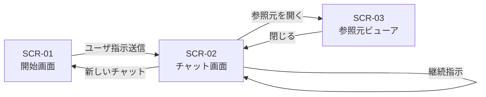

# 画面一覧

## 1. 文書の目的

本書は、D-Conciergeで提供する画面を一覧化し、用途と遷移関係を明確にすることを目的とする。

## 2. 前提

- 本システムでは独立した履歴管理画面を設けず、チャット画面内のサイドバーで履歴を扱う。
- 画面設計は要件定義を正とする。
- 各画面のレイアウトは、個別画面設計で定義する。

## 3. 画面一覧

| 画面ID | 画面名 | 利用者 | 目的 | 主な遷移元 | 主な遷移先 |
| --- | --- | --- | --- | --- | --- |
| SCR-01 | 開始画面 | 利用者 | 新しいユーザ指示を開始する。 | Web画面起動時、チャット画面の新しいチャット操作 | チャット画面 |
| SCR-02 | チャット画面 | 利用者 | ユーザ指示、回答、中間メッセージ、履歴を表示し、継続指示やキャンセルを行う。 | 開始画面、チャット画面内の履歴選択 | 開始画面、参照元ビューア、チャット画面 |
| SCR-03 | 参照元ビューア | 利用者 | 回答の根拠となる参照元を表示する。 | チャット画面の参照元リンク | チャット画面 |

## 4. 画面遷移図

## 5. 共通方針

- アプリ名は `D-Concierge` として表示する。
- 利用者はログイン済みとして扱い、ログイン画面は表示しない。
- 回答生成中は送信操作をキャンセル操作へ切り替える。
- エラー表示には内部パス、秘密情報、スタックトレースを含めない。
- サイドバーは折りたたみと展開ができる。
- 履歴検索、データソース追加、画面上の設定変更は対象外である。
