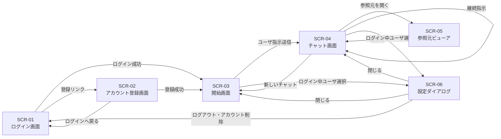

# 画面一覧

## 1. 文書の目的

本書は、D-Conciergeで提供する画面を一覧化し、用途と遷移関係を明確にすることを目的とする。

## 2. 前提

- 本システムでは独立した履歴管理画面を設けず、チャット画面内のサイドバーで履歴を扱う。
- 画面設計は要件定義を正とする。
- 各画面のレイアウトは、個別画面設計で定義する。

## 3. 画面一覧

| 画面ID | 画面名 | 利用者 | 目的 | 主な遷移元 | 主な遷移先 |
| --- | --- | --- | --- | --- | --- |
| SCR-01 | ログイン画面 | 利用者 | 登録済みユーザIDとパスワードでログインする。 | 未ログイン時の保護対象画面アクセス、ログアウト、アカウント削除、URL直接指定 | 開始画面、アカウント登録画面 |
| SCR-02 | アカウント登録画面 | 利用者 | ユーザID、ユーザ名、パスワードを登録する。 | ログイン画面、URL直接指定 | 開始画面、ログイン画面 |
| SCR-03 | 開始画面 | 利用者 | 新しいユーザ指示を開始する。 | 保護対象URL直接指定、チャット画面の新しいチャット操作、ログイン成功、アカウント登録成功 | チャット画面、設定ダイアログ |
| SCR-04 | チャット画面 | 利用者 | ユーザ指示、回答、中間メッセージ、履歴を表示し、継続指示やキャンセルを行う。 | 開始画面、チャット画面内の履歴選択 | 開始画面、参照元ビューア、設定ダイアログ、チャット画面 |
| SCR-05 | 参照元ビューア | 利用者 | 回答の根拠となる参照元を表示する。 | チャット画面の参照元リンク | チャット画面 |
| SCR-06 | 設定ダイアログ | 利用者 | ログイン中ユーザのユーザ名変更、パスワード変更、ログアウト、アカウント削除を行う。 | 開始画面、チャット画面のログイン中ユーザ表示 | 開始画面、チャット画面、ログイン画面 |

## 4. 画面遷移図

## 5. 共通方針

- アプリ名は `D-Concierge` として表示する。
- ログイン画面とアカウント登録画面では、ロゴとアプリ名を上部に表示する。
- 未ログイン時に保護対象画面へアクセスした場合はログイン画面を表示する。
- `/login` と `/register` はログイン状態に関わらず直接表示できる。
- 回答生成中は送信操作をキャンセル操作へ切り替える。
- エラー表示には内部パス、秘密情報、スタックトレースを含めない。
- サイドバーは折りたたみと展開ができる。
- 履歴検索、データソース追加、アプリケーション設定変更は対象外である。
