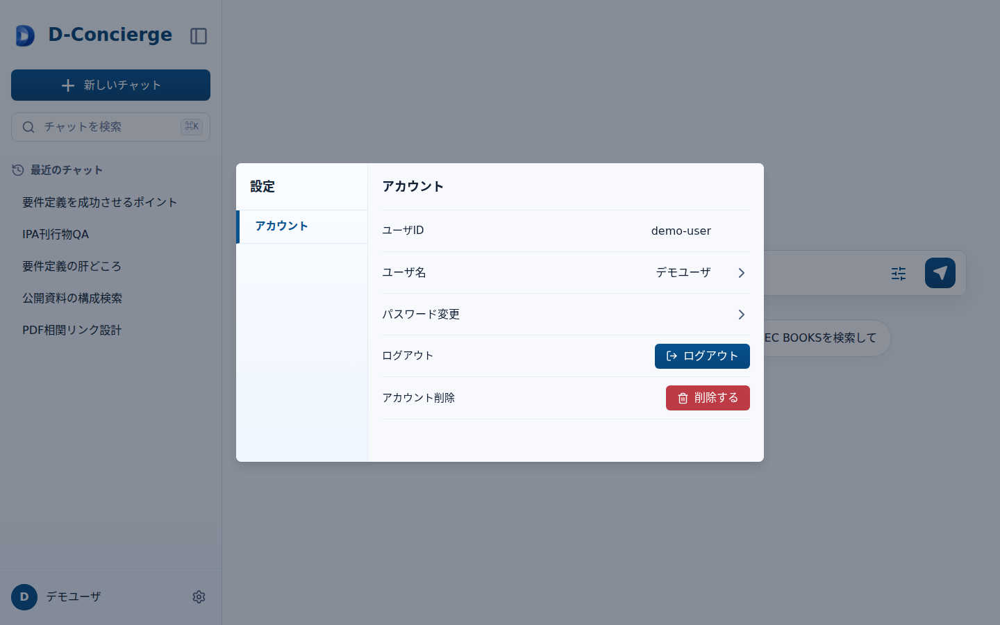

# 設定ダイアログ

## 1. 文書の目的

本書は、ログイン中の利用者がアカウント操作を行う設定ダイアログの外部仕様を定義することを目的とする。

## 2. 前提

- 設定ダイアログは、開始画面またはチャット画面のログイン中ユーザ表示領域を選択したときに表示する。
- メニューには `アカウント` のみを表示する。
- 設定ダイアログ内で、アカウント操作一覧と個別フォームを切り替える。

## 3. 画面レイアウト

設定ダイアログのレイアウトを以下に示す。

## 4. 項目一覧

### 4.1. 共通領域

| 項目名 | 機能詳細 | 種別 | 初期値 | 備考 |
| --- | --- | --- | --- | --- |
| ダイアログタイトル | `設定` を表示する。 | ラベル | `設定` | - |
| メニュー | メニュー項目 `アカウント` を表示する。 | メニュー | `アカウント` 選択中 | メニュー項目は1件だけ表示する。 |
| ヘッダー | 表示中の設定項目名を表示する。 | ヘッダー | `アカウント` | 個別フォーム表示時は戻るアイコンを表示する。 |
| コンテンツ領域 | アカウント操作一覧または個別フォームを表示する。 | 表示領域 | アカウント操作一覧 | 画面遷移ではなくダイアログ内表示を切り替える。 |

### 4.2. アカウント操作一覧

| 項目名 | 機能詳細 | 種別 | 初期値 | 備考 |
| --- | --- | --- | --- | --- |
| ユーザID | ログイン中ユーザのユーザIDを表示する。 | 行 | 表示 | 表示のみとし、画面遷移や実行ボタンは表示しない。 |
| ユーザ名 | ユーザ名変更フォームを表示する。 | 行 | 表示 | 現在のユーザ名を表示する。 |
| パスワード変更 | パスワード変更フォームを表示する。 | 行 | 表示 | - |
| ログアウト | ログアウト確認ダイアログを表示する。 | 行 | 表示 | 個別フォームは作らない。 |
| アカウント削除 | アカウント削除確認ダイアログを表示する。 | 行 | 表示 | 個別フォームは作らない。 |

### 4.3. ユーザ名変更フォーム

| 項目名 | 機能詳細 | 種別 | 初期値 | 備考 |
| --- | --- | --- | --- | --- |
| 戻るアイコン | アカウント操作一覧へ戻る。 | アイコンボタン | 表示 | - |
| 新しいユーザ名入力欄 | 変更後のユーザ名を入力する。 | テキスト入力 | 現在のユーザ名 | 最大30文字まで入力できる。プレースホルダは `任意の文字列を使用可` とする。 |
| 変更ボタン | ユーザ名変更APIへ送信する。 | ボタン | 有効 | ボタン押下時だけ送信する。 |
| 入力エラーメッセージ | APIから返された項目別エラーを表示する。 | メッセージ | 非表示 | 入力欄の近くに表示する。 |

### 4.4. パスワード変更フォーム

| 項目名 | 機能詳細 | 種別 | 初期値 | 備考 |
| --- | --- | --- | --- | --- |
| 戻るアイコン | アカウント操作一覧へ戻る。 | アイコンボタン | 表示 | - |
| 現在のパスワード入力欄 | 現在のパスワードを入力する。 | パスワード入力 | 空 | `autocomplete="current-password"` を設定する。最大30文字まで入力できる。入力制約プレースホルダは表示しない。 |
| 新しいパスワード入力欄 | 新しいパスワードを入力する。 | パスワード入力 | 空 | `autocomplete="new-password"` を設定する。最大30文字まで入力できる。プレースホルダは `5文字以上、半角英数字と記号を使用可` とする。 |
| 新しいパスワード確認入力欄 | 新しいパスワード確認値を入力する。 | パスワード入力 | 空 | `autocomplete="new-password"` を設定する。最大30文字まで入力できる。プレースホルダは `同じパスワードを再入力` とする。 |
| パスワード表示切替 | 各パスワード入力欄の表示・非表示を個別に切り替える。 | アイコンボタン | 非表示状態 | 入力値は変更しない。 |
| 変更ボタン | パスワード変更APIへ送信する。 | ボタン | 有効 | ボタン押下時だけ送信する。 |
| 入力エラーメッセージ | APIから返された項目別エラーを表示する。 | メッセージ | 非表示 | 入力欄の近くに表示する。 |

### 4.5. 確認ダイアログ

| 項目名 | 機能詳細 | 種別 | 初期値 | 備考 |
| --- | --- | --- | --- | --- |
| ログアウト確認 | ログアウト実行確認を表示する。 | ダイアログ | 非表示 | タイトルは `ログアウトしますか？` とする。本文は表示しない。確認ボタンは `ログアウト` とする。 |
| アカウント削除確認 | アカウント削除実行確認を表示する。 | ダイアログ | 非表示 | タイトルは `アカウントを完全に削除しますか？` とする。本文は `この操作は取り消せません。アカウントに紐づけられている全てのデータが完全に削除されます。` とする。確認ボタンは `削除する` とする。 |

## 5. イベント一覧

### 5.1. 初期表示時

1. 設定ダイアログを表示する。
2. メニューに `アカウント` を表示する。
3. ヘッダーに `アカウント` を表示する。
4. コンテンツ領域に、ユーザID、ユーザ名、パスワード変更、ログアウト、アカウント削除の操作一覧を表示する。

### 5.2. ユーザ名変更時

1. 利用者がユーザ名を選択する。
2. ヘッダーを `ユーザ名変更` へ切り替え、コンテンツ領域をユーザ名変更フォームへ切り替える。
3. 利用者が変更ボタンを押す。
4. `PATCH /api/account/name` を呼び出す。
5. 変更成功時は、ログイン中ユーザ表示を新しいユーザ名へ更新し、アカウント操作一覧へ戻る。
6. 変更失敗時は、入力欄近くにエラーを表示し、ユーザ名変更フォームに留める。

### 5.3. パスワード変更時

1. 利用者がパスワード変更を選択する。
2. ヘッダーを `パスワード変更` へ切り替え、コンテンツ領域をパスワード変更フォームへ切り替える。
3. 利用者が変更ボタンを押す。
4. `PATCH /api/account/password` を呼び出す。
5. 変更成功時は、成功メッセージを表示せず、アカウント操作一覧へ戻る。
6. 変更失敗時は、入力欄近くにエラーを表示し、パスワード変更フォームに留める。

### 5.4. ログアウト時

1. 利用者がログアウトを選択する。
2. ログアウト確認ダイアログを表示する。
3. 利用者が確認ボタンを押した場合、`POST /api/auth/logout` を呼び出す。
4. ログアウト成功時は、設定ダイアログを閉じ、ログイン画面へ遷移する。
5. 利用者がキャンセルまたは閉じる操作を選択した場合、ログアウト要求を送信せず元の表示を維持する。

### 5.5. アカウント削除時

1. 利用者がアカウント削除を選択する。
2. アカウント削除確認ダイアログを表示する。
3. 利用者が確認ボタンを押した場合、`DELETE /api/account` を呼び出す。
4. 削除受付成功時は、設定ダイアログを閉じ、ログイン画面へ遷移する。
5. 利用者がキャンセルまたは閉じる操作を選択した場合、削除要求を送信せず元の表示を維持する。

### 5.6. 戻るアイコン選択時

1. ユーザ名変更フォームまたはパスワード変更フォームで、利用者が戻るアイコンを選択する。
2. ヘッダーを `アカウント` へ戻し、コンテンツ領域をアカウント操作一覧へ戻す。
