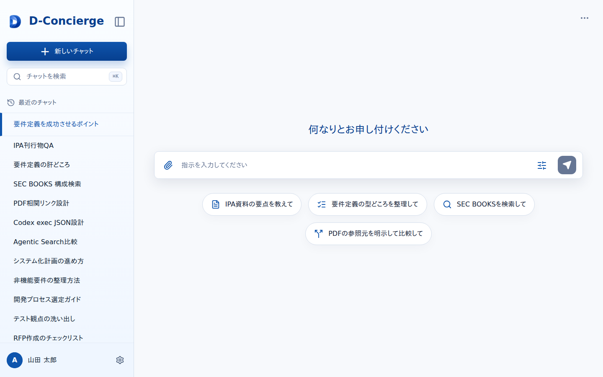

# 開始画面

## 1. 文書の目的

本書は、利用者が新しいユーザ指示を開始するための開始画面の外部仕様を定義することを目的とする。

## 2. 前提

- ログイン状態確認後に `GET /api/app-config` で `welcome_message`、`sub_welcome_message`、`input_suggestions` を取得する。
- アプリ名は `D-Concierge` 固定表示とする。
- `ui.welcome_message` が未設定の場合、ウェルカムメッセージ領域は表示しない。
- `ui.sub_welcome_message` が未設定の場合、補足案内文は表示しない。
- `ui.input_suggestions` が未設定または空の場合、入力候補チップは表示しない。
- `welcome_message`、`sub_welcome_message`、`input_suggestions` に改行文字が含まれる場合は、開始画面上も改行を維持して表示する。
- 利用者は入力欄へ自然文を入力し、新しいチャットの最初のユーザ指示として送信する。
- 開始画面はログイン後に表示する保護対象画面である。

## 3. 画面レイアウト

開始画面のレイアウトを以下に示す。

## 4. 項目一覧

### 4.1. ヘッダー領域

| 項目名 | 機能詳細 | 種別 | 初期値 | 備考 |
| --- | --- | --- | --- | --- |
| アプリ名 | アプリケーション名として `D-Concierge` を表示する。 | ラベル | `D-Concierge` | 固定表示とする。 |

### 4.2. 入力領域

| 項目名 | 機能詳細 | 種別 | 初期値 | 備考 |
| --- | --- | --- | --- | --- |
| ウェルカムメッセージ | `welcome_message` がある場合に、入力欄の上に案内文として表示する。改行文字を含む場合は改行を維持する。未設定時は領域ごと表示しない。 | ラベル | - | `GET /api/app-config` の取得結果を使用する。 |
| 補足案内文 | `sub_welcome_message` がある場合に、ウェルカムメッセージの下に補足文として表示する。改行文字を含む場合は改行を維持する。未設定時は表示しない。 | ラベル | - | `GET /api/app-config` の取得結果を使用する。 |
| 入力欄 | 利用者がユーザ指示本文を入力する。空白だけの値は送信できない。 | テキスト入力 | 空 | 複数行入力を扱える。 |
| 入力候補チップ | `input_suggestions` がある場合に候補文字列をチップとして表示する。改行文字を含む場合は改行を維持する。選択時は候補文字列を入力欄へ反映する。 | 選択チップ | - | 未設定または空配列の場合は表示しない。 |
| 送信ボタン | 入力欄の内容を新規チャット開始として送信する。 | ボタン | 有効 | 空白だけの入力では送信せず、入力修正を促す。 |

### 4.3. ログイン中ユーザ領域

| 項目名 | 機能詳細 | 種別 | 初期値 | 備考 |
| --- | --- | --- | --- | --- |
| ユーザアイコン | ログイン中ユーザのユーザID先頭1文字を表示する。 | ボタン内表示 | ログイン中ユーザ | サイドバー左下に表示する。 |
| ユーザ名 | ログイン中ユーザのユーザ名を表示する。 | ボタン内表示 | ログイン中ユーザ | ユーザ名変更後は即時更新する。 |
| 設定ダイアログ起動 | 設定ダイアログを表示する。 | ボタン | 表示 | ログイン中ユーザ領域全体を選択対象とする。 |

### 4.4. メッセージ領域

| 項目名 | 機能詳細 | 種別 | 初期値 | 備考 |
| --- | --- | --- | --- | --- |
| 入力エラーメッセージ | 空白だけの入力を送信しようとした場合に、ユーザ指示の入力を促す。 | メッセージ | 非表示 | 関連メッセージ: MSG-001 |
| 送信失敗メッセージ | ユーザ指示送信RESTが失敗した場合に、受付に失敗したことを表示する。 | メッセージ | 非表示 | 関連メッセージ: MSG-002 |

## 5. イベント一覧

### 5.1. 初期表示時

1. ログイン状態確認後に開始画面を表示する。
2. `GET /api/app-config` で画面表示設定を取得する。
3. `welcome_message` がある場合は、改行文字を維持してウェルカムメッセージを表示する。
4. `sub_welcome_message` がある場合は、改行文字を維持して補足案内文を表示する。
5. `input_suggestions` がある場合は、改行文字を維持して入力候補チップを表示する。
6. app-config取得に失敗した場合でも開始画面は表示し、ウェルカムメッセージ、補足案内文、入力候補チップは表示しない。
7. ログイン中ユーザ情報をサイドバー左下へ表示する。

### 5.2. 入力候補選択時

1. 利用者が入力候補チップを選択する。
2. 選択された候補文字列を、改行文字を含めて入力欄へ反映する。
3. 利用者は反映後の文字列を編集できる。

### 5.3. 送信時

1. 利用者が送信ボタンを押す。
2. 入力欄が空白だけの場合は、入力エラーメッセージを表示し、送信しない。
3. 入力欄に有効なユーザ指示本文がある場合は、`POST /api/chats/start` へ送信する。
4. 受付成功時は、返却されたSSE URLへ接続し、チャット画面へ遷移する。
5. 受付失敗時は、送信失敗メッセージを表示し、開始画面に留める。
