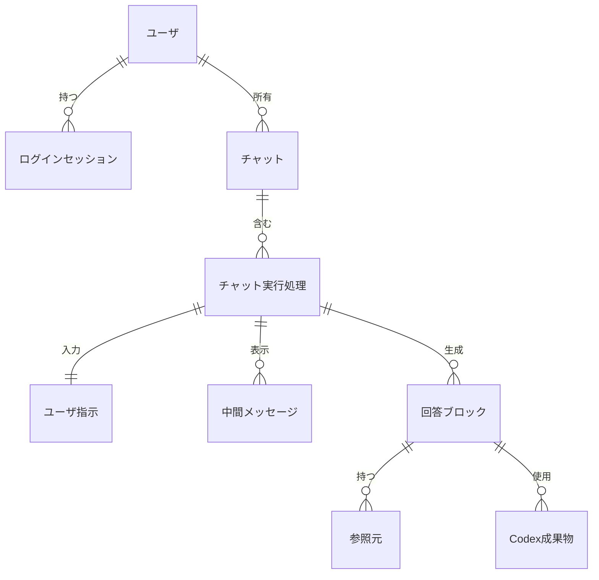

# 論理データ設計

## 1. 文書の目的

本書は、D-Conciergeで扱う主要データの論理構造、関連、保持方針を定義することを目的とする。

## 2. 前提

- 物理テーブル名、カラム名、インデックス、制約の実装詳細は内部設計で定義する。
- ユーザはアカウント登録で作成され、チャット履歴と作業領域はログインユーザごとに分離する。
- チャット履歴、ユーザ指示、実行状態、中間メッセージ、回答、参照元、Codex成果物メタ情報は削除操作が行われない限り保持する。トレースログは論理データの対象外であり、ファイル領域で保存期間と起動単位の同日上限に従って管理する。
- Codex成果物本体はアプリケーション管理下の保存領域にファイルとして保持し、DBには検証済み回答が使用するメタ情報だけを保存する。
- 検証結果は処理中の一時出力として扱い、DBの論理データ対象外とする。
- トレースログは論理データの対象外とする。
- アプリケーション設定は設定ファイルIFで扱い、DBの論理データ対象外とする。
- 参照元の参照位置情報はDBで保持し、画面バックエンドAPIで表示用参照元メタ情報として提供する。
- 参照元のPDFパスは共有データソースルートからの相対パスとして保持し、Codex作業領域上の `readonly/` 接頭辞や絶対パスは論理データに含めない。
- 識別子は、画面バックエンドAPIで扱える一意なIDとする。

## 3. エンティティ一覧

| エンティティ | 概要 |
| --- | --- |
| ユーザ | ログイン利用者を識別し、ユーザ名、認証情報、利用状態を管理する情報。 |
| ログインセッション | ブラウザごとのログイン状態を管理する情報。 |
| チャット | 一連のユーザ指示応答をまとめる単位。 |
| ユーザ指示 | 利用者が送信した1回分の自然文入力。 |
| チャット実行処理 | ユーザ指示に対する回答生成、検証、キャンセル、終了状態を管理する処理単位。 |
| 中間メッセージ | 履歴再表示で利用する、画面表示用に整形済みの途中状況メッセージ。 |
| 回答ブロック | 完了したチャット実行処理に紐づき、Codex出力の `answers` 単位で保持する検証済み回答ブロック本文と表示順。 |
| 参照元 | 回答ブロックの根拠となるデータソース種別、表示名、位置情報。 |
| Codex成果物 | 回答ブロックが使用する保存済み成果物のメタ情報。 |

## 4. ER図

## 5. エンティティ定義

### 5.1. ユーザ

| 属性名 | 説明 | 型 | 主キー | 外部キー | 必須 | 備考 |
| --- | --- | --- | --- | --- | --- | --- |
| ユーザID | ログイン識別子。 | 識別子 | 〇 |  | 〇 | 登録後は変更できない。1文字以上30文字以内で、半角英数字、`_`、`-` を使用できる。先頭と末尾は半角英数字とする。 |
| ユーザ名 | 画面上の利用者表示名。 | 文字列 |  |  | 〇 | 1文字以上30文字以内。登録後に変更できる。 |
| 認証情報 | パスワード検証に必要な情報。 | 秘密情報 |  |  | 〇 | 平文パスワードは保存しない。 |
| ユーザ状態 | ログイン可否と削除処理を判断する状態。 | `active` / `deleting` |  |  | 〇 | 削除中ユーザは通常操作対象外とする。 |

### 5.2. ログインセッション

| 属性名 | 説明 | 型 | 主キー | 外部キー | 必須 | 備考 |
| --- | --- | --- | --- | --- | --- | --- |
| ログインセッション内部ID | ブラウザごとのログイン状態を識別する内部ID。 | 連番 | 〇 |  | 〇 | ブラウザへは発行しない。 |
| ログインセッショントークン照合情報 | Cookieへ発行したログインセッショントークンを照合する情報。 | 秘密情報 |  |  | 〇 | ログインセッショントークンの生値は保存しない。 |
| ユーザID | セッションを所有するユーザのID。 | 識別子 |  | 〇 | 〇 | アカウント削除時は対象ユーザの全セッションを削除する。 |
| 有効期限 | Cookieの長期保持と整合する期限。 | 日時 |  |  | 〇 | Cookieの `Max-Age` は400日とする。 |

### 5.3. チャット

| 属性名 | 説明 | 型 | 主キー | 外部キー | 必須 | 備考 |
| --- | --- | --- | --- | --- | --- | --- |
| チャットID | チャットを一意に識別するID。 | 識別子 | 〇 |  | 〇 |  |
| ユーザID | チャットを所有するユーザのID。 | 識別子 |  | 〇 | 〇 | ログインユーザごとの履歴分離に利用する。 |
| セッションID | codex execの作業領域を決める内部ID。 | 識別子 |  |  | 〇 | チャットID、チャット実行処理ID、生成用Codex側の会話継続ID、検証用Codex側の会話継続IDとは別の識別子として管理する。 |
| チャットタイトル | 履歴一覧に表示するタイトル。 | 文字列 |  |  | 〇 | 最初のユーザ指示本文を正規化し、最大50文字で保存する。 |
| チャット状態 | チャット単位のライフサイクル状態。 | `active` / `deleting` |  |  | 〇 | 削除要求受付後は削除中にし、履歴一覧、履歴再表示、継続指示、参照元表示、Codex成果物配信の対象外にする。 |
| 生成用Codex側の会話継続ID | 生成用codex execの継続指示で使う会話継続ID。 | 識別子 |  |  |  | D-ConciergeのチャットID、セッションID、チャット実行処理IDとは別の識別子として管理する。 |
| 検証用Codex側の会話継続ID | 検証用codex execの2回目以降の検証で使う会話継続ID。 | 識別子 |  |  |  | 生成用Codex側の会話継続IDとは別の識別子として管理する。 |
| 最終更新日時 | 履歴一覧の並び順に使う更新日時。 | 日時 |  |  | 〇 | チャット実行処理開始時と終了状態確定時に更新する。 |

### 5.4. ユーザ指示

| 属性名 | 説明 | 型 | 主キー | 外部キー | 必須 | 備考 |
| --- | --- | --- | --- | --- | --- | --- |
| ユーザ指示ID | 利用者が送信した1回分のユーザ指示を一意に識別するID。 | 識別子 | 〇 |  | 〇 |  |
| チャット実行処理ID | 対象となるチャット実行処理のID。 | 識別子 |  | 〇 | 〇 | 本システムではチャット実行処理と1対1で対応する。 |
| ユーザ指示本文 | 利用者が送信したユーザ指示本文。 | 文字列 |  |  | 〇 |  |

### 5.5. チャット実行処理

| 属性名 | 説明 | 型 | 主キー | 外部キー | 必須 | 備考 |
| --- | --- | --- | --- | --- | --- | --- |
| チャット実行処理ID | ユーザ指示1回ごとの処理を一意に識別するID。 | 識別子 | 〇 |  | 〇 |  |
| チャットID | 所属するチャットのID。 | 識別子 |  | 〇 | 〇 |  |
| 実行状態 | チャット実行処理の現在状態。 | `accepted` / `running` / `validating` / `cancel_requested` / `canceled` / `completed` / `error` / `timed_out` |  |  | 〇 |  |
| 開始日時 | ユーザ指示を受け付け、チャット実行処理を開始した日時。 | 日時 |  |  | 〇 | 履歴詳細の並び順に使う。 |
| 実行期限日時 | 回答生成から検証完了までの全体タイムアウト基準となる日時。 | 日時 |  |  |  | 画面表示用のAPI項目には含めない。 |
| 終了日時 | 完了、キャンセル済み、エラー、タイムアウトが確定した日時。 | 日時 |  |  |  | 終了前は未設定となる。 |
| 利用者向けメッセージ | 状態やエラーを利用者へ説明する文言。 | 文字列 |  |  |  | 内部例外やトレースログ詳細は含めない。 |

### 5.6. 中間メッセージ

| 属性名 | 説明 | 型 | 主キー | 外部キー | 必須 | 備考 |
| --- | --- | --- | --- | --- | --- | --- |
| 中間メッセージID | 中間メッセージを一意に識別するID。 | 識別子 | 〇 |  | 〇 |  |
| チャット実行処理ID | 対象となるチャット実行処理のID。 | 識別子 |  | 〇 | 〇 |  |
| メッセージ本文 | 利用者画面に表示する中間メッセージ本文。 | 文字列 |  |  | 〇 | 整形・マスク済みの本文だけを保存し、内部パス、秘密情報、生JSONL、コマンド出力は含めない。 |
| 作成日時 | 中間メッセージを作成した日時。 | 日時 |  |  | 〇 | 画面表示と履歴再表示の並び順に使う。 |

### 5.7. 回答ブロック

| 属性名 | 説明 | 型 | 主キー | 外部キー | 必須 | 備考 |
| --- | --- | --- | --- | --- | --- | --- |
| 回答ブロックID | 回答ブロックを一意に識別するID。 | 識別子 | 〇 |  | 〇 |  |
| チャット実行処理ID | 対象となるチャット実行処理のID。 | 識別子 |  | 〇 | 〇 | 完了状態のチャット実行処理に紐づく。 |
| 表示順 | チャット実行処理内での表示順。 | 整数 |  |  | 〇 | Codex出力の `answers` 配列順を保持する。 |
| 回答ブロック本文 | 検証済みの回答ブロック本文。 | 文字列 |  |  | 〇 | Markdown、表、コードブロック、Mermaid記法などを含む。 |

### 5.8. 参照元

| 属性名 | 説明 | 型 | 主キー | 外部キー | 必須 | 備考 |
| --- | --- | --- | --- | --- | --- | --- |
| 参照元ID | 参照元を一意に識別するID。 | 識別子 | 〇 |  | 〇 |  |
| 回答ブロックID | 対象となる回答ブロックのID。 | 識別子 |  | 〇 | 〇 |  |
| 表示順 | 回答ブロック内での表示順。 | 整数 |  |  | 〇 | 回答ブロックごとにCodex出力の参照元配列順を保持する。 |
| 参照元種別 | 実装済み参照元ビューアを選択するための種別。 | 文字列 |  |  | 〇 |  |
| 表示ラベル | 画面に表示する参照元ラベル。 | 文字列 |  |  | 〇 |  |
| 参照位置情報 | 共有データソース内の対象PDFと位置を特定する情報。 | 構造化データ |  |  | 〇 | PDFパスは共有データソースルートからの相対パス、位置は開始ページと終了ページで保持する。 |

### 5.9. Codex成果物

| 属性名 | 説明 | 型 | 主キー | 外部キー | 必須 | 備考 |
| --- | --- | --- | --- | --- | --- | --- |
| Codex成果物ID | Codex成果物を一意に識別するID。 | 識別子 | 〇 |  | 〇 |  |
| 回答ブロックID | 対象となる回答ブロックのID。 | 識別子 |  | 〇 | 〇 |  |
| MIMEタイプ | 配信時に使用するMIMEタイプ。 | 文字列 |  |  | 〇 | HTTP `Content-Type` として使用する。 |
| 保存先参照 | `<user-id>/<run_id>/<artifact_id>.<拡張子>` 形式で `generator.saved_artifacts_dir` からの相対パス。 | 文字列 |  |  | 〇 | OS依存の絶対パスを利用者へ表示しない。 |
| 作成日時 | 保存済みCodex成果物として作成した日時。 | 日時 |  |  | 〇 |  |

## 6. 保持方針

| 項目 | 方針 |
| --- | --- |
| チャット履歴 | 削除操作が行われない限り保持する。 |
| ユーザ、ログインセッション | アカウント削除が行われない限り保持する。ログアウト時は対象ログインセッションを削除する。有効期限を過ぎたログインセッションは認証状態確認時またはアプリケーション起動時に削除する。 |
| ユーザ指示 | 履歴再表示で利用するため、削除操作が行われない限り保持する。 |
| チャット実行処理 | 完了、キャンセル済み、エラー、タイムアウトを含め、削除操作が行われない限り状態付きで保持する。 |
| 中間メッセージ | 履歴再表示で利用するため、画面表示用に整形・マスク済みの本文だけを削除操作が行われない限り保持する。 |
| 回答ブロック、参照元、Codex成果物メタ情報 | 履歴再表示で利用するため、削除操作が行われない限り保持する。 |
| チャット一式削除 | 手動削除では、チャット、ユーザ指示、チャット実行処理、中間メッセージ、回答ブロック、参照元、Codex成果物メタ情報をDB削除対象にする。あわせて、生成用作業ディレクトリ `<generator.workdir>/<user-id>/<session-id>`、検証用作業ディレクトリ `<validator.workdir>/<user-id>/<session-id>`、`generator.saved_artifacts_dir` 配下の保存済みCodex成果物実体と保存先ディレクトリを削除対象にする。自動削除は提供しない。トレースログは論理データとして扱わず、ログ設計の保存期間に従う。 |
| アカウント削除 | 対象ユーザ、ログインセッション、チャット、ユーザ指示、チャット実行処理、中間メッセージ、回答ブロック、参照元、Codex成果物メタ情報をDB削除対象にする。あわせて、対象ユーザ配下の生成用・検証用作業領域と保存済みCodex成果物実体を削除対象にする。トレースログは削除対象外とする。 |

削除要求受付後のチャットは、物理削除が完了するまでDB上では削除中として扱う。削除中のチャットは履歴一覧、履歴再表示、継続指示、参照元表示、Codex成果物配信の対象外であり、物理削除失敗時も利用者操作対象へ戻さない。

アカウント削除要求受付後のユーザは、物理削除が完了するまで削除中または通常操作不可として扱う。削除中ユーザはログイン、履歴表示、チャット実行処理、アカウント操作の対象外であり、物理削除失敗時も通常利用可能な状態へ戻さない。
