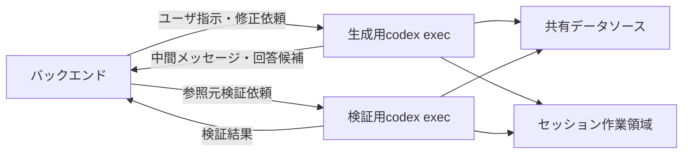

# codex exec IF

## 1. 文書の目的

本書は、D-Conciergeバックエンドとcodex execの間で利用する起動、入力、出力、キャンセル、異常時の扱いを定義することを目的とする。

## 2. 前提

- 生成用codex execと検証用codex execは別設定で実行する。
- それぞれのホームディレクトリには `AGENTS.md` とSkillsが含まれる。
- 作業ディレクトリはDBに保存されたユーザIDとセッションIDで分離する。
- 起動処理とキャンセル処理のOS差異はバックエンド内部で吸収する。
- 生成用codex execから得た未検証回答は、検証成功まで最終回答として扱わない。
- 生成用codex execと検証用codex execは、標準出力JSONLを逐次読み取れる起動方式で実行する。
- 最終回答または検証結果は、設定された出力契約に適合する構造化データとして受け取る。
- 継続指示では、初回実行時に取得した生成用Codex側の会話継続IDを指定して生成用codex execを `codex exec resume` で再開する。
- 検証用codex execは、初回検証時に取得した検証用Codex側の会話継続IDを指定して2回目以降の検証を `codex exec resume` で再開する。

## 3. インターフェース概要

### 3.1. 連携目的

| 項目 | 内容 |
| --- | --- |
| 文書名 | codex exec IF |
| 連携目的 | 回答生成と参照元検証を行うため。 |
| 関連業務 | チャット実行処理、キャンセル |
| 関連機能 | 回答生成、回答検証、キャンセル、トレースログ保存 |

### 3.2. 連携対象

| 項目 | 内容 |
| --- | --- |
| 送信元または起動元 | バックエンド |
| 受信先または処理先 | 生成用codex exec、検証用codex exec |
| 方向 | 双方向 |
| 主要情報 | ユーザ指示本文、出力契約、生成用Codex側の会話継続ID、検証用Codex側の会話継続ID、JSONLイベント、回答候補、参照元、検証結果、中間メッセージ、Codex成果物候補 |

### 3.3. 連携全体像

## 4. IF一覧

| IFID | IF名 | 用途 | 起動トリガー | 方向 | 連携方式 | 関連機能 | 備考 |
| --- | --- | --- | --- | --- | --- | --- | --- |
| IF-CX-01 | 生成用codex exec起動 | 回答候補を生成する。 | ユーザ指示送信受付後、継続指示受付後、または再生成時 | 送信 / 受信 | プロセス実行 | 回答生成、トレースログ保存 | 継続指示では生成用Codex側の会話継続IDを指定して `codex exec resume` で再開する。 |
| IF-CX-02 | 検証用codex exec起動 | 参照元が回答を支えるか検証する。 | 形式検証成功後 | 送信 / 受信 | プロセス実行 | 回答検証、トレースログ保存 | 2回目以降は検証用Codex側の会話継続IDを指定して `codex exec resume` で再開する。 |
| IF-CX-03 | codex execキャンセル | 実行中のcodex exec連携処理を終了させる。 | 利用者のキャンセル要求時 | 送信 / 受信 | プロセス制御 | キャンセル、トレースログ保存 | OS差異はバックエンド内部で吸収する。 |

## 5. IF詳細

### 5.1. IF-CX-01 生成用codex exec起動

#### 5.1.1. 起動トリガー

| 項目 | 内容 |
| --- | --- |
| 起動トリガー | ユーザ指示送信受付後、継続指示受付後、または再生成時 |
| 実施タイミング | チャット実行処理の状態を実行中にするとき |
| 実施条件 | 生成用ホームディレクトリ、生成用作業領域、出力契約を利用できること。継続指示時は生成用Codex側の会話継続IDを利用できること。 |

#### 5.1.2. 入力情報

| 項目名 | 必須 | 型・形式 | 制約 | 備考 |
| --- | --- | --- | --- | --- |
| ユーザ指示本文 | 必須 | 文字列 | 空文字は不可。 | 利用者が送信したユーザ指示。 |
| 出力契約 | 必須 | 構造化データ | 最終回答が満たすべき構造を示す。codex execが受理できる形式であること。 | `generator.output_schema` から導出し、起動時に出力スキーマとして指定する。 |
| 生成用Codex側の会話継続ID | 継続指示時必須 | 識別子 | 新規チャットでは指定しない。継続指示では初回実行時に取得した値を指定する。 | JSONLの `thread.started.thread_id` で得たID。 |
| セッション作業領域 | 必須 | パス | ユーザIDとセッションIDで分離する。 | OS依存表現は利用者へ表示しない。 |
| 生成用ホームディレクトリ | 必須 | パス | `AGENTS.md` とSkillsを含む。 | 設定ファイルから導出する。 |

#### 5.1.3. 出力情報

| 項目名 | 必須 | 型・形式 | 制約 | 備考 |
| --- | --- | --- | --- | --- |
| JSONLイベント | 必須 | 構造化データ | 標準出力から行単位で読み取る。内部パス、コマンド、標準出力を利用者画面へ直接表示しない。 | 実行状態、中間メッセージ候補、最終回答候補、エラーを判定する。 |
| 生成用Codex側の会話継続ID | 必須 | 識別子 | 新規チャット初回実行後は、以後の継続指示で利用できるよう保存する。 | JSONLの `thread.started.thread_id` で得たID。 |
| 中間メッセージ候補 | 任意 | 構造化データ | `item.completed` の `agent_message.text` が `payload.kind="progress"` のJSONである場合だけ対象にする。 | `payload.text` を画面へ配信する。`payload.kind="final"`、内部パス、コマンド、標準出力は配信しない。 |
| 回答候補 | 必須 | 構造化データ | 出力契約に適合すること。検証成功まで最終回答として扱わない。 | 最後のエージェントメッセージを完了後に形式検証へ渡す。 |
| Codex成果物候補 | 任意 | ファイルまたは参照情報 | 回答候補が参照する一時成果物であること。 | 検証済み回答が参照するものだけを保存済みCodex成果物にする。 |

#### 5.1.4. 正常時の扱い

| 項目 | 内容 |
| --- | --- |
| 正常終了条件 | 生成用Codex側の会話継続IDを取得し、完了イベントを受信し、最後のエージェントメッセージから出力契約に適合する回答候補を取得できること。 |
| 結果通知 | 安全に抽出できた中間メッセージをSSEへ渡し、回答候補をバックエンドへ返す。 |
| 後続処理 | 生成用Codex側の会話継続IDをチャットに紐づけて保存する。回答候補とCodex成果物候補を形式検証へ渡す。 |

#### 5.1.5. 異常時の扱い

| 異常事象 | 検知方法 | システムの扱い | 業務上の扱い | 再実行方針 |
| --- | --- | --- | --- | --- |
| 起動失敗 | codex execプロセスを開始できない。 | チャット実行処理の状態をエラーにし、トレースログを保存する。 | 回答を表示できない。 | 利用者による同一ユーザ指示の再送で再実行する。 |
| タイムアウト | 設定された時間内に完了しない。 | チャット実行処理の状態をタイムアウトにし、トレースログを保存する。 | タイムアウトを表示する。 | 利用者が必要に応じて再送する。 |
| 出力契約不正 | codex execが出力契約を受理せず、起動後にエラーを返す。 | チャット実行処理の状態をエラーにし、トレースログを保存する。 | 回答を表示できない。 | 設定修正後に再実行する。 |
| Codex JSONLエラー | JSONLで `type:error` または `turn.failed` を受信する。 | チャット実行処理の状態をエラーにし、Codexのエラーメッセージをトレースログに保存する。 | AIサービスプロバイダ側エラーを表示する。 | 利用者が必要に応じて再送する。 |
| プロセス異常終了 | JSONLエラーを受信せずにcodex execが非ゼロ終了する。 | チャット実行処理の状態をエラーにし、終了コードと標準エラー要約をトレースログに保存する。 | 予期しないエラーを表示する。 | 運用者確認後に再実行する。 |
| 最終回答欠落 | 完了イベントを受信したが最終回答候補を取得できない。 | チャット実行処理の状態をエラーにし、トレースログを保存する。 | 回答を表示できない。 | 利用者が必要に応じて再送する。 |
| 生成用会話継続ID不正 | 継続指示時に指定した生成用Codex側の会話継続IDで再開できない。 | チャット実行処理の状態をエラーにし、トレースログを保存する。 | 継続指示の回答を表示できない。 | 利用者が必要に応じて新規チャットとして再送する。 |

### 5.2. IF-CX-02 検証用codex exec起動

#### 5.2.1. 起動トリガー

| 項目 | 内容 |
| --- | --- |
| 起動トリガー | 形式検証成功後 |
| 実施タイミング | チャット実行処理の状態を検証中にするとき |
| 実施条件 | 回答候補、参照元情報、検証指示、検証用作業領域を利用できること。2回目以降の検証では検証用Codex側の会話継続IDを利用できること。 |

#### 5.2.2. 入力情報

| 項目名 | 必須 | 型・形式 | 制約 | 備考 |
| --- | --- | --- | --- | --- |
| 回答候補 | 必須 | 構造化データ | 形式検証に成功していること。 | 生成用codex execの最終回答候補をJSONとしてパースしたもの。 |
| 参照元情報 | 必須 | 構造化データ | 回答候補の根拠として検証対象にする。 |  |
| 検証指示 | 必須 | 文字列または構造化データ | 参照元検証の観点を示す。 | 検証用ホームディレクトリの指示に従う。 |
| 検証用Codex側の会話継続ID | 2回目以降必須 | 識別子 | 同一チャットの初回検証では指定しない。2回目以降の検証では初回検証時に取得した値を指定する。 | JSONLの `thread.started.thread_id` で得たID。 |
| 検証結果出力契約 | 必須 | 構造化データ | 検証結果と中間メッセージが満たすべき構造を示す。中間メッセージ用の `payload.kind="progress"` と最終検証結果用の `payload.kind="final"` をどちらもcodex execが受理できる形式であること。 | `validator.output_schema` から導出し、起動時に出力スキーマとして指定する。 |
| 検証用ホームディレクトリ | 必須 | パス | `AGENTS.md` とSkillsを含む。 | 設定ファイルから導出する。 |
| 検証用作業領域 | 必須 | パス | ユーザIDとセッションIDで分離する。 | OS依存表現は利用者へ表示しない。 |

#### 5.2.3. 出力情報

| 項目名 | 必須 | 型・形式 | 制約 | 備考 |
| --- | --- | --- | --- | --- |
| JSONLイベント | 必須 | 構造化データ | 標準出力から行単位で読み取る。内部パス、コマンド、標準出力を利用者画面へ直接表示しない。 | 検証状態、中間メッセージ候補、検証結果候補、エラーを判定する。 |
| 検証用Codex側の会話継続ID | 必須 | 識別子 | 同一チャットの2回目以降の検証で利用できるよう保存する。 | JSONLの `thread.started.thread_id` で得たID。 |
| 検証結果 | 必須 | 構造化データ | 参照元が回答内容を支えているかを示し、`payload.kind="final"`、`valid`、`comment` を満たす。 | 最後のエージェントメッセージを完了後に採用候補にし、バックエンドで最終出力固定検証を行う。 |
| 中間メッセージ候補 | 任意 | 構造化データ | `item.completed` の `agent_message.text` が `payload.kind="progress"` のJSONである場合だけ対象にする。 | `payload.text` を画面へ配信する。`payload.kind="final"`、内部パス、コマンド、標準出力は配信しない。 |

#### 5.2.4. 正常時の扱い

| 項目 | 内容 |
| --- | --- |
| 正常終了条件 | 検証用Codex側の会話継続IDを取得し、完了イベントを受信し、最後のエージェントメッセージから `payload.kind="final"` の検証結果を取得できること。 |
| 結果通知 | 検証結果と、安全に抽出できた中間メッセージをバックエンドへ返す。 |
| 後続処理 | 検証用Codex側の会話継続IDをチャットに紐づけて保存する。検証成功時は回答を保存し、検証失敗時は設定上限まで再生成へ進める。 |

#### 5.2.5. 異常時の扱い

| 異常事象 | 検知方法 | システムの扱い | 業務上の扱い | 再実行方針 |
| --- | --- | --- | --- | --- |
| 検証失敗 | 検証結果が失敗となる。 | 設定上限まで再生成へ進める。 | 上限内では利用者へ最終回答を表示しない。 | 設定上限内でシステムが再生成する。 |
| 上限超過 | 再生成が設定上限に到達する。 | チャット実行処理の状態をエラーにし、トレースログへ記録する。 | 回答を表示できないことを示す。 | 利用者が必要に応じて再送する。 |
| Codex JSONLエラー | JSONLで `type:error` または `turn.failed` を受信する。 | チャット実行処理の状態をエラーにし、Codexのエラーメッセージをトレースログに保存する。 | AIサービスプロバイダ側エラーを表示する。 | 利用者が必要に応じて再送する。 |
| 検証処理失敗 | 検証用codex execの起動失敗または異常終了を検知する。 | チャット実行処理の状態をエラーにし、トレースログへ記録する。 | 回答を表示できないことを示す。 | 利用者が必要に応じて再送する。 |
| 検証出力形式不正 | 完了イベントを受信したが、最終検証結果候補が `payload.kind="final"`、`valid`、`comment` を満たさない。 | `validator.max_retries` の範囲で同じ検証用Codex会話へ最終検証結果JSONの再出力を依頼する。上限後も不正な場合はチャット実行処理の状態をエラーにし、トレースログへ記録する。 | 再出力中は回答表示を保留し、上限後は回答を表示できないことを示す。 | 利用者が必要に応じて再送する。 |
| 検証用会話継続ID不正 | 2回目以降の検証または再出力依頼で指定した検証用Codex側の会話継続IDで再開できない。 | チャット実行処理の状態をエラーにし、トレースログへ記録する。 | 回答を表示できないことを示す。 | 利用者が必要に応じて再送する。 |

### 5.3. IF-CX-03 codex execキャンセル

#### 5.3.1. 起動トリガー

| 項目 | 内容 |
| --- | --- |
| 起動トリガー | 利用者のキャンセル要求時 |
| 実施タイミング | キャンセル要求を受け付け、状態をキャンセル要求中にした後 |
| 実施条件 | 対象チャット実行処理に紐づくcodex exec連携処理が実行中であること。 |

#### 5.3.2. 入力情報

| 項目名 | 必須 | 型・形式 | 制約 | 備考 |
| --- | --- | --- | --- | --- |
| チャット実行処理ID | 必須 | UUID文字列 | キャンセル対象の実行を指定する。 | API項目名: `run_id` |
| 対象プロセス情報 | 必須 | 構造化データ | OS差異をバックエンド内部で吸収できる情報を含む。 | 利用者へは表示しない。 |

#### 5.3.3. 出力情報

| 項目名 | 必須 | 型・形式 | 制約 | 備考 |
| --- | --- | --- | --- | --- |
| キャンセル結果 | 必須 | 成功 / 失敗 | 実行終了または終了不可を示す。 |  |

#### 5.3.4. 正常時の扱い

| 項目 | 内容 |
| --- | --- |
| 正常終了条件 | 対象codex exec連携処理を終了できること。 |
| 結果通知 | バックエンドへキャンセル結果を返す。 |
| 後続処理 | チャット実行処理の状態をキャンセル済みにし、部分回答や途中Codex成果物を最終回答にしない。 |

#### 5.3.5. 異常時の扱い

| 異常事象 | 検知方法 | システムの扱い | 業務上の扱い | 再実行方針 |
| --- | --- | --- | --- | --- |
| キャンセル失敗 | 対象プロセスを終了できない。 | トレースログへ保存し、利用者向けエラーを表示する。 | 利用者はキャンセル完了を確認できない。 | 状態再取得後に必要なら再要求する。 |
| 対象プロセスなし | 対象チャット実行処理に紐づく実行中プロセスを確認できない。 | 現在状態を確認し、完了済みならキャンセル不可として扱う。 | 利用者は最新状態を確認する。 | 履歴詳細を再取得する。 |

## 6. 共通事項

### 6.1. 共通データ項目

| 項目名 | 必須 | 型・形式 | 制約 | 備考 |
| --- | --- | --- | --- | --- |
| ユーザID | 必須 | 識別子 | 作業領域分離に利用する。 | ログインユーザのユーザIDを指す。 |
| セッションID | 必須 | 識別子 | 生成用と検証用で同じ値を使う。 | チャットに保存されたD-Concierge内部ID。チャット単位の作業領域に対応する。 |
| 生成用Codex側の会話継続ID | 任意 | 識別子 | 生成用codex execの継続指示で使う。 | D-ConciergeのセッションIDとは別に管理する。 |
| 検証用Codex側の会話継続ID | 任意 | 識別子 | 検証用codex execの2回目以降の検証で使う。 | 生成用Codex側の会話継続IDとは別に管理する。 |
| ホームディレクトリ | 必須 | パス | `AGENTS.md` とSkillsを含む。 | 生成用と検証用で別設定にできる。 |
| 作業ディレクトリ | 必須 | パス | ユーザIDとセッションIDで分離する。 | OS依存表現は利用者へ表示しない。 |
| 出力スキーマ | 必須 | 構造化データ | codex execが受理できるJSON Schemaであること。 | 生成用と検証用で別内容にできる。 |
| JSONLイベント | 必須 | 構造化データ | 標準出力に1行1イベントとして出力される。 | 利用者画面へそのまま表示しない。 |
| Codexエージェントメッセージ | 任意 | 構造化データ | `item.completed` の `agent_message.text` として出力されるJSON文字列。 | `payload.kind` により中間メッセージまたは最終結果を判定する。 |

### 6.2. JSONLメッセージ判定

| 判定対象 | 扱い |
| --- | --- |
| `payload.kind="progress"` のエージェントメッセージ受信時 | `payload.text` が非空文字列の場合だけ中間メッセージ候補として即時に扱う。 |
| `payload.kind="final"` のエージェントメッセージ受信時 | 中間メッセージ候補にせず、完了イベント受信時の最終回答候補または検証結果候補として扱う。 |
| 完了イベント受信時 | 最新の `agent_message.text` を最終回答候補または検証結果候補にする。 |
| `type:error` または `turn.failed` 受信時 | 最終結果を採用せず、`message` または `error.message` をトレースログに保存する。 |
| 失敗、キャンセル、タイムアウト、プロセス異常終了時 | 最新の `agent_message.text` を最終結果として採用しない。 |

中間メッセージ候補は、`payload.kind="progress"` の `payload.text` からだけ抽出する。生成用の `payload.kind="final"`、検証用の `payload.kind="final"`、内部パス、コマンド、標準出力は中間メッセージとして配信しない。Codex由来の中間メッセージがない場合でも、バックエンドは処理段階に応じた定型メッセージを配信する。

### 6.3. 共通エラー・異常時の扱い

| 異常事象 | 検知方法 | システムの扱い | 業務上の扱い | 再実行方針 |
| --- | --- | --- | --- | --- |
| 内部パスまたは秘密情報混入 | 中間メッセージや出力内容の検査で検知する。 | 利用者向け表示に出さず、必要に応じてトレースログを保存する。 | 利用者へ内部情報を開示しない。 | 原則として自動再実行しない。 |
| OS差異による起動または終了失敗 | バックエンドの実行制御で異常を検知する。 | トレースログへOS名と実行制御結果を保存する。 | 利用者には共通のエラーとして表示する。 | 運用者確認後に再実行する。 |
| 設定不足 | ホームディレクトリ、作業ディレクトリ、指示ファイルを確認できない。 | 対象チャット実行処理をエラーにする。 | 回答生成または検証を開始できない。 | 設定修正後に再実行する。 |
| JSONL解析失敗 | 標準出力のイベントを構造化データとして解釈できない。 | 対象チャット実行処理をエラーにし、トレースログを保存する。 | 回答または検証結果を表示できない。 | 利用者が必要に応じて再送する。 |

## 7. 運用上の留意事項

- 起動時のパス、ホームディレクトリ、作業ディレクトリは設定ファイルから導出する。
- 起動時は標準出力JSONLと出力スキーマを利用し、最終結果もJSONLから取得する。
- 継続指示時は、同じ生成用作業ディレクトリを指定し、生成用Codex側の会話継続IDで生成用codex execを `codex exec resume` により再開する。
- 2回目以降の検証時は、同じ検証用作業ディレクトリを指定し、検証用Codex側の会話継続IDで検証用codex execを `codex exec resume` により再開する。
- 新規チャット初回実行では、チャットに保存されたセッションIDで作業領域を作成する。
- 継続指示では、チャットIDから保存済みセッションIDを取得し、同じ作業領域を再利用する。
- 生成用と検証用は同じユーザIDとセッションIDを使って対応付けるが、生成用Codex側の会話継続IDと検証用Codex側の会話継続IDは別々に管理する。
- 共有データソースはセッションごとに複製しない。
- 中間メッセージ候補やJSONLイベントには内部パス、秘密情報、環境変数を表示しない。
- コマンド実行時の通知に含まれるコマンド文字列、標準出力、絶対パスは利用者画面へ直接表示しない。
- Windows/Linuxの具体的なプロセス制御差異はバックエンド内部に閉じ込め、キャンセル時は子プロセスを含めて終了要求を送る。
