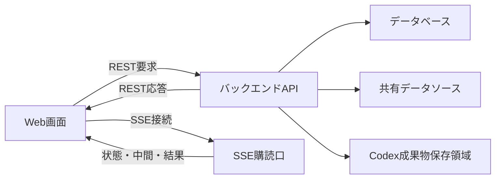

# 画面バックエンドAPI IF

## 1. 文書の目的

本書は、D-ConciergeのWeb画面とバックエンド間で利用するREST API、SSE、参照元データ配信、Codex成果物配信のインターフェースを定義することを目的とする。

## 2. 前提

- APIのベースパスは `/api` とする。
- REST APIはユーザ指示受付、履歴取得、キャンセル、参照元データ取得、Codex成果物取得に利用する。
- SSEは実行状態、中間メッセージ、最終回答、エラー、キャンセル結果の配信に利用する。
- `chat_id` はチャットID、`run_id` はチャット実行処理IDとして扱う。
- `reference_id` は参照元IDとして扱う。
- `artifact_id` はCodex成果物IDとして扱う。
- `chat_id`、`run_id`、`reference_id`、`artifact_id` はUUID形式とする。
- 履歴詳細とSSE最終回答の参照元は、画面表示用に整形した表示用参照元メタ情報として返す。
- 表示中チャットで意図せずSSEが切断された場合は利用者向けエラー表示とする。
- 内部パス、秘密情報、スタックトレースは応答に含めない。
- 履歴タイトル、履歴一覧更新、SSE購読解除・再接続の共通ルールは「チャット履歴・実行中表示設計」に従う。

## 3. インターフェース概要

### 3.1. 連携目的

| 項目 | 内容 |
| --- | --- |
| 文書名 | 画面バックエンドAPI IF |
| 連携目的 | Web画面からチャット実行処理、キャンセル、履歴再表示、参照元表示を行うため。 |
| 関連業務 | チャット実行処理、キャンセル、履歴再表示 |
| 関連機能 | アプリ設定取得、新規チャット開始、継続指示、SSE配信、履歴表示、参照元表示、Codex成果物配信 |

### 3.2. 連携対象

| 項目 | 内容 |
| --- | --- |
| 送信元または起動元 | Web画面 |
| 受信先または処理先 | バックエンド |
| 方向 | 双方向 |
| 主要情報 | 画面設定、ユーザ指示、実行状態、回答、参照元、参照元データ、Codex成果物、エラー |

### 3.3. 連携全体像

## 4. IF一覧

| IFID | IF名 | 用途 | 起動トリガー | 方向 | 連携方式 | 関連機能 | 備考 |
| --- | --- | --- | --- | --- | --- | --- | --- |
| IF-SB-01 | アプリ設定取得 | 開始画面表示に必要な設定を取得する。 | Web画面起動時 | 受信 | REST GET | アプリ設定取得 | URL: `/api/app-config` |
| IF-SB-02 | 新規チャット開始 | 新規チャット作成と最初のユーザ指示送信を同時に行う。 | 開始画面でユーザ指示を送信したとき | 送信 / 受信 | REST POST | 新規チャット開始 | URL: `/api/chats/start` |
| IF-SB-03 | 継続ユーザ指示送信 | 既存チャットへ追加指示する。 | チャット画面で既存チャットへ追加指示したとき | 送信 / 受信 | REST POST | 継続指示 | URL: `/api/chats/{chat_id}/runs` |
| IF-SB-04 | 履歴一覧取得 | チャット履歴一覧を取得する。 | チャット画面表示時または履歴更新時 | 受信 | REST GET | 履歴一覧表示 | URL: `/api/chat-histories` |
| IF-SB-05 | 履歴詳細取得 | チャット詳細を取得する。 | 利用者が履歴を選択したとき | 送信 / 受信 | REST GET | 履歴詳細表示 | URL: `/api/chats/{chat_id}` |
| IF-SB-06 | 実行SSE購読 | チャット実行処理の状態、中間メッセージ、結果を購読する。 | ユーザ指示送信RESTの受付後 | 受信 | SSE | SSE配信 | URL: `/api/chats/{chat_id}/runs/{run_id}/sse` |
| IF-SB-07 | キャンセル要求 | 実行中のチャット実行処理をキャンセルする。 | チャット画面でキャンセル操作を行ったとき | 送信 / 受信 | REST POST | キャンセル | URL: `/api/chats/{chat_id}/runs/{run_id}/cancel` |
| IF-SB-08 | Codex成果物取得 | 保存済みCodex成果物を取得する。 | 回答表示でCodex成果物が必要になったとき | 送信 / 受信 | REST GET | Codex成果物配信 | URL: `/api/artifacts/{artifact_id}`。Codex成果物専用 |
| IF-SB-09 | 参照元データ取得 | 参照元ビューアで表示する参照元データを取得する。 | 参照元ビューア表示時 | 送信 / 受信 | REST GET | 参照元表示 | URL: `/api/references/{reference_id}` |

## 5. IF詳細

### 5.1. IF-SB-01 アプリ設定取得

#### 5.1.1. 起動トリガー

| 項目 | 内容 |
| --- | --- |
| 起動トリガー | Web画面起動時 |
| 実施タイミング | 開始画面またはチャット画面の初期表示前 |
| 実施条件 | Web画面がバックエンドへ接続できること |

#### 5.1.2. 入力情報

| 項目名 | 必須 | 型・形式 | 制約 | 備考 |
| --- | --- | --- | --- | --- |
| 入力情報なし | 任意 | なし | なし | リクエストボディは使用しない。 |

#### 5.1.3. 出力情報

| 項目名 | 必須 | 型・形式 | 制約 | 備考 |
| --- | --- | --- | --- | --- |
| ウェルカムメッセージ | 任意 | 文字列 | 未設定時は返さない、または空扱いとする。 | API項目名: `welcome_message` |
| 入力候補 | 任意 | 文字列配列 | 未設定時は返さない、または空配列扱いとする。 | API項目名: `input_suggestions` |

#### 5.1.4. 正常時の扱い

| 項目 | 内容 |
| --- | --- |
| 正常終了条件 | 画面表示設定を取得できること。 |
| 結果通知 | REST応答で画面へ設定値を返す。 |
| 後続処理 | 開始画面のウェルカムメッセージと入力候補チップへ反映する。 |

#### 5.1.5. 異常時の扱い

| 異常事象 | 検知方法 | システムの扱い | 業務上の扱い | 再実行方針 |
| --- | --- | --- | --- | --- |
| 設定取得失敗 | バックエンド処理で設定を取得できない。 | 利用者向けエラーを返さず、設定なし相当で応答する。 | 画面は利用できるが、ウェルカムメッセージと入力候補チップを表示しない。 | 画面再読み込み時に再取得する。 |

### 5.2. IF-SB-02 新規チャット開始

#### 5.2.1. 起動トリガー

| 項目 | 内容 |
| --- | --- |
| 起動トリガー | 開始画面でユーザ指示を送信したとき |
| 実施タイミング | 利用者が送信操作を行った直後 |
| 実施条件 | ユーザ指示本文が入力されていること。 |

#### 5.2.2. 入力情報

| 項目名 | 必須 | 型・形式 | 制約 | 備考 |
| --- | --- | --- | --- | --- |
| ユーザ指示本文 | 必須 | 文字列 | 空文字は不可。 | API項目名: `user_instruction`。利用者が入力した最初のユーザ指示。 |

#### 5.2.3. 出力情報

| 項目名 | 必須 | 型・形式 | 制約 | 備考 |
| --- | --- | --- | --- | --- |
| チャットID | 必須 | UUID文字列 | 新規に採番する。 | API項目名: `chat_id` |
| チャット実行処理ID | 必須 | UUID文字列 | 新規に採番する。 | API項目名: `run_id` |
| SSE URL | 必須 | URL文字列 | 対象チャット実行処理のSSE購読口を返す。 |  |
| 受付状態 | 必須 | 列挙値 | 受付状態を返す。 |  |

#### 5.2.4. 正常時の扱い

| 項目 | 内容 |
| --- | --- |
| 正常終了条件 | チャット、最初のチャット実行処理、最初のユーザ指示を作成できること。 |
| 結果通知 | REST応答でチャットID、チャット実行処理ID、SSE URL、受付状態を返す。 |
| 後続処理 | 画面はSSE購読を開始し、履歴一覧を再取得する。 |

#### 5.2.5. 異常時の扱い

| 異常事象 | 検知方法 | システムの扱い | 業務上の扱い | 再実行方針 |
| --- | --- | --- | --- | --- |
| ユーザ指示受付失敗 | チャットまたはチャット実行処理を作成できない。 | 利用者向けエラーを返し、必要に応じてトレースログを保存する。 | チャットは開始されない。 | 利用者が再送できる。 |

### 5.3. IF-SB-03 継続ユーザ指示送信

#### 5.3.1. 起動トリガー

| 項目 | 内容 |
| --- | --- |
| 起動トリガー | チャット画面で既存チャットへ追加指示したとき |
| 実施タイミング | 利用者が継続指示を送信した直後 |
| 実施条件 | 対象チャットに未完了のチャット実行処理がないこと。 |

#### 5.3.2. 入力情報

| 項目名 | 必須 | 型・形式 | 制約 | 備考 |
| --- | --- | --- | --- | --- |
| チャットID | 必須 | UUID文字列 | 既存チャットを指定する。 | API項目名: `chat_id` |
| ユーザ指示本文 | 必須 | 文字列 | 空文字は不可。 | API項目名: `user_instruction`。利用者が入力した追加指示。 |

#### 5.3.3. 出力情報

| 項目名 | 必須 | 型・形式 | 制約 | 備考 |
| --- | --- | --- | --- | --- |
| チャット実行処理ID | 必須 | UUID文字列 | 新規に採番する。 | API項目名: `run_id` |
| SSE URL | 必須 | URL文字列 | 対象チャット実行処理のSSE購読口を返す。 |  |
| 受付状態 | 必須 | 列挙値 | 受付状態を返す。 |  |

#### 5.3.4. 正常時の扱い

| 項目 | 内容 |
| --- | --- |
| 正常終了条件 | 既存チャットに新しいチャット実行処理とユーザ指示を追加できること。 |
| 結果通知 | REST応答でチャット実行処理ID、SSE URL、受付状態を返す。 |
| 後続処理 | 画面はSSE購読を開始し、履歴一覧を再取得する。 |

#### 5.3.5. 異常時の扱い

| 異常事象 | 検知方法 | システムの扱い | 業務上の扱い | 再実行方針 |
| --- | --- | --- | --- | --- |
| 対象チャットなし | 指定されたチャットIDを確認できない。 | 対象なしのエラーを返す。 | 継続指示は受け付けない。 | 利用者が履歴を再選択してから再送する。 |
| 未完了処理中の継続指示 | 対象チャットに未完了のチャット実行処理がある。 | 新しいチャット実行処理とユーザ指示を保存せず、受付不可のエラーを返す。 | 現在の処理が終了状態になった後に送信できる。 | 終了状態になった後に利用者が再送する。 |

### 5.4. IF-SB-04 履歴一覧取得

#### 5.4.1. 起動トリガー

| 項目 | 内容 |
| --- | --- |
| 起動トリガー | チャット画面表示時または履歴更新時 |
| 実施タイミング | チャット画面初期表示時、ユーザ指示受付後、終了状態受信後 |
| 実施条件 | Web画面がバックエンドへ接続できること。 |

#### 5.4.2. 入力情報

| 項目名 | 必須 | 型・形式 | 制約 | 備考 |
| --- | --- | --- | --- | --- |
| 入力情報なし | 任意 | なし | なし | リクエストボディは使用しない。 |

#### 5.4.3. 出力情報

| 項目名 | 必須 | 型・形式 | 制約 | 備考 |
| --- | --- | --- | --- | --- |
| チャットID | 必須 | UUID文字列 | 履歴一覧の各行に含める。 | API項目名: `chat_id` |
| チャットタイトル | 必須 | 文字列 | サイドバーに表示する文字情報。 | API項目名: `title` |
| 最新チャット実行処理ID | 任意 | UUID文字列 | 最新のチャット実行処理から導出して返す。 | API項目名: `latest_run_id` |
| 最新チャット実行処理状態 | 必須 | 列挙値 | 最新のチャット実行処理から導出して返す。サイドバーには文字表示しない。 | API項目名: `latest_state` |
| 最終更新日時 | 必須 | 日時文字列 | 履歴一覧の並び順に利用する。 | API項目名: `updated_at` |

#### 5.4.4. 正常時の扱い

| 項目 | 内容 |
| --- | --- |
| 正常終了条件 | チャット履歴一覧を取得できること。 |
| 結果通知 | REST応答で履歴一覧を返す。 |
| 後続処理 | 画面はサイドバーへチャットタイトルだけを表示する。 |

#### 5.4.5. 異常時の扱い

| 異常事象 | 検知方法 | システムの扱い | 業務上の扱い | 再実行方針 |
| --- | --- | --- | --- | --- |
| 履歴一覧取得失敗 | 履歴一覧を取得できない。 | 利用者向けエラーを返し、必要に応じてトレースログを保存する。 | 履歴一覧を表示できない。 | 画面再表示または再取得操作で再試行する。 |

### 5.5. IF-SB-05 履歴詳細取得

#### 5.5.1. 起動トリガー

| 項目 | 内容 |
| --- | --- |
| 起動トリガー | 利用者が履歴を選択したとき |
| 実施タイミング | サイドバーでチャットタイトルを選択した直後 |
| 実施条件 | 履歴一覧に含まれるチャットIDを指定できること。 |

#### 5.5.2. 入力情報

| 項目名 | 必須 | 型・形式 | 制約 | 備考 |
| --- | --- | --- | --- | --- |
| チャットID | 必須 | UUID文字列 | 既存チャットを指定する。 | API項目名: `chat_id` |

#### 5.5.3. 出力情報

| 項目名 | 必須 | 型・形式 | 制約 | 備考 |
| --- | --- | --- | --- | --- |
| チャット実行処理一覧 | 必須 | 配列 | 開始日時の昇順で返す。 |  |
| ユーザ指示本文 | 必須 | 文字列 | 各チャット実行処理に紐づく。 | API項目名: `user_instruction` |
| 回答 | 任意 | 文字列 | 完了時のみ検証済み回答を返す。 |  |
| 参照元 | 任意 | 表示用参照元メタ情報配列 | 回答に参照元がある場合に返す。 | API項目名: `references`。参照元本体取得先は `url` とする。 |
| Codex成果物参照 | 任意 | 配列 | 回答内の画像、HTMLなどCodex成果物表示に必要な場合に返す。 |  |
| 実行状態 | 必須 | 列挙値 | 各チャット実行処理の状態を返す。 |  |
| 中間メッセージ | 任意 | 配列 | 保存済みの中間メッセージエンティティがある場合に返す。 | 画面表示用に整形・マスク済みの本文を返す。 |
| 利用者向けメッセージ | 任意 | 文字列 | エラー、キャンセル、タイムアウト時などに返す。 |  |

#### 5.5.4. 正常時の扱い

| 項目 | 内容 |
| --- | --- |
| 正常終了条件 | チャット詳細を取得できること。 |
| 結果通知 | REST応答で保存済み内容を返す。 |
| 後続処理 | 画面はチャット詳細を再表示し、継続中の実行があればSSEへ再接続する。 |

#### 5.5.5. 異常時の扱い

| 異常事象 | 検知方法 | システムの扱い | 業務上の扱い | 再実行方針 |
| --- | --- | --- | --- | --- |
| 対象チャットなし | 指定されたチャットIDを確認できない。 | 対象なしのエラーを返す。 | チャット詳細を表示できない。 | 利用者が履歴一覧を再取得して選択し直す。 |

### 5.6. IF-SB-06 実行SSE購読

#### 5.6.1. 起動トリガー

| 項目 | 内容 |
| --- | --- |
| 起動トリガー | ユーザ指示送信RESTの受付後 |
| 実施タイミング | 画面がSSE URLを受け取った直後 |
| 実施条件 | 対象チャット実行処理が存在すること。 |

#### 5.6.2. 入力情報

| 項目名 | 必須 | 型・形式 | 制約 | 備考 |
| --- | --- | --- | --- | --- |
| チャットID | 必須 | UUID文字列 | 既存チャットを指定する。 | API項目名: `chat_id` |
| チャット実行処理ID | 必須 | UUID文字列 | 購読対象の実行を指定する。 | API項目名: `run_id` |

#### 5.6.3. 出力情報

| 項目名 | 必須 | 型・形式 | 制約 | 備考 |
| --- | --- | --- | --- | --- |
| 状態通知 | 任意 | SSEイベント | 実行状態の変化時に配信する。 | event: `state` |
| 中間メッセージ | 任意 | SSEイベント | 生成または検証の途中状況を配信する。 | event: `message` |
| 最終回答 | 任意 | SSEイベント | 検証済み回答本文と表示用参照元メタ情報を配信する。 | event: `answer`。参照元の構造は履歴詳細取得と同じ。 |
| エラー | 任意 | SSEイベント | 利用者向けエラーを配信する。 | event: `error` |
| キャンセル結果 | 任意 | SSEイベント | キャンセル済みを配信する。 | event: `canceled` |

#### 5.6.4. 正常時の扱い

| 項目 | 内容 |
| --- | --- |
| 正常終了条件 | 完了、キャンセル済み、エラー、タイムアウトのいずれかを配信できること。 |
| 結果通知 | SSEで状態、中間メッセージ、最終結果を配信する。中間メッセージは画面表示用に整形・マスク済みの本文だけを履歴再表示用に保存する。 |
| 後続処理 | 画面は実行状態と回答表示を更新し、終了状態受信後に履歴一覧を再取得する。 |

#### 5.6.5. 異常時の扱い

| 異常事象 | 検知方法 | システムの扱い | 業務上の扱い | 再実行方針 |
| --- | --- | --- | --- | --- |
| 意図しないSSE切断 | 表示中チャットのSSE接続が予期せず切断される。 | 画面は利用者向けエラーを表示する。 | 実行自体はバックエンド側で継続する。 | 履歴詳細取得後、継続中なら再接続する。 |
| 対象実行なし | 指定されたチャット実行処理IDを確認できない。 | 対象なしのエラーを返す。 | 実行状態を購読できない。 | 履歴詳細を再取得する。 |

### 5.7. IF-SB-07 キャンセル要求

#### 5.7.1. 起動トリガー

| 項目 | 内容 |
| --- | --- |
| 起動トリガー | チャット画面でキャンセル操作を行ったとき |
| 実施タイミング | 利用者がキャンセルボタンを押した直後 |
| 実施条件 | 対象チャット実行処理が実行中または検証中であること。 |

#### 5.7.2. 入力情報

| 項目名 | 必須 | 型・形式 | 制約 | 備考 |
| --- | --- | --- | --- | --- |
| チャットID | 必須 | UUID文字列 | 既存チャットを指定する。 | API項目名: `chat_id` |
| チャット実行処理ID | 必須 | UUID文字列 | キャンセル対象の実行を指定する。 | API項目名: `run_id` |

#### 5.7.3. 出力情報

| 項目名 | 必須 | 型・形式 | 制約 | 備考 |
| --- | --- | --- | --- | --- |
| キャンセル要求受付状態 | 必須 | 列挙値 | キャンセル要求中を返す。 |  |

#### 5.7.4. 正常時の扱い

| 項目 | 内容 |
| --- | --- |
| 正常終了条件 | キャンセル要求を受け付け、実行状態をキャンセル要求中にできること。 |
| 結果通知 | REST応答でキャンセル要求受付状態を返し、SSEでキャンセル済みを配信する。 |
| 後続処理 | 部分回答や途中Codex成果物は最終回答として表示しない。 |

#### 5.7.5. 異常時の扱い

| 異常事象 | 検知方法 | システムの扱い | 業務上の扱い | 再実行方針 |
| --- | --- | --- | --- | --- |
| キャンセル不可 | 対象チャット実行処理が存在しない、または完了済みである。 | キャンセル不可のエラーを返す。 | 利用者は現在状態を確認する。 | 履歴詳細を再取得する。 |

### 5.8. IF-SB-08 Codex成果物取得

#### 5.8.1. 起動トリガー

| 項目 | 内容 |
| --- | --- |
| 起動トリガー | 回答表示でCodex成果物が必要になったとき |
| 実施タイミング | 回答内画像、HTMLなどを表示する直前 |
| 実施条件 | Codex成果物IDが保存済みであること。 |

#### 5.8.2. 入力情報

| 項目名 | 必須 | 型・形式 | 制約 | 備考 |
| --- | --- | --- | --- | --- |
| Codex成果物ID | 必須 | UUID文字列 | 保存済みCodex成果物を指定する。 | API項目名: `artifact_id` |

#### 5.8.3. 出力情報

| 項目名 | 必須 | 型・形式 | 制約 | 備考 |
| --- | --- | --- | --- | --- |
| Codex成果物本体 | 必須 | バイナリまたは文字列 | MIMEタイプに応じて返す。 |  |
| MIMEタイプ | 必須 | HTTPヘッダー | DBに保存したMIMEタイプを `Content-Type` として返す。 | JSON項目ではなくレスポンスヘッダーで扱う。 |

#### 5.8.4. 正常時の扱い

| 項目 | 内容 |
| --- | --- |
| 正常終了条件 | 保存済みCodex成果物を取得できること。 |
| 結果通知 | REST応答でCodex成果物本体を返し、MIMEタイプをHTTP `Content-Type` として返す。 |
| 後続処理 | 画面は回答内要素として表示する。 |

#### 5.8.5. 異常時の扱い

| 異常事象 | 検知方法 | システムの扱い | 業務上の扱い | 再実行方針 |
| --- | --- | --- | --- | --- |
| Codex成果物取得失敗 | 指定されたCodex成果物を取得できない。 | 表示できないことを返す。 | 回答本文の閲覧は継続し、該当要素だけ失敗表示にする。 | 画面再表示時に再取得する。 |

### 5.9. IF-SB-09 参照元データ取得

#### 5.9.1. 起動トリガー

| 項目 | 内容 |
| --- | --- |
| 起動トリガー | 参照元ビューア表示時 |
| API | `GET /api/references/{reference_id}` |
| 実施タイミング | 利用者が回答内の参照元リンクを選択した直後 |
| 実施条件 | 参照元IDが保存済みであること。 |

#### 5.9.2. 入力情報

| 項目名 | 必須 | 型・形式 | 制約 | 備考 |
| --- | --- | --- | --- | --- |
| 参照元ID | 必須 | UUID文字列 | 保存済み参照元を指定する。 | URLパスの `{reference_id}` に指定する。参照元ビューアは表示用参照元メタ情報の `url` を呼び出す。 |

#### 5.9.3. 出力情報

| 項目名 | 必須 | 型・形式 | 制約 | 備考 |
| --- | --- | --- | --- | --- |
| 参照元データ本体 | 必須 | バイナリまたは文字列 | 参照元種別とMIMEタイプに応じて返す。 | 共有データソース内の許可範囲から取得する。 |
| MIMEタイプ | 必須 | HTTPヘッダー | 取得対象に応じたMIMEタイプを `Content-Type` として返す。 | JSON項目ではなくレスポンスヘッダーで扱う。 |

#### 5.9.4. 正常時の扱い

| 項目 | 内容 |
| --- | --- |
| 正常終了条件 | 参照元種別と参照位置情報をもとに、共有データソース内の許可範囲から対象データを取得できること。 |
| 結果通知 | REST応答で参照元データ本体を返し、MIMEタイプをHTTP `Content-Type` として返す。 |
| 後続処理 | 画面は事前に受け取った表示用参照元メタ情報に基づき、参照元種別に対応する参照元ビューアへ表示する。 |

#### 5.9.5. 異常時の扱い

| 異常事象 | 検知方法 | システムの扱い | 業務上の扱い | 再実行方針 |
| --- | --- | --- | --- | --- |
| 参照元なし | 指定された参照元IDを確認できない。 | 対象なしのエラーを返す。 | 参照元を表示できない。 | 履歴詳細を再取得する。 |
| 未対応参照元種別 | 参照元種別に対応する取得処理がない。 | 表示できないことを返し、必要に応じてトレースログを保存する。 | 参照元を表示できない。 | 設定または参照元データを見直す。 |
| 許可範囲外参照 | 参照位置情報が許可範囲外を指している。 | 拒否し、内部情報を返さない。 | 参照元を表示できない。 | 再実行しない。 |
| 参照元取得失敗 | 共有データソースから対象データを取得できない。 | 表示できないことを返し、必要に応じてトレースログを保存する。 | 参照元を表示できない。 | 画面再表示時に再取得する。 |

## 6. 共通事項

### 6.1. 共通データ項目

| 項目名 | 必須 | 型・形式 | 制約 | 備考 |
| --- | --- | --- | --- | --- |
| チャットID | 必須 | UUID文字列 | チャットを一意に識別する。 | API項目名: `chat_id` |
| チャット実行処理ID | 必須 | UUID文字列 | ユーザ指示1回ごとの処理を一意に識別する。 | API項目名: `run_id` |
| 参照元ID | 必須 | UUID文字列 | 参照元を一意に識別する。 | 参照元本体取得APIのURLパス `{reference_id}` で使用する。 |
| Codex成果物ID | 必須 | UUID文字列 | Codex成果物を一意に識別する。 | API項目名: `artifact_id` |
| 最終更新日時 | 必須 | 日時文字列 | 履歴一覧の並び順に利用する。 | API項目名: `updated_at` |

### 6.2. 表示用参照元メタ情報

表示用参照元メタ情報は、履歴詳細取得とSSE最終回答で同じ構造とする。画面表示とビューア初期表示に使用する。

| 項目名 | 必須 | 型・形式 | 制約 | 備考 |
| --- | --- | --- | --- | --- |
| 参照元種別 | 必須 | 文字列 | 対応する参照元ビューアを選択できる値であること。 | API項目名: `source_type` |
| 表示ラベル | 必須 | 文字列 | 画面に表示できる文字列であること。 | API項目名: `label` |
| 参照元本体取得URL | 必須 | URL文字列 | 参照元本体取得APIを指すこと。 | API項目名: `url`。例: `/api/references/{reference_id}` |
| 参照位置 | 必須 | 構造化データ | 参照元種別ごとに画面表示とビューア初期位置指定へ使用する値であること。 | API項目名: `locator` |

PDF参照元の `locator` は次の項目で構成する。

| 項目名 | 必須 | 型・形式 | 制約 | 備考 |
| --- | --- | --- | --- | --- |
| 開始ページ番号 | 必須 | 整数 | 1以上。 | API項目名: `page_start` |
| 終了ページ番号 | 必須 | 整数 | 開始ページ番号以上。 | API項目名: `page_end` |

画面は、表示ラベルと参照位置から参照元表示文字列を組み立てる。PDFの場合、開始ページ番号と終了ページ番号が同じなら `XXXXX p.20`、異なるなら `XXXXX p.20-24` と表示する。

### 6.3. 共通エラー・異常時の扱い

| 異常事象 | 検知方法 | システムの扱い | 業務上の扱い | 再実行方針 |
| --- | --- | --- | --- | --- |
| 入力不正 | 必須項目不足、形式不正、空ユーザ指示を検知する。 | 受付せず、利用者が修正できるメッセージを返す。 | 対象処理は開始しない。 | 利用者が入力を修正して再実行する。 |
| 対象なし | 指定されたチャット、チャット実行処理、参照元、Codex成果物を確認できない。 | 対象なしのエラーを返す。 | 対象データを表示または操作できない。 | 履歴一覧または履歴詳細を再取得する。 |
| 内部失敗 | バックエンド内部の処理失敗を検知する。 | 利用者向けエラーを返し、トレースログを保存する。 | 利用者は処理を完了できない。 | 状況に応じて再実行する。 |
| 権限外参照 | 許可範囲外の参照を検知する。 | 拒否し、内部情報を返さない。 | 参照元またはCodex成果物を表示できない。 | 再実行しない。 |
