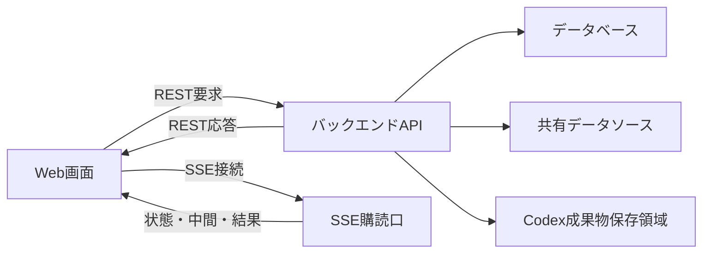

# 画面バックエンドAPI IF

## 1. 文書の目的

本書は、D-ConciergeのWeb画面とバックエンド間で利用するREST API、SSE、参照元データ配信、Codex成果物配信のインターフェースを定義することを目的とする。

## 2. 前提

- APIのベースパスは `/api` とする。
- REST APIは認証状態確認、アカウント登録、ログイン、ログアウト、アカウント変更、ユーザ指示受付、履歴取得、キャンセル、チャット削除、参照元データ取得、Codex成果物取得に利用する。
- SSEは実行状態、中間メッセージ、最終回答、エラー、キャンセル結果の配信に利用する。
- `chat_id` はチャットID、`run_id` はチャット実行処理IDとして扱う。
- `reference_id` は参照元IDとして扱う。
- `artifact_id` はCodex成果物IDとして扱う。
- `chat_id`、`run_id`、`reference_id`、`artifact_id` はUUID形式とする。
- 履歴詳細とSSE最終回答の参照元は、画面表示用に整形した表示用参照元メタ情報として返す。
- 表示中チャットで意図せずSSEが切断された場合は利用者向けエラー表示とする。
- 内部パス、秘密情報、スタックトレースは応答に含めない。
- 履歴タイトル、履歴一覧更新、SSE購読解除・再接続の共通ルールは「チャット履歴・実行中表示設計」に従う。

## 3. インターフェース概要

### 3.1. 連携目的

| 項目 | 内容 |
| --- | --- |
| 文書名 | 画面バックエンドAPI IF |
| 連携目的 | Web画面から認証、アカウント管理、チャット実行処理、キャンセル、履歴再表示、チャット削除、参照元表示を行うため。 |
| 関連業務 | 認証、アカウント管理、チャット実行処理、キャンセル、履歴再表示、チャット削除 |
| 関連機能 | 認証状態確認、アカウント登録、ログイン、ログアウト、ユーザ名変更、パスワード変更、アカウント削除、アプリ設定取得、新規チャット開始、継続指示、SSE配信、履歴表示、チャット削除、参照元表示、Codex成果物配信 |

### 3.2. 連携対象

| 項目 | 内容 |
| --- | --- |
| 送信元または起動元 | Web画面 |
| 受信先または処理先 | バックエンド |
| 方向 | 双方向 |
| 主要情報 | ログインセッション、ユーザ情報、画面設定、ユーザ指示、チャット状態、実行状態、回答、参照元、参照元データ、Codex成果物、エラー |

### 3.3. 連携全体像



## 4. IF一覧

| IFID | IF名 | 用途 | 起動トリガー | 方向 | 連携方式 | 関連機能 | 備考 |
| --- | --- | --- | --- | --- | --- | --- | --- |
| IF-SB-01 | アプリ設定取得 | 開始画面表示に必要な設定を取得する。 | ログイン後に開始画面を表示するとき | 受信 | REST GET | アプリ設定取得 | URL: `/api/app-config` |
| IF-SB-02 | 新規チャット開始 | 新規チャット作成と最初のユーザ指示送信を同時に行う。 | 開始画面でユーザ指示を送信したとき | 送信 / 受信 | REST POST | 新規チャット開始 | URL: `/api/chats/start` |
| IF-SB-03 | 継続ユーザ指示送信 | 既存チャットへ追加指示する。 | チャット画面で既存チャットへ追加指示したとき | 送信 / 受信 | REST POST | 継続指示 | URL: `/api/chats/{chat_id}/runs` |
| IF-SB-04 | 履歴一覧取得 | チャット履歴一覧を取得する。 | チャット画面表示時または履歴更新時 | 受信 | REST GET | 履歴一覧表示 | URL: `/api/chat-histories` |
| IF-SB-05 | 履歴詳細取得 | チャット詳細を取得する。 | 利用者が履歴を選択したとき | 送信 / 受信 | REST GET | 履歴詳細表示 | URL: `/api/chats/{chat_id}` |
| IF-SB-06 | 実行SSE購読 | チャット実行処理の状態、中間メッセージ、結果を購読する。 | ユーザ指示送信RESTの受付後 | 受信 | SSE | SSE配信 | URL: `/api/chats/{chat_id}/runs/{run_id}/sse` |
| IF-SB-07 | キャンセル要求 | 受付、実行中、検証中のチャット実行処理をキャンセルする。 | チャット画面でキャンセル操作を行ったとき | 送信 / 受信 | REST POST | キャンセル | URL: `/api/chats/{chat_id}/runs/{run_id}/cancel` |
| IF-SB-08 | Codex成果物取得 | 保存済みCodex成果物を取得する。 | 回答表示でCodex成果物が必要になったとき | 送信 / 受信 | REST GET | Codex成果物配信 | URL: `/api/artifacts/{artifact_id}`。Codex成果物専用 |
| IF-SB-09 | 参照元データ取得 | 参照元ビューアで表示する参照元データを取得する。 | 参照元ビューア表示時 | 送信 / 受信 | REST GET | 参照元表示 | URL: `/api/references/{reference_id}` |
| IF-SB-10 | チャット削除 | チャットを削除中にし、後続の物理削除を開始する。 | チャット画面または履歴項目メニューで削除操作を行ったとき | 送信 / 受信 | REST DELETE | チャット削除 | URL: `/api/chats/{chat_id}` |
| IF-SB-11 | 認証状態確認 | ログインセッションからログイン中ユーザを取得する。 | 保護対象画面表示時 | 受信 | REST GET | 認証状態確認 | URL: `/api/auth/me` |
| IF-SB-12 | アカウント登録 | ユーザID、ユーザ名、パスワードを登録し、ログインセッションを発行する。 | アカウント登録画面で登録操作を行ったとき | 送信 / 受信 | REST POST | アカウント登録 | URL: `/api/auth/register` |
| IF-SB-13 | ログイン | ユーザIDとパスワードで認証し、ログインセッションを発行する。 | ログイン画面でログイン操作を行ったとき | 送信 / 受信 | REST POST | ログイン | URL: `/api/auth/login` |
| IF-SB-14 | ログアウト | 現在のログインセッションを終了する。 | 設定ダイアログでログアウトを確定したとき | 送信 / 受信 | REST POST | ログアウト | URL: `/api/auth/logout` |
| IF-SB-15 | ユーザ名変更 | ログイン中ユーザのユーザ名を変更する。 | 設定ダイアログでユーザ名変更を行ったとき | 送信 / 受信 | REST PATCH | ユーザ名変更 | URL: `/api/account/name` |
| IF-SB-16 | パスワード変更 | 現在のパスワード確認後、新しいパスワードへ変更する。 | 設定ダイアログでパスワード変更を行ったとき | 送信 / 受信 | REST PATCH | パスワード変更 | URL: `/api/account/password` |
| IF-SB-17 | アカウント削除 | ログイン中ユーザを削除中にし、ユーザに紐づくデータを削除対象にする。 | 設定ダイアログでアカウント削除を確定したとき | 送信 / 受信 | REST DELETE | アカウント削除 | URL: `/api/account` |

## 5. IF詳細

### 5.1. IF-SB-01 アプリ設定取得

#### 5.1.1. 起動トリガー

| 項目 | 内容 |
| --- | --- |
| 起動トリガー | ログイン後に開始画面を表示するとき |
| 実施タイミング | 認証状態確認後、開始画面またはチャット画面の初期表示前 |
| 実施条件 | 有効なログインセッションがあること。 |

#### 5.1.2. 入力情報

| 項目名 | 必須 | 型・形式 | 制約 | 備考 |
| --- | --- | --- | --- | --- |
| ログインセッションCookie | 必須 | Cookie | 有効なログインセッションであること。 | リクエストボディは使用しない。 |

#### 5.1.3. 出力情報

| 項目名 | 必須 | 型・形式 | 制約 | 備考 |
| --- | --- | --- | --- | --- |
| ウェルカムメッセージ | 任意 | 文字列 | 未設定時は返さない、または空扱いとする。 | API項目名: `welcome_message` |
| 入力候補 | 任意 | 文字列配列 | 未設定時は返さない、または空配列扱いとする。 | API項目名: `input_suggestions` |

#### 5.1.4. 正常時の扱い

| 項目 | 内容 |
| --- | --- |
| 正常終了条件 | 画面表示設定を取得できること。 |
| 結果通知 | REST応答で画面へ設定値を返す。 |
| 後続処理 | 開始画面のウェルカムメッセージと入力候補チップへ反映する。 |

#### 5.1.5. 異常時の扱い

| 異常事象 | 検知方法 | システムの扱い | 業務上の扱い | 再実行方針 |
| --- | --- | --- | --- | --- |
| 設定取得失敗 | バックエンド処理で設定を取得できない。 | 利用者向けエラーを返さず、設定なし相当で応答する。 | 画面は利用できるが、ウェルカムメッセージと入力候補チップを表示しない。 | 画面再読み込み時に再取得する。 |
| 未ログインまたはセッション切れ | ログインセッションCookieがない、セッション行がない、または有効期限を過ぎている。 | `401 Unauthorized` と利用者向けメッセージを返す。有効期限切れのセッション行は削除する。 | 画面はログイン画面へ遷移する。 | 利用者がログインする。 |

### 5.2. IF-SB-02 新規チャット開始

#### 5.2.1. 起動トリガー

| 項目 | 内容 |
| --- | --- |
| 起動トリガー | 開始画面でユーザ指示を送信したとき |
| 実施タイミング | 利用者が送信操作を行った直後 |
| 実施条件 | ユーザ指示本文が入力されていること。 |

#### 5.2.2. 入力情報

| 項目名 | 必須 | 型・形式 | 制約 | 備考 |
| --- | --- | --- | --- | --- |
| ユーザ指示本文 | 必須 | 文字列 | 空文字は不可。 | API項目名: `user_instruction`。利用者が入力した最初のユーザ指示。 |

#### 5.2.3. 出力情報

| 項目名 | 必須 | 型・形式 | 制約 | 備考 |
| --- | --- | --- | --- | --- |
| チャットID | 必須 | UUID文字列 | 新規に採番する。 | API項目名: `chat_id` |
| チャット実行処理ID | 必須 | UUID文字列 | 新規に採番する。 | API項目名: `run_id` |
| SSE URL | 必須 | URL文字列 | 対象チャット実行処理のSSE購読口を返す。 | API項目名: `sse_url` |
| 受付状態 | 必須 | 列挙値 | 受付状態を返す。 | API項目名: `state` |

#### 5.2.4. 正常時の扱い

| 項目 | 内容 |
| --- | --- |
| 正常終了条件 | チャット、最初のチャット実行処理、最初のユーザ指示を作成できること。 |
| 結果通知 | REST応答でチャットID、チャット実行処理ID、SSE URL、受付状態を返す。 |
| 後続処理 | 画面はSSE購読を開始し、履歴一覧を再取得する。 |

#### 5.2.5. 異常時の扱い

| 異常事象 | 検知方法 | システムの扱い | 業務上の扱い | 再実行方針 |
| --- | --- | --- | --- | --- |
| ユーザ指示受付失敗 | チャットまたはチャット実行処理を作成できない。 | 利用者向けエラーを返し、必要に応じてトレースログを保存する。 | チャットは開始されない。 | 利用者が再送できる。 |

### 5.3. IF-SB-03 継続ユーザ指示送信

#### 5.3.1. 起動トリガー

| 項目 | 内容 |
| --- | --- |
| 起動トリガー | チャット画面で既存チャットへ追加指示したとき |
| 実施タイミング | 利用者が継続指示を送信した直後 |
| 実施条件 | 対象チャットに未完了のチャット実行処理がないこと。 |

#### 5.3.2. 入力情報

| 項目名 | 必須 | 型・形式 | 制約 | 備考 |
| --- | --- | --- | --- | --- |
| チャットID | 必須 | UUID文字列 | 既存チャットを指定する。 | API項目名: `chat_id` |
| ユーザ指示本文 | 必須 | 文字列 | 空文字は不可。 | API項目名: `user_instruction`。利用者が入力した追加指示。 |

#### 5.3.3. 出力情報

| 項目名 | 必須 | 型・形式 | 制約 | 備考 |
| --- | --- | --- | --- | --- |
| チャットID | 必須 | UUID文字列 | 継続指示の対象チャットを返す。 | API項目名: `chat_id` |
| チャット実行処理ID | 必須 | UUID文字列 | 新規に採番する。 | API項目名: `run_id` |
| SSE URL | 必須 | URL文字列 | 対象チャット実行処理のSSE購読口を返す。 | API項目名: `sse_url` |
| 受付状態 | 必須 | 列挙値 | 受付状態を返す。 | API項目名: `state` |

#### 5.3.4. 正常時の扱い

| 項目 | 内容 |
| --- | --- |
| 正常終了条件 | 既存チャットに新しいチャット実行処理とユーザ指示を追加できること。 |
| 結果通知 | REST応答でチャットID、チャット実行処理ID、SSE URL、受付状態を返す。 |
| 後続処理 | 画面はSSE購読を開始し、履歴一覧を再取得する。 |

#### 5.3.5. 異常時の扱い

| 異常事象 | 検知方法 | システムの扱い | 業務上の扱い | 再実行方針 |
| --- | --- | --- | --- | --- |
| 対象チャットなし | 指定されたチャットIDを確認できない。 | 対象なしのエラーを返す。 | 継続指示は受け付けない。 | 利用者が履歴を再選択してから再送する。 |
| 未完了処理中の継続指示 | 対象チャットに未完了のチャット実行処理がある。 | 新しいチャット実行処理とユーザ指示を保存せず、受付不可のエラーを返す。 | 現在の処理が終了状態になった後に送信できる。 | 終了状態になった後に利用者が再送する。 |

### 5.4. IF-SB-04 履歴一覧取得

#### 5.4.1. 起動トリガー

| 項目 | 内容 |
| --- | --- |
| 起動トリガー | チャット画面表示時または履歴更新時 |
| 実施タイミング | チャット画面初期表示時、ユーザ指示受付後、終了状態受信後 |
| 実施条件 | Web画面がバックエンドへ接続できること。 |

#### 5.4.2. 入力情報

| 項目名 | 必須 | 型・形式 | 制約 | 備考 |
| --- | --- | --- | --- | --- |
| 入力情報なし | 任意 | なし | なし | リクエストボディは使用しない。 |

#### 5.4.3. 出力情報

| 項目名 | 必須 | 型・形式 | 制約 | 備考 |
| --- | --- | --- | --- | --- |
| チャットID | 必須 | UUID文字列 | 履歴一覧の各行に含める。 | API項目名: `chat_id` |
| チャットタイトル | 必須 | 文字列 | サイドバーに表示する文字情報。 | API項目名: `title` |
| 最新チャット実行処理ID | 任意 | UUID文字列 | 最新のチャット実行処理から導出して返す。 | API項目名: `latest_run_id` |
| 最新チャット実行処理状態 | 必須 | 列挙値 | 最新のチャット実行処理から導出して返す。サイドバーには文字表示しない。 | API項目名: `latest_state` |
| 最終更新日時 | 必須 | 日時文字列 | 履歴一覧の並び順に利用する。 | API項目名: `updated_at` |

#### 5.4.4. 正常時の扱い

| 項目 | 内容 |
| --- | --- |
| 正常終了条件 | チャット履歴一覧を取得できること。 |
| 結果通知 | REST応答で履歴一覧を返す。 |
| 後続処理 | 画面はサイドバーへチャットタイトルだけを表示する。 |

#### 5.4.5. 異常時の扱い

| 異常事象 | 検知方法 | システムの扱い | 業務上の扱い | 再実行方針 |
| --- | --- | --- | --- | --- |
| 履歴一覧取得失敗 | 履歴一覧を取得できない。 | 利用者向けエラーを返し、必要に応じてトレースログを保存する。 | 履歴一覧を表示できない。 | 画面再表示または再取得操作で再試行する。 |

### 5.5. IF-SB-05 履歴詳細取得

#### 5.5.1. 起動トリガー

| 項目 | 内容 |
| --- | --- |
| 起動トリガー | 利用者が履歴を選択したとき |
| 実施タイミング | サイドバーでチャットタイトルを選択した直後 |
| 実施条件 | 履歴一覧に含まれるチャットIDを指定できること。 |

#### 5.5.2. 入力情報

| 項目名 | 必須 | 型・形式 | 制約 | 備考 |
| --- | --- | --- | --- | --- |
| チャットID | 必須 | UUID文字列 | 既存チャットを指定する。 | API項目名: `chat_id` |

#### 5.5.3. 出力情報

| 項目名 | 必須 | 型・形式 | 制約 | 備考 |
| --- | --- | --- | --- | --- |
| チャットID | 必須 | UUID文字列 | 既存チャットを返す。 | API項目名: `chat_id` |
| チャットタイトル | 必須 | 文字列 | 履歴一覧と同じタイトルを返す。 | API項目名: `title` |
| チャット実行処理一覧 | 必須 | チャット実行処理表示情報配列 | バックエンドが開始日時の昇順で並べて返す。 | API項目名: `runs` |

#### 5.5.4. 正常時の扱い

| 項目 | 内容 |
| --- | --- |
| 正常終了条件 | チャット詳細を取得できること。 |
| 結果通知 | REST応答で保存済み内容を返す。 |
| 後続処理 | 画面はチャット詳細を再表示し、継続中の実行があればSSEへ再接続する。 |

#### 5.5.5. 異常時の扱い

| 異常事象 | 検知方法 | システムの扱い | 業務上の扱い | 再実行方針 |
| --- | --- | --- | --- | --- |
| 対象チャットなし | 指定されたチャットIDを確認できない。 | 対象なしのエラーを返す。 | チャット詳細を表示できない。 | 利用者が履歴一覧を再取得して選択し直す。 |

### 5.6. IF-SB-06 実行SSE購読

#### 5.6.1. 起動トリガー

| 項目 | 内容 |
| --- | --- |
| 起動トリガー | ユーザ指示送信RESTの受付後 |
| 実施タイミング | 画面がSSE URLを受け取った直後 |
| 実施条件 | 対象チャット実行処理が存在すること。 |

#### 5.6.2. 入力情報

| 項目名 | 必須 | 型・形式 | 制約 | 備考 |
| --- | --- | --- | --- | --- |
| チャットID | 必須 | UUID文字列 | 既存チャットを指定する。 | API項目名: `chat_id` |
| チャット実行処理ID | 必須 | UUID文字列 | 購読対象の実行を指定する。 | API項目名: `run_id` |

#### 5.6.3. 出力情報

| 項目名 | 必須 | 型・形式 | 制約 | 備考 |
| --- | --- | --- | --- | --- |
| 状態通知 | 必須 | SSEイベント | 接続成立直後に現在状態を必ず配信し、以後は実行状態の変化時に配信する。 | event: `state`。payloadは状態通知イベント情報とする。 |
| 中間メッセージ | 任意 | SSEイベント | 接続成立直後に保存済み中間メッセージを発生順で配信し、以後は生成または検証の途中状況を配信する。ユーザ指示受付後の初回生成前、生成完了時、検証開始前、検証合格時、再生成前にはシステム固定の中間メッセージを即時配信する。 | event: `message`。payloadは中間メッセージイベント情報とする。 |
| 最終回答 | 任意 | SSEイベント | 検証済み回答ブロック配列と各ブロックの表示用参照元メタ情報を配信する。 | event: `answer`。payloadは最終回答イベント情報とする。 |
| エラー | 任意 | SSEイベント | 利用者向けエラーを配信する。 | event: `error`。payloadは終了通知イベント情報とする。 |
| キャンセル結果 | 任意 | SSEイベント | キャンセル済みを配信する。 | event: `canceled`。payloadは終了通知イベント情報とする。 |

#### 5.6.4. 正常時の扱い

| 項目 | 内容 |
| --- | --- |
| 正常終了条件 | 完了、キャンセル済み、エラー、タイムアウトのいずれかを配信できること。 |
| 結果通知 | SSE接続成立直後に現在状態を配信し、保存済み中間メッセージがある場合は続けて発生順で配信する。以後は状態変化、中間メッセージ、最終結果を配信する。中間メッセージは画面表示用に整形・マスク済みの本文だけを履歴再表示用に保存する。 |
| 後続処理 | 画面は実行状態と回答表示を更新し、終了状態受信後に履歴一覧を再取得する。接続成立直後の状態通知が終了状態の場合は、履歴詳細と履歴一覧を再取得する。 |

#### 5.6.5. 異常時の扱い

| 異常事象 | 検知方法 | システムの扱い | 業務上の扱い | 再実行方針 |
| --- | --- | --- | --- | --- |
| 意図しないSSE切断 | 表示中チャットのSSE接続が予期せず切断される。 | 画面は利用者向けエラーを表示する。 | 実行自体はバックエンド側で継続する。 | 履歴詳細取得後、継続中なら再接続する。 |
| 対象実行なし | 指定されたチャット実行処理IDを確認できない。 | 対象なしのエラーを返す。 | 実行状態を購読できない。 | 履歴詳細を再取得する。 |

### 5.7. IF-SB-07 キャンセル要求

#### 5.7.1. 起動トリガー

| 項目 | 内容 |
| --- | --- |
| 起動トリガー | チャット画面でキャンセル操作を行ったとき |
| 実施タイミング | 利用者がキャンセルボタンを押した直後 |
| 実施条件 | 対象チャット実行処理が受付、実行中、検証中のいずれかであること。 |

#### 5.7.2. 入力情報

| 項目名 | 必須 | 型・形式 | 制約 | 備考 |
| --- | --- | --- | --- | --- |
| チャットID | 必須 | UUID文字列 | 既存チャットを指定する。 | API項目名: `chat_id` |
| チャット実行処理ID | 必須 | UUID文字列 | キャンセル対象の実行を指定する。 | API項目名: `run_id` |

#### 5.7.3. 出力情報

| 項目名 | 必須 | 型・形式 | 制約 | 備考 |
| --- | --- | --- | --- | --- |
| キャンセル要求受付状態 | 必須 | 列挙値 | キャンセル要求中を返す。 | API項目名: `state` |
| 利用者向けメッセージ | 必須 | 文字列 | `処理をキャンセルしています。` を返す。 | API項目名: `user_message` |

#### 5.7.4. 正常時の扱い

| 項目 | 内容 |
| --- | --- |
| 正常終了条件 | 対象チャット実行処理の状態が受付、実行中、検証中のいずれかである場合に、状態条件付き更新でキャンセル要求中にできること。 |
| 結果通知 | REST応答でキャンセル要求受付状態と利用者向けメッセージを返し、SSEでキャンセル済みを配信する。 |
| 後続処理 | 部分回答や途中Codex成果物は最終回答として表示しない。 |

#### 5.7.5. 異常時の扱い

| 異常事象 | 検知方法 | システムの扱い | 業務上の扱い | 再実行方針 |
| --- | --- | --- | --- | --- |
| キャンセル不可 | 対象チャット実行処理が存在しない、キャンセル要求中、または終了状態である。 | キャンセル不可のエラーを返す。 | 利用者は現在状態を確認する。 | 履歴詳細を再取得する。 |

### 5.8. IF-SB-08 Codex成果物取得

#### 5.8.1. 起動トリガー

| 項目 | 内容 |
| --- | --- |
| 起動トリガー | 回答表示でCodex成果物が必要になったとき |
| 実施タイミング | 回答内画像、HTMLなどを表示する直前 |
| 実施条件 | Codex成果物IDが保存済みであること。 |

#### 5.8.2. 入力情報

| 項目名 | 必須 | 型・形式 | 制約 | 備考 |
| --- | --- | --- | --- | --- |
| Codex成果物ID | 必須 | UUID文字列 | 保存済みCodex成果物を指定する。 | API項目名: `artifact_id` |

#### 5.8.3. 出力情報

| 項目名 | 必須 | 型・形式 | 制約 | 備考 |
| --- | --- | --- | --- | --- |
| Codex成果物本体 | 必須 | バイナリまたは文字列 | MIMEタイプに応じて返す。 |  |
| MIMEタイプ | 必須 | HTTPヘッダー | DBに保存したMIMEタイプを `Content-Type` として返す。 | JSON項目ではなくレスポンスヘッダーで扱う。 |

#### 5.8.4. 正常時の扱い

| 項目 | 内容 |
| --- | --- |
| 正常終了条件 | 保存済みCodex成果物を取得できること。 |
| 結果通知 | REST応答でCodex成果物本体を返し、MIMEタイプをHTTP `Content-Type` として返す。 |
| 後続処理 | 画面は画像成果物を回答内要素として表示し、HTML/CSV成果物は通常リンクとしてブラウザで開く。 |

#### 5.8.5. 異常時の扱い

| 異常事象 | 検知方法 | システムの扱い | 業務上の扱い | 再実行方針 |
| --- | --- | --- | --- | --- |
| Codex成果物取得失敗 | 指定されたCodex成果物を取得できない。 | 表示できないことを返す。 | 回答ブロック本文の閲覧は継続し、該当要素だけ失敗表示にする。 | 画面再表示時に再取得する。 |

### 5.9. IF-SB-09 参照元データ取得

#### 5.9.1. 起動トリガー

| 項目 | 内容 |
| --- | --- |
| 起動トリガー | 参照元ビューア表示時 |
| API | `GET /api/references/{reference_id}` |
| 実施タイミング | 利用者が回答内の参照元リンクを選択した直後 |
| 実施条件 | 参照元IDが保存済みであること。 |

#### 5.9.2. 入力情報

| 項目名 | 必須 | 型・形式 | 制約 | 備考 |
| --- | --- | --- | --- | --- |
| 参照元ID | 必須 | UUID文字列 | 保存済み参照元を指定する。 | URLパスの `{reference_id}` に指定する。参照元ビューアは表示用参照元メタ情報の `url` を呼び出す。 |

#### 5.9.3. 出力情報

| 項目名 | 必須 | 型・形式 | 制約 | 備考 |
| --- | --- | --- | --- | --- |
| 参照元データ本体 | 必須 | バイナリまたは文字列 | 参照元種別とMIMEタイプに応じて返す。 | 共有データソース内の許可範囲から取得する。 |
| MIMEタイプ | 必須 | HTTPヘッダー | 取得対象に応じたMIMEタイプを `Content-Type` として返す。 | JSON項目ではなくレスポンスヘッダーで扱う。 |

#### 5.9.4. 正常時の扱い

| 項目 | 内容 |
| --- | --- |
| 正常終了条件 | 参照元種別と参照位置情報をもとに、共有データソース内の許可範囲から対象データを取得できること。 |
| 結果通知 | REST応答で参照元データ本体を返し、MIMEタイプをHTTP `Content-Type` として返す。 |
| 後続処理 | 画面は事前に受け取った表示用参照元メタ情報に基づき、参照元種別に対応する実装済み参照元ビューアへ表示する。 |

#### 5.9.5. 異常時の扱い

| 異常事象 | 検知方法 | システムの扱い | 業務上の扱い | 再実行方針 |
| --- | --- | --- | --- | --- |
| 参照元なし | 指定された参照元IDを確認できない。 | 対象なしのエラーを返す。 | 参照元を表示できない。 | 履歴詳細を再取得する。 |
| 未対応参照元種別 | 参照元種別に対応する取得処理がない。 | 表示できないことを返し、必要に応じてトレースログを保存する。 | 参照元を表示できない。 | 設定または参照元データを見直す。 |
| 許可範囲外参照 | 参照位置情報が許可範囲外を指している。 | 拒否し、内部情報を返さない。 | 参照元を表示できない。 | 再実行しない。 |
| 参照元取得失敗 | 共有データソースから対象データを取得できない。 | 表示できないことを返し、必要に応じてトレースログを保存する。 | 参照元を表示できない。 | 画面再表示時に再取得する。 |

### 5.10. IF-SB-10 チャット削除

#### 5.10.1. 起動トリガー

| 項目 | 内容 |
| --- | --- |
| 起動トリガー | チャット画面または履歴項目メニューで削除操作を行ったとき |
| API | `DELETE /api/chats/{chat_id}` |
| 実施タイミング | 削除確認ダイアログでOKを選択した直後 |
| 実施条件 | チャットIDが有効または削除中のチャットを指すこと。 |

#### 5.10.2. 入力情報

| 項目名 | 必須 | 型・形式 | 制約 | 備考 |
| --- | --- | --- | --- | --- |
| チャットID | 必須 | UUID文字列 | 既存チャットを指定する。 | URLパスの `{chat_id}` に指定する。 |
| リクエストボディ | 任意 | なし | なし | 使用しない。 |

#### 5.10.3. 出力情報

| 項目名 | 必須 | 型・形式 | 制約 | 備考 |
| --- | --- | --- | --- | --- |
| チャットID | 必須 | UUID文字列 | 削除対象チャットを返す。 | API項目名: `chat_id` |
| チャット状態 | 必須 | 列挙値 | `削除中` を返す。 | API項目名: `chat_state` |
| HTTPステータス | 必須 | HTTPステータス | `202 Accepted` 相当。 | 削除要求受付を表す。 |

#### 5.10.4. 正常時の扱い

| 項目 | 内容 |
| --- | --- |
| 正常終了条件 | 対象チャットを利用者操作対象外にできること。既に削除中の場合も削除受付済みとして扱う。 |
| 結果通知 | REST応答でチャットIDとチャット状態を返す。 |
| 後続処理 | バックエンドは物理削除完了を待たずに応答する。未完了のチャット実行処理がある場合はキャンセル要求を行い、終了後に生成用・検証用作業ディレクトリ、保存済みCodex成果物実体、DB上のチャット一式を削除する。画面は対象チャットを履歴一覧から除外し、履歴一覧を再取得する。 |

#### 5.10.5. 異常時の扱い

| 異常事象 | 検知方法 | システムの扱い | 業務上の扱い | 再実行方針 |
| --- | --- | --- | --- | --- |
| 対象チャットなし | 指定されたチャットIDを確認できない、または物理削除後である。 | 対象なしのエラーを返す。 | 画面は削除済みとして扱い、開始画面へ戻して履歴一覧を再取得する。 | 再実行しない。 |
| 削除要求受付失敗 | 対象チャットを利用者操作対象外にできない。 | 削除失敗の利用者向けエラーを返し、必要に応じてトレースログを保存する。 | 画面は遷移せず、現在の表示を維持する。 | 利用者が時間を置いて再実行する。 |
| 物理削除失敗 | 削除要求受付後のファイル削除またはDB削除で失敗する。 | 対象チャットを利用者操作対象外のまま維持し、トレースログを保存する。 | 履歴一覧や履歴再表示へ復帰させない。 | 内部設計で再試行方針を定義する。 |

### 5.11. IF-SB-11 認証状態確認

#### 5.11.1. 起動トリガー

| 項目 | 内容 |
| --- | --- |
| 起動トリガー | 保護対象画面の表示前、または画面更新時 |
| API | `GET /api/auth/me` |
| 実施タイミング | 保護対象画面の表示可否とログイン中ユーザ情報を確定するとき |
| 実施条件 | Web画面がバックエンドへ接続できること。 |

#### 5.11.2. 入力情報

| 項目名 | 必須 | 型・形式 | 制約 | 備考 |
| --- | --- | --- | --- | --- |
| ログインセッションCookie | 任意 | Cookie | 有効なログインセッションであること。 | Cookieがない場合も未ログイン判定のためAPIを呼び出せる。リクエストボディは使用しない。 |

#### 5.11.3. 出力情報

| 項目名 | 必須 | 型・形式 | 制約 | 備考 |
| --- | --- | --- | --- | --- |
| ユーザ情報 | 必須 | オブジェクト | ログイン中ユーザを返す。 | API項目名: `user` |
| ユーザID | 必須 | 文字列 | 登録済みユーザID。 | API項目名: `user.user_id` |
| ユーザ名 | 必須 | 文字列 | 画面表示用ユーザ名。 | API項目名: `user.user_name` |

```json
{
  "user": {
    "user_id": "user-001",
    "user_name": "利用者"
  }
}
```

#### 5.11.4. 正常時の扱い

| 項目 | 内容 |
| --- | --- |
| 正常終了条件 | 有効なログインセッションから通常利用可能なユーザを取得できること。 |
| 結果通知 | REST応答でユーザ情報を返す。 |
| 後続処理 | 画面は取得したユーザ情報をログイン中ユーザとして表示する。 |

#### 5.11.5. 異常時の扱い

| 異常事象 | 検知方法 | システムの扱い | 業務上の扱い | 再実行方針 |
| --- | --- | --- | --- | --- |
| 未ログインまたはセッション切れ | ログインセッションCookieがない、セッション行がない、または有効期限を過ぎている。 | `401 Unauthorized` と利用者向けメッセージを返す。有効期限切れのセッション行は削除する。 | 画面は表示中の内容を破棄してログイン画面へ遷移する。 | 利用者がログインする。 |
| 削除中ユーザ | セッションのユーザが削除中または通常操作不可である。 | `401 Unauthorized` と利用者向けメッセージを返す。 | 画面はログイン画面へ遷移する。 | 再実行しない。 |

### 5.12. IF-SB-12 アカウント登録

#### 5.12.1. 起動トリガー

| 項目 | 内容 |
| --- | --- |
| 起動トリガー | アカウント登録画面で登録ボタンを押したとき |
| API | `POST /api/auth/register` |
| 実施タイミング | 利用者が登録操作を行った直後 |
| 実施条件 | 未ログインでも実行できる。 |

#### 5.12.2. 入力情報

| 項目名 | 必須 | 型・形式 | 制約 | 備考 |
| --- | --- | --- | --- | --- |
| ユーザID | 必須 | 文字列 | 1文字以上30文字以内。半角英数字、`_`、`-` のみ。先頭と末尾は半角英数字。既存ユーザIDと重複不可。 | API項目名: `user_id` |
| ユーザ名 | 必須 | 文字列 | 1文字以上30文字以内。 | API項目名: `user_name` |
| パスワード | 必須 | 文字列 | 5文字以上30文字以内。半角の英字、数字、記号を許可する。 | API項目名: `password` |
| パスワード確認 | 必須 | 文字列 | パスワードと一致すること。 | API項目名: `password_confirmation` |

#### 5.12.3. 出力情報

| 項目名 | 必須 | 型・形式 | 制約 | 備考 |
| --- | --- | --- | --- | --- |
| HTTPステータス | 必須 | HTTPステータス | `200 OK` 相当。 | 登録成功を表す。 |
| ユーザ情報 | 必須 | オブジェクト | 登録したユーザを返す。 | IF-SB-11のユーザ情報と同じ形式。 |
| ログインセッションCookie | 必須 | Cookie | 新しいログインセッションを発行する。 | Cookie属性は共通データ項目に従う。 |

#### 5.12.4. 正常時の扱い

| 項目 | 内容 |
| --- | --- |
| 正常終了条件 | ユーザを作成し、登録したユーザでログインセッションを発行できること。 |
| 結果通知 | REST応答でユーザ情報を返し、Cookieでログインセッションを設定する。 |
| 後続処理 | 画面は返却されたユーザ情報をログイン中ユーザとして保持し、開始画面へ遷移する。 |

#### 5.12.5. 異常時の扱い

| 異常事象 | 検知方法 | システムの扱い | 業務上の扱い | 再実行方針 |
| --- | --- | --- | --- | --- |
| 入力不正 | ユーザID、ユーザ名、パスワード、確認値が制約に合わない。 | `400 Bad Request` と項目別エラーを返す。 | 画面は入力欄近くにエラーを表示し、登録画面に留める。 | 利用者が入力を修正して再実行する。 |
| ユーザID重複 | 登録対象ユーザIDが既に存在する。 | `400 Bad Request` とユーザID項目の重複エラーを返す。 | 画面はユーザID入力欄近くにエラーを表示する。 | 利用者が別のユーザIDで登録する。 |
| 登録処理失敗 | ユーザまたはログインセッションを作成できない。 | 利用者向けエラーを返し、必要に応じてトレースログを保存する。 | 画面は遷移せず、入力内容を維持する。 | 利用者が時間を置いて再実行する。 |

### 5.13. IF-SB-13 ログイン

#### 5.13.1. 起動トリガー

| 項目 | 内容 |
| --- | --- |
| 起動トリガー | ログイン画面でログインボタンを押したとき |
| API | `POST /api/auth/login` |
| 実施タイミング | 利用者がログイン操作を行った直後 |
| 実施条件 | 未ログインでも実行できる。 |

#### 5.13.2. 入力情報

| 項目名 | 必須 | 型・形式 | 制約 | 備考 |
| --- | --- | --- | --- | --- |
| ユーザID | 必須 | 文字列 | 登録済みであること。 | API項目名: `user_id` |
| パスワード | 必須 | 文字列 | 登録済みパスワードと一致すること。 | API項目名: `password` |

#### 5.13.3. 出力情報

| 項目名 | 必須 | 型・形式 | 制約 | 備考 |
| --- | --- | --- | --- | --- |
| HTTPステータス | 必須 | HTTPステータス | `200 OK` 相当。 | ログイン成功を表す。 |
| ユーザ情報 | 必須 | オブジェクト | 認証したユーザを返す。 | IF-SB-11のユーザ情報と同じ形式。 |
| ログインセッションCookie | 必須 | Cookie | 新しいログインセッションを発行する。 | Cookie属性は共通データ項目に従う。 |

#### 5.13.4. 正常時の扱い

| 項目 | 内容 |
| --- | --- |
| 正常終了条件 | ユーザIDとパスワードが一致し、通常利用可能なユーザでログインセッションを発行できること。 |
| 結果通知 | REST応答でユーザ情報を返し、Cookieでログインセッションを設定する。 |
| 後続処理 | 画面は返却されたユーザ情報をログイン中ユーザとして保持し、開始画面へ遷移する。 |

#### 5.13.5. 異常時の扱い

| 異常事象 | 検知方法 | システムの扱い | 業務上の扱い | 再実行方針 |
| --- | --- | --- | --- | --- |
| ユーザID不存在 | 入力されたユーザIDを確認できない。 | `400 Bad Request` とユーザID項目のエラーを返す。 | 画面はユーザID入力欄近くにエラーを表示する。 | 利用者が入力を修正して再実行する。 |
| パスワード不一致 | パスワードが登録済み認証情報と一致しない。 | `400 Bad Request` とパスワード項目のエラーを返す。 | 画面はパスワード入力欄近くにエラーを表示する。 | 利用者が入力を修正して再実行する。 |
| 削除中ユーザ | ユーザが削除中または通常操作不可である。 | `400 Bad Request` とユーザID項目のエラーを返す。 | 画面はユーザID入力欄近くにエラーを表示する。 | 再実行しない。 |
| ログイン処理失敗 | ログインセッションを作成できない。 | 利用者向けエラーを返し、必要に応じてトレースログを保存する。 | 画面は遷移せず、ログイン画面に留める。 | 利用者が時間を置いて再実行する。 |

### 5.14. IF-SB-14 ログアウト

#### 5.14.1. 起動トリガー

| 項目 | 内容 |
| --- | --- |
| 起動トリガー | 設定ダイアログでログアウトを確定したとき |
| API | `POST /api/auth/logout` |
| 実施タイミング | ログアウト確認ダイアログで確認ボタンを押した直後 |
| 実施条件 | 有効なログインセッションがあること。 |

#### 5.14.2. 入力情報

| 項目名 | 必須 | 型・形式 | 制約 | 備考 |
| --- | --- | --- | --- | --- |
| ログインセッションCookie | 必須 | Cookie | 有効なログインセッションであること。 | リクエストボディは使用しない。 |

#### 5.14.3. 出力情報

| 項目名 | 必須 | 型・形式 | 制約 | 備考 |
| --- | --- | --- | --- | --- |
| HTTPステータス | 必須 | HTTPステータス | `204 No Content` 相当。 | レスポンスボディは返さない。 |
| ログインセッションCookie | 必須 | Cookie | ブラウザ側Cookieを失効させる。 | サーバ側では現在のログインセッション行を削除する。 |

#### 5.14.4. 正常時の扱い

| 項目 | 内容 |
| --- | --- |
| 正常終了条件 | 現在のログインセッション行を削除できること。 |
| 結果通知 | REST応答でログアウト完了を返す。 |
| 後続処理 | 画面は設定ダイアログを閉じ、ログイン画面へ遷移する。 |

#### 5.14.5. 異常時の扱い

| 異常事象 | 検知方法 | システムの扱い | 業務上の扱い | 再実行方針 |
| --- | --- | --- | --- | --- |
| 未ログインまたはセッション切れ | ログインセッションCookieがない、セッション行がない、または有効期限を過ぎている。 | `401 Unauthorized` と利用者向けメッセージを返す。有効期限切れのセッション行は削除する。 | 画面はログイン画面へ遷移する。 | 利用者がログインする。 |
| ログアウト処理失敗 | 現在のログインセッション行を削除できない。 | 利用者向けエラーを返し、必要に応じてトレースログを保存する。 | 画面は現在の表示を維持する。 | 利用者が時間を置いて再実行する。 |

### 5.15. IF-SB-15 ユーザ名変更

#### 5.15.1. 起動トリガー

| 項目 | 内容 |
| --- | --- |
| 起動トリガー | 設定ダイアログでユーザ名変更ボタンを押したとき |
| API | `PATCH /api/account/name` |
| 実施タイミング | 利用者がユーザ名変更フォームで変更操作を行った直後 |
| 実施条件 | 有効なログインセッションがあること。 |

#### 5.15.2. 入力情報

| 項目名 | 必須 | 型・形式 | 制約 | 備考 |
| --- | --- | --- | --- | --- |
| ログインセッションCookie | 必須 | Cookie | 有効なログインセッションであること。 |  |
| ユーザ名 | 必須 | 文字列 | 1文字以上30文字以内。 | API項目名: `user_name` |

#### 5.15.3. 出力情報

| 項目名 | 必須 | 型・形式 | 制約 | 備考 |
| --- | --- | --- | --- | --- |
| HTTPステータス | 必須 | HTTPステータス | `200 OK` 相当。 | 変更成功を表す。 |
| ユーザ情報 | 必須 | オブジェクト | 変更後のユーザ名を含む。 | IF-SB-11のユーザ情報と同じ形式。 |

#### 5.15.4. 正常時の扱い

| 項目 | 内容 |
| --- | --- |
| 正常終了条件 | ログイン中ユーザのユーザ名を更新できること。 |
| 結果通知 | REST応答で変更後のユーザ情報を返す。 |
| 後続処理 | 画面はログイン中ユーザ表示を更新し、設定ダイアログのアカウント操作一覧へ戻る。 |

#### 5.15.5. 異常時の扱い

| 異常事象 | 検知方法 | システムの扱い | 業務上の扱い | 再実行方針 |
| --- | --- | --- | --- | --- |
| 未ログインまたはセッション切れ | ログインセッションCookieがない、セッション行がない、または有効期限を過ぎている。 | `401 Unauthorized` と利用者向けメッセージを返す。有効期限切れのセッション行は削除する。 | 画面はログイン画面へ遷移する。 | 利用者がログインする。 |
| 入力不正 | ユーザ名が制約に合わない。 | `400 Bad Request` とユーザ名項目のエラーを返す。 | 画面はユーザ名入力欄近くにエラーを表示する。 | 利用者が入力を修正して再実行する。 |
| ユーザ名変更失敗 | ユーザ名を更新できない。 | 利用者向けエラーを返し、必要に応じてトレースログを保存する。 | 画面はユーザ名変更フォームに留める。 | 利用者が時間を置いて再実行する。 |

### 5.16. IF-SB-16 パスワード変更

#### 5.16.1. 起動トリガー

| 項目 | 内容 |
| --- | --- |
| 起動トリガー | 設定ダイアログでパスワード変更ボタンを押したとき |
| API | `PATCH /api/account/password` |
| 実施タイミング | 利用者がパスワード変更フォームで変更操作を行った直後 |
| 実施条件 | 有効なログインセッションがあること。 |

#### 5.16.2. 入力情報

| 項目名 | 必須 | 型・形式 | 制約 | 備考 |
| --- | --- | --- | --- | --- |
| ログインセッションCookie | 必須 | Cookie | 有効なログインセッションであること。 |  |
| 現在のパスワード | 必須 | 文字列 | 登録済みパスワードと一致すること。 | API項目名: `current_password` |
| 新しいパスワード | 必須 | 文字列 | 5文字以上30文字以内。半角の英字、数字、記号を許可する。 | API項目名: `new_password` |
| 新しいパスワード確認 | 必須 | 文字列 | 新しいパスワードと一致すること。 | API項目名: `new_password_confirmation` |

#### 5.16.3. 出力情報

| 項目名 | 必須 | 型・形式 | 制約 | 備考 |
| --- | --- | --- | --- | --- |
| HTTPステータス | 必須 | HTTPステータス | `204 No Content` 相当。 | レスポンスボディは返さない。 |

#### 5.16.4. 正常時の扱い

| 項目 | 内容 |
| --- | --- |
| 正常終了条件 | 現在のパスワードを確認し、新しいパスワードへ更新できること。 |
| 結果通知 | REST応答で変更完了を返す。 |
| 後続処理 | 画面は成功メッセージを表示せず、設定ダイアログのアカウント操作一覧へ戻る。現在のログイン状態は維持する。 |

#### 5.16.5. 異常時の扱い

| 異常事象 | 検知方法 | システムの扱い | 業務上の扱い | 再実行方針 |
| --- | --- | --- | --- | --- |
| 未ログインまたはセッション切れ | ログインセッションCookieがない、セッション行がない、または有効期限を過ぎている。 | `401 Unauthorized` と利用者向けメッセージを返す。有効期限切れのセッション行は削除する。 | 画面はログイン画面へ遷移する。 | 利用者がログインする。 |
| 現在のパスワード不一致 | 現在のパスワードが登録済み認証情報と一致しない。 | `400 Bad Request` と現在のパスワード項目のエラーを返す。 | 画面は現在のパスワード入力欄近くにエラーを表示する。 | 利用者が入力を修正して再実行する。 |
| 新しいパスワード入力不正 | 新しいパスワードまたは確認値が制約に合わない。 | `400 Bad Request` と項目別エラーを返す。 | 画面は該当入力欄近くにエラーを表示する。 | 利用者が入力を修正して再実行する。 |
| パスワード変更失敗 | パスワードを更新できない。 | 利用者向けエラーを返し、必要に応じてトレースログを保存する。 | 画面はパスワード変更フォームに留める。 | 利用者が時間を置いて再実行する。 |

### 5.17. IF-SB-17 アカウント削除

#### 5.17.1. 起動トリガー

| 項目 | 内容 |
| --- | --- |
| 起動トリガー | 設定ダイアログでアカウント削除を確定したとき |
| API | `DELETE /api/account` |
| 実施タイミング | アカウント削除確認ダイアログで確認ボタンを押した直後 |
| 実施条件 | 有効なログインセッションがあること。 |

#### 5.17.2. 入力情報

| 項目名 | 必須 | 型・形式 | 制約 | 備考 |
| --- | --- | --- | --- | --- |
| ログインセッションCookie | 必須 | Cookie | 有効なログインセッションであること。 | リクエストボディは使用しない。 |

#### 5.17.3. 出力情報

| 項目名 | 必須 | 型・形式 | 制約 | 備考 |
| --- | --- | --- | --- | --- |
| HTTPステータス | 必須 | HTTPステータス | `202 Accepted` 相当。 | 削除要求受付を表す。 |
| アカウント状態 | 必須 | 列挙値 | `deleting` を返す。 | API項目名: `account_state` |
| ログインセッションCookie | 必須 | Cookie | ブラウザ側Cookieを失効させる。 | サーバ側では対象ユーザのログインセッション行を削除する。 |

```json
{
  "account_state": "deleting"
}
```

#### 5.17.4. 正常時の扱い

| 項目 | 内容 |
| --- | --- |
| 正常終了条件 | 対象ユーザを削除中または通常操作不可状態にし、対象ユーザの全ログインセッション行を削除できること。 |
| 結果通知 | REST応答でアカウント削除受付結果を返す。 |
| 後続処理 | バックエンドは対象ユーザに紐づく全データを削除対象にする。物理削除完了を待たずに応答し、途中失敗した場合も対象ユーザを通常利用可能な状態へ戻さない。画面は設定ダイアログを閉じ、ログイン画面へ遷移する。 |

#### 5.17.5. 異常時の扱い

| 異常事象 | 検知方法 | システムの扱い | 業務上の扱い | 再実行方針 |
| --- | --- | --- | --- | --- |
| 未ログインまたはセッション切れ | ログインセッションCookieがない、セッション行がない、または有効期限を過ぎている。 | `401 Unauthorized` と利用者向けメッセージを返す。有効期限切れのセッション行は削除する。 | 画面はログイン画面へ遷移する。 | 利用者がログインする。 |
| アカウント削除受付失敗 | 対象ユーザを削除中または通常操作不可状態にできない。 | 利用者向けエラーを返し、必要に応じてトレースログを保存する。 | 画面は遷移せず、設定ダイアログの表示を維持する。 | 利用者が時間を置いて再実行する。 |
| アカウント物理削除失敗 | 削除要求受付後のファイル削除またはDB削除で失敗する。 | 対象ユーザを通常操作不可のまま維持し、トレースログを保存する。 | 既に削除受付済みのため通常画面には戻さない。 | アプリケーション起動時または後続削除処理で再試行する。 |

## 6. 共通事項

### 6.1. 共通データ項目

| 項目名 | 必須 | 型・形式 | 制約 | 備考 |
| --- | --- | --- | --- | --- |
| ユーザID | 必須 | 文字列 | ユーザを一意に識別する。 | API項目名: `user_id` |
| ユーザ名 | 必須 | 文字列 | 画面表示名として利用する。 | API項目名: `user_name` |
| ログインセッションCookie | 必須 | Cookie | Cookie名は `d_concierge_session` とする。 | Cookie値は予測困難なログインセッショントークンとする。`HttpOnly`、`SameSite=Lax`、`Path=/`、`Max-Age=34560000` を設定する。HTTP構成では `Secure` を必須にしない。サーバ側には照合用情報と同じ期限を保存し、Cookie値の生値は保存しない。 |
| チャットID | 必須 | UUID文字列 | チャットを一意に識別する。 | API項目名: `chat_id` |
| チャット実行処理ID | 必須 | UUID文字列 | ユーザ指示1回ごとの処理を一意に識別する。 | API項目名: `run_id` |
| 参照元ID | 必須 | UUID文字列 | 参照元を一意に識別する。 | 参照元本体取得APIのURLパス `{reference_id}` で使用する。 |
| Codex成果物ID | 必須 | UUID文字列 | Codex成果物を一意に識別する。 | API項目名: `artifact_id` |
| 最終更新日時 | 必須 | 日時文字列 | 履歴一覧の並び順に利用する。 | API項目名: `updated_at` |
| チャット状態 | 必須 | 列挙値 | 有効、削除中のいずれか。 | API項目名: `chat_state`。削除受付結果で使用し、実行処理の状態とは別に扱う。 |

### 6.2. 表示用参照元メタ情報

表示用参照元メタ情報は、履歴詳細取得とSSE最終回答で同じ構造とする。画面表示とビューア初期表示に使用する。

| 項目名 | 必須 | 型・形式 | 制約 | 備考 |
| --- | --- | --- | --- | --- |
| 参照元種別 | 必須 | 文字列 | 画面が対応する実装済み参照元ビューアを選択できる値であること。 | API項目名: `source_type` |
| 表示ラベル | 必須 | 文字列 | 画面に表示できる文字列であること。 | API項目名: `label` |
| 参照元本体取得URL | 必須 | URL文字列 | 参照元本体取得APIを指すこと。 | API項目名: `url`。例: `/api/references/{reference_id}` |
| 参照位置 | 必須 | 構造化データ | 参照元種別ごとに画面表示とビューア初期位置指定へ使用する値であること。 | API項目名: `locator` |

PDF参照元の `locator` は次の項目で構成する。

| 項目名 | 必須 | 型・形式 | 制約 | 備考 |
| --- | --- | --- | --- | --- |
| 開始ページ番号 | 必須 | 整数 | 1以上。 | API項目名: `page_start` |
| 終了ページ番号 | 必須 | 整数 | 開始ページ番号以上。 | API項目名: `page_end` |

画面は、表示ラベルと参照位置から参照元表示文字列を組み立てる。PDFの場合、開始ページ番号と終了ページ番号が同じなら `XXXXX p.20`、異なるなら `XXXXX p.20-24` と表示する。

### 6.3. チャット実行処理表示情報

チャット実行処理表示情報は、履歴詳細取得で返す `runs` の要素とする。画面は返却順に表示する。

| 項目名 | 必須 | 型・形式 | 制約 | 備考 |
| --- | --- | --- | --- | --- |
| チャット実行処理ID | 必須 | UUID文字列 | チャット実行処理を一意に識別する。 | API項目名: `run_id` |
| 実行状態 | 必須 | 列挙値 | 受付、実行中、検証中、キャンセル要求中、キャンセル済み、完了、エラー、タイムアウトのいずれか。 | API項目名: `state` |
| ユーザ指示本文 | 必須 | 文字列 | 利用者が送信したユーザ指示本文。 | API項目名: `user_instruction` |
| 中間メッセージ | 任意 | 中間メッセージ表示情報配列 | 作成順で返す。 | API項目名: `intermediate_messages` |
| 回答 | 任意 | 回答表示情報 | 完了状態のチャット実行処理で返す。 | API項目名: `answer` |
| 利用者向けメッセージ | 任意 | 文字列 | エラー、キャンセル、タイムアウト時などに返す。 | API項目名: `user_message` |

### 6.4. 回答・中間メッセージ表示情報

| 項目名 | 必須 | 型・形式 | 制約 | 備考 |
| --- | --- | --- | --- | --- |
| 中間メッセージ本文 | 必須 | 文字列 | 画面表示用に整形・マスク済みであること。 | 中間メッセージ表示情報のAPI項目名: `text` |
| 回答ブロック | 必須 | 回答ブロック表示情報配列 | 1件以上。検証済み回答をCodex出力の `answers` 単位で保持する。 | 回答表示情報のAPI項目名: `blocks` |
| 回答ブロック本文 | 必須 | 文字列 | 検証済み回答ブロック本文であること。 | 回答ブロック表示情報のAPI項目名: `markdown` |
| ブロック参照元 | 任意 | 表示用参照元メタ情報配列 | 当該回答ブロックに参照元がある場合に返す。 | 回答ブロック表示情報のAPI項目名: `references` |

回答ブロック本文に保存済みCodex成果物を埋め込む場合は、`/api/artifacts/{artifact_id}` 形式のURLを使用する。生成用Codexの最終回答候補では `artifacts/...` または `./artifacts/...` の相対リンクだけを使い、回答採用時にバックエンドが保存済みURLへ置換する。画像として表示できる成果物は `.svg`、`.png`、`.jpg`、`.jpeg` とし、`.html` と `.csv` は通常リンクとして扱う。

システム固定の中間メッセージ本文は以下とする。

| 本文 | 配信タイミング |
| --- | --- |
| `作業を開始します。` | ユーザ指示を受け付けた後、初回の生成用codex execを起動する前。再生成時は配信しない。 |
| `作業が完了しました。` | 生成用codex execが最終回答候補を返した直後。 |
| `回答の検証を開始します。` | 回答候補の検証処理を開始する直前。 |
| `回答の検証を完了しました。` | 回答候補の検証が合格した直後。 |
| `回答を修正します。` | 検証が不合格で再生成可能な場合に、次の生成用codex execを起動する前。 |

### 6.5. SSEイベント情報

SSEイベント情報は、画面が実行状態と表示内容を更新するための正式な配信契約とする。

| イベント | payload項目 | 必須 | 内容 |
| --- | --- | --- | --- |
| `state` | `run_id` | 〇 | 対象のチャット実行処理ID。 |
| `state` | `state` | 〇 | 接続時点または状態変化後の実行状態。 |
| `message` | `run_id` | 〇 | 対象のチャット実行処理ID。 |
| `message` | `text` | 〇 | 画面表示用に整形・マスク済みの中間メッセージ本文。 |
| `answer` | `run_id` | 〇 | 対象のチャット実行処理ID。 |
| `answer` | `state` | 〇 | 完了状態。 |
| `answer` | `answer` | 〇 | 回答表示情報。 |
| `error` | `run_id` | 〇 | 対象のチャット実行処理ID。 |
| `error` | `state` | 〇 | エラーまたはタイムアウト状態。 |
| `error` | `user_message` | 〇 | 利用者向けメッセージ。 |
| `canceled` | `run_id` | 〇 | 対象のチャット実行処理ID。 |
| `canceled` | `state` | 〇 | キャンセル済み状態。 |
| `canceled` | `user_message` | 〇 | 利用者向けメッセージ。 |

### 6.6. RESTエラー応答

REST APIで入力エラー、認証エラー、通常競合、内部失敗を返す場合は、利用者向けの表示に必要な情報だけを返す。内部パス、秘密情報、スタックトレースは含めない。

| 項目名 | 必須 | 型・形式 | 制約 | 備考 |
| --- | --- | --- | --- | --- |
| エラーコード | 必須 | 文字列 | 画面側が大分類を判定できる値。 | API項目名: `error` |
| 利用者向けメッセージ | 必須 | 文字列 | 画面に表示できる文言。 | API項目名: `message` |
| 項目別エラー | 任意 | オブジェクト | 入力欄に紐づくエラーだけを含める。 | API項目名: `field_errors` |

```json
{
  "error": "validation_error",
  "message": "入力内容を確認してください。",
  "field_errors": {
    "user_id": "このユーザIDは既に使用されています。"
  }
}
```

### 6.7. 共通エラー・異常時の扱い

| 異常事象 | 検知方法 | システムの扱い | 業務上の扱い | 再実行方針 |
| --- | --- | --- | --- | --- |
| 入力不正 | 必須項目不足、形式不正、空ユーザ指示を検知する。 | 受付せず、利用者が修正できるメッセージを返す。 | 対象処理は開始しない。 | 利用者が入力を修正して再実行する。 |
| 未ログインまたはセッション切れ | 保護対象APIで、有効期限内のログインセッション行を確認できない。 | `401 Unauthorized` と利用者向けメッセージを返す。有効期限切れのセッション行は削除する。 | 画面は表示中の内容を破棄してログイン画面へ遷移する。 | 利用者がログインする。 |
| 対象なし | 指定されたチャット、チャット実行処理、参照元、Codex成果物を確認できない。 | 対象なしのエラーを返す。 | 対象データを表示または操作できない。 | 履歴一覧または履歴詳細を再取得する。 |
| 削除中チャットへの操作 | 対象チャットが削除中であり、継続指示、履歴詳細取得、実行ストリーム購読、参照元取得、Codex成果物取得を行った。 | `409 Conflict` 相当の削除中エラーを返す。 | 画面は操作不可メッセージを表示し、開始画面へ戻して履歴一覧を再取得する。 | 再実行しない。 |
| 削除中ユーザへの操作 | 対象ユーザが削除中または通常操作不可である。 | 未ログイン相当のエラーを返す。 | 画面はログイン画面へ遷移する。 | 再実行しない。 |
| 内部失敗 | バックエンド内部の処理失敗を検知する。 | 利用者向けエラーを返し、トレースログを保存する。 | 利用者は処理を完了できない。 | 状況に応じて再実行する。 |
| 権限外参照 | 許可範囲外の参照を検知する。 | 拒否し、内部情報を返さない。 | 参照元またはCodex成果物を表示できない。 | 再実行しない。 |
