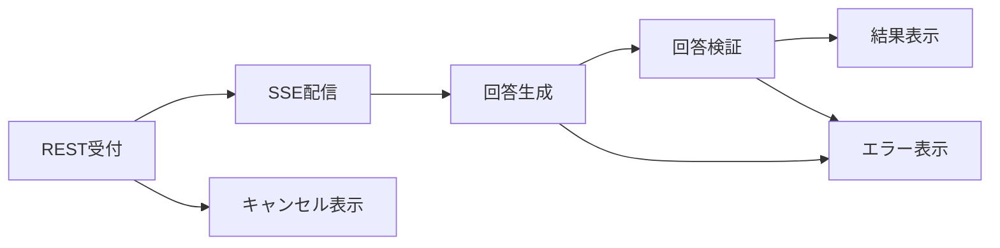

# 非機能設計

## 1. 文書の目的

本書は、D-Concierge MVPの性能、操作性、信頼性、セキュリティ、互換性、運用制約を外部設計レベルで定義することを目的とする。

## 2. 前提

- 社内LANでの少人数小規模利用を前提とする。
- 画面利用者は10人程度、回答生成の同時実行は3件程度を想定する。
- 本番・社内配布構成は単一ホスト上にアプリケーションとデータベースを同居させる。
- WindowsとLinuxの両方で利用できることを前提とする。
- チャット履歴、ユーザ指示、中間メッセージ、回答、参照元、Codex成果物、トレースログはMVPでは無期限保持する。

## 3. 非機能要件一覧

| 区分 | 設計方針 |
| --- | --- |
| 操作性 | 利用者が画面を開いてすぐユーザ指示を送信でき、回答生成中、検証中、キャンセル中の状態を判断できるようにする。 |
| 応答性 | ユーザ指示送信後、REST受付結果を返し、以後はSSEで状態と中間メッセージを逐次配信する。 |
| 信頼性 | 検証済み回答だけを最終回答として表示し、キャンセル済み・エラー・タイムアウトの状態を履歴に残す。 |
| セキュリティ | 内部パス、秘密情報、スタックトレースを画面、SSE、利用者向けエラーに出さない。 |
| 互換性 | Windows/LinuxのOS差異を利用者操作へ露出させない。 |
| 保守性 | 用途別差分を設定、生成用・検証用ホームディレクトリ、出力契約、参照元ビューア実装へ分離する。 |
| 監査性 | 障害調査用トレースログをファイル保存し、回答生成失敗、検証失敗、キャンセル、タイムアウトを追跡できるようにする。 |
| 運用制約 | 単一ホスト構成、社内LAN限定、無期限保持、削除機能なしを前提にする。 |

## 4. 性能・信頼性の考え方

### 4.1. 応答性

- ユーザ指示送信RESTは、回答生成完了を待たずに受付結果を返す。
- 回答生成中と検証中の進行状況はSSEで配信する。
- 表示中チャットで意図せずSSEが切断された場合は利用者向けエラーを表示し、利用者操作によるSSE購読解除はエラー扱いにしない。
- タイムアウト値は設定で管理する。

### 4.2. 信頼性

- 回答候補は形式検証と参照元検証に成功するまで最終回答にしない。
- 検証失敗時は設定された上限まで再生成する。
- キャンセルされた実行の部分回答、未検証回答、途中Codex成果物は最終回答として表示しない。
- 履歴再表示では保存済み回答と保存済みCodex成果物を使用する。

### 4.3. セキュリティ

- 参照元データとCodex成果物は、それぞれバックエンドAPI経由で取得する。
- 許可範囲外のパス、ディレクトリトラバーサル、未対応参照元種別は拒否する。
- HTML表示は安全化後に表示する。
- 中間メッセージ、回答、エラー、トレースログには秘密情報や不要な全文データを保存または表示しない。

### 4.4. 互換性

- Web画面、REST API、SSE APIの契約はWindows/Linuxで同一にする。
- codex execの起動、キャンセル、パス正規化はバックエンド内部でOS差異を吸収する。
- データベースや画面表示ではOS依存の絶対パスを扱わない。

## 5. 運用上の留意事項

- 単一ホスト構成のため、ホスト停止時は全機能が利用できない。
- 無期限保持のため、データベース、Codex成果物、トレースログの容量確認が必要である。
- 自動削除機能と手動削除機能はMVP対象外である。
- トレースログは利用者向け画面には表示しない。
