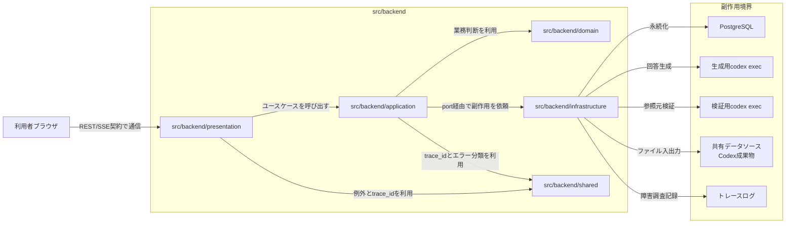
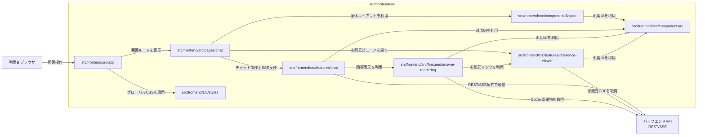
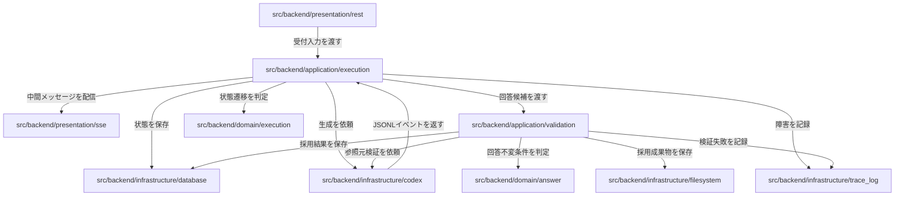

# アーキテクチャ設計

## 1. 文書の目的

本書は、D-Concierge MVPの内部実装における構成要素の責務分割、依存方向、公開口、副作用境界、契約境界を定義することを目的とする。

本書では、画面、API、DB、codex exec、ファイル保存、トレースログを単なる外部構成として再掲せず、実装内部でどの層とモジュールがどの判断と副作用を所有するかを定義する。

## 2. 前提

- 要件定義書は `docs/01_要件定義/MVP要件定義.md` を正とする。
- 外部設計書は `docs/02_外部設計/` 配下のMVP外部設計を正とする。
- バックエンドは `presentation`、`application`、`domain`、`infrastructure` のレイヤに分割する。
- フロントエンドは `pages`、`features`、`components`、`app` を中心に分割する。
- 参照元ビューアのMVP実装対象はPDFのみとする。
- `src/frontend/backend_mock/` はフロントエンド単体確認用の開発支援資産であり、アプリ本体のクラス・モジュール設計対象から除外する。
- ファイル添付ボタンと表示設定ボタンは将来拡張用の表示部品として扱い、MVPの処理設計および内部IF設計には含めない。

## 3. 構成要素一覧

| 構成要素 | 責務 |
| --- | --- |
| `src` | D-Conciergeの実装資産を配置する。 |
| `src/backend` | FastAPIによるREST、SSE、実行制御、検証、永続化、ファイル配信を提供する。 |
| `src/backend/app` | FastAPIアプリケーションの生成、ルーティング登録、静的配信設定を組み立てる。 |
| `src/backend/app/router` | REST/SSEエンドポイントをFastAPIアプリへ登録する。 |
| `src/backend/app/static` | ビルド済みSPAを配信する設定を保持する。 |
| `src/backend/presentation` | HTTP/SSE契約をアプリケーション内部の入力へ変換し、内部結果を画面向け応答へ変換する。 |
| `src/backend/presentation/rest` | RESTエンドポイントを実装し、入力検証、trace_id発行、ユースケース呼び出しを行う。 |
| `src/backend/presentation/sse` | SSE接続、現在状態通知、イベント配信、購読解除を制御する。 |
| `src/backend/presentation/schemas` | 画面バックエンドAPI IFに対応するPydanticスキーマを定義する。 |
| `src/backend/presentation/errors` | 共通例外をHTTP応答と利用者向けメッセージへ変換する。 |
| `src/backend/application` | ユースケースの実行順序、状態条件付き更新、トランザクション境界、外部副作用の呼び出しを調停する。 |
| `src/backend/application/chat` | 新規チャット開始、継続指示、チャット詳細取得のユースケースを担う。 |
| `src/backend/application/execution` | チャット実行処理、状態更新、キャンセル、タイムアウト制御を担う。 |
| `src/backend/application/validation` | 固定検証、参照元検証、再生成可否判断を調停する。 |
| `src/backend/application/history` | 履歴一覧、履歴再表示、チャットタイトル生成を担う。 |
| `src/backend/application/references` | 表示用参照元メタ情報生成と参照元データ取得を担う。 |
| `src/backend/application/artifacts` | 採用済みCodex成果物の保存、回答本文内URL置換、成果物配信を担う。 |
| `src/backend/application/ports` | DB、codex exec、ファイル、時刻、ID、ログなどの副作用を抽象化する。 |
| `src/backend/domain` | 副作用を持たない業務判断、不変条件、値オブジェクト、状態遷移ルールを保持する。 |
| `src/backend/domain/chat` | チャット、ユーザ指示、セッションID、タイトルの業務ルールを保持する。 |
| `src/backend/domain/execution` | 実行状態、終端状態、状態条件付き更新の成立条件を保持する。 |
| `src/backend/domain/answer` | 回答候補、採用済み回答、回答本文の不変条件を保持する。 |
| `src/backend/domain/validation` | 検証結果、再試行可否、検証失敗理由の判断を保持する。 |
| `src/backend/domain/references` | PDF参照元、locator、表示ラベル生成ルールを保持する。 |
| `src/backend/domain/artifacts` | Codex成果物ID、MIMEタイプ、保存参照の不変条件を保持する。 |
| `src/backend/domain/shared` | ドメイン横断のID、日時、共通エラーを保持する。 |
| `src/backend/infrastructure` | DB、codex exec、ファイル、設定、時刻、ID、ログなど副作用を伴う実装を提供する。 |
| `src/backend/infrastructure/config` | `config.yaml` の読込、必須設定検証、内部パス設定の正規化を行う。 |
| `src/backend/infrastructure/database` | PostgreSQL、SQLAlchemy、Alembic、Repository実装を管理する。 |
| `src/backend/infrastructure/codex` | 生成用/検証用codex execの起動、resume、JSONL解析、キャンセル制御を行う。 |
| `src/backend/infrastructure/filesystem` | 参照元ファイル取得、Codex成果物保存、パス安全検証を行う。 |
| `src/backend/infrastructure/runtime` | 現在時刻取得、ID発番、受付済みrunのバックグラウンド登録の本番実装を提供する。 |
| `src/backend/infrastructure/trace_log` | JSONL形式の障害調査用トレースログを出力する。 |
| `src/backend/shared` | 複数レイヤを接続する横断契約を保持する。 |
| `src/backend/shared/errors` | エラー分類と共通基底例外を保持する。 |
| `src/backend/shared/tracing` | trace_idの値と受け渡し型を保持する。 |
| `src/frontend` | React/Viteによる利用者向けSPAとフロントエンド単体確認用モックを配置する。 |
| `src/frontend/src` | 利用者向けSPA本体を配置する。 |
| `src/frontend/src/app` | ReactアプリのルートとProvider登録を行う。 |
| `src/frontend/src/pages` | 画面単位のコンテナを配置する。 |
| `src/frontend/src/pages/chat` | 開始画面、チャット画面、参照元ビューアの状態を統合する。 |
| `src/frontend/src/features` | 機能単位のAPI境界、UI、モデル、純粋ロジックを配置する。 |
| `src/frontend/src/features/chat` | チャット開始、継続指示、履歴表示、SSE反映、キャンセル操作を扱う。 |
| `src/frontend/src/features/answer-rendering` | Markdown、表、コード、画像、Mermaid、HTMLの回答表示を扱う。 |
| `src/frontend/src/features/reference-viewer` | 表示用参照元メタ情報をもとにPDF参照元ビューアを開く。 |
| `src/frontend/src/components` | 複数機能で共有するレイアウトとUIラッパーを配置する。 |
| `src/frontend/src/components/layout` | AppShell、Sidebar、TopMenuなど画面全体の骨格を提供する。 |
| `src/frontend/src/components/ui` | shadcn/ui由来の汎用UIラッパーを提供する。 |
| `src/frontend/src/styles` | Tailwind/shadcnテーマ、body初期設定、外部ライブラリ生成DOM向けCSSを保持する。 |
| `src/frontend/backend_mock` | フロントエンド単体確認用の固定データ、疑似REST/SSE、参照元、Codex成果物を提供する。 |

## 4. 構成要素関連図

### 4.1. バックエンド関連図

### 4.2. フロントエンド関連図

### 4.3. チャット実行時の副作用境界図

## 5. 留意事項

- `domain` はDB、codex exec、ファイル、時刻、ID発番、ログ出力を直接呼び出さない。
- `application` は `application/ports` を通じて副作用を利用し、状態条件付き更新とトランザクション境界を所有する。
- `presentation` はAPI契約とSSE契約を所有し、業務判断を持たない。
- `infrastructure` は外部副作用の実装を所有し、業務上の採用可否判断を持たない。
- `shared` はエラー分類とtrace_idのように複数レイヤを接続する横断契約だけを置く。
- PDF以外の参照元種別はMVPの画面実装対象に含めない。
- `src/frontend/backend_mock/` はフロントエンド単体確認用の補助資産として維持するが、UIコンポーネントから直接参照しない。
