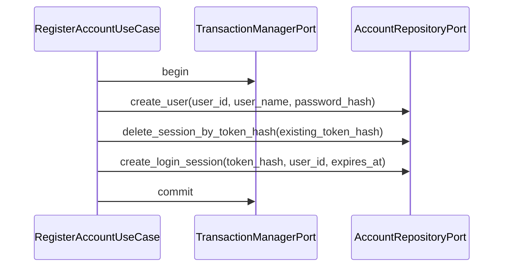

# AccountRepository IF

## 1. 文書の目的

本書は、`application/account` と `infrastructure/database/repositories` の間で、`application/ports/database/interface.py` を通じて利用するアカウント永続化IFの契約を定義することを目的とする。

## 2. 前提

- 呼出方式: PythonのProtocol相当のメソッド呼出。
- 呼出主体: `AuthenticateSessionUseCase`、`RegisterAccountUseCase`、`LoginUseCase`、`LogoutUseCase`、`ChangeUserNameUseCase`、`ChangePasswordUseCase`、`DeleteAccountUseCase`、`ExecuteAccountDeletionUseCase`、起動時アカウント回復処理。
- 呼出先: `AccountRepositoryPort`。具象実装は `SqlAlchemyAccountRepository` とする。
- DBトランザクション境界はユースケースが `TransactionManagerPort` で所有する。
- パスワード生値とログインセッショントークン生値は本IFへ渡さない。

## 3. IF概要

| 項目 | 内容 |
| --- | --- |
| IF名 | AccountRepository IF |
| 呼出元 | `src/backend/application/account`、`src/backend/app` |
| 呼出先 | `src/backend/application/ports/database/interface.py`。具象実装は `src/backend/infrastructure/database/repositories/SqlAlchemyAccountRepository` |
| 目的 | ユーザ、ログインセッション、アカウント削除対象の保存、取得、状態更新、削除をapplication層から抽象化する。 |
| 冪等性 | セッション削除、期限切れセッション削除、`削除中`更新は対象が存在しない場合も呼出元が結果を判定できる値を返す。ユーザ作成とセッション作成は非冪等。 |

### 3.1. Port構成

| Port | 役割 |
| --- | --- |
| `AccountReadRepositoryPort` | ユーザ参照、ログイン検証用情報取得、認証済みユーザ取得を行う。 |
| `AccountWriteRepositoryPort` | ユーザ作成、ユーザ名更新、パスワードハッシュ更新、ユーザ状態更新を行う。 |
| `LoginSessionRepositoryPort` | ログインセッションの作成、検索、現在セッション削除、ユーザ単位削除、期限切れ削除を行う。 |
| `AccountDeletionRepositoryPort` | アカウント削除受付、削除中ユーザ一覧取得、物理削除対象取得、ユーザ関連DBデータ削除を行う。 |
| `AccountRepositoryPort` | 上記用途別Portを束ね、アカウント系ユースケースへ注入する。 |

## 4. 呼出シーケンス

## 5. 事前条件 / 事後条件 / 不変条件

### 5.1. 事前条件

- 呼出元は入力制約をdomain policyで検証済みである。
- パスワードはハッシュ化済みである。
- ログインセッショントークンは照合用ハッシュへ変換済みである。
- DBセッションはTransactionManagerから提供される。

### 5.2. 事後条件

- RepositoryはSQLAlchemy ORMモデルではなくDTOを返す。
- ユーザ作成、ユーザ名変更、パスワード変更、削除受付は呼出元のトランザクション内で確定する。
- 期限切れセッション削除は対象行がない場合も正常に完了する。
- アカウント物理削除対象DTOには、未完了run、対象セッションID、保存済み成果物参照が含まれる。

### 5.3. 不変条件

- パスワード生値、ログインセッショントークン生値を受け取らない。
- `削除中`ユーザを通常の認証成功、ログイン成功、変更成功として返さない。
- `login_sessions` は状態列を持たず、有効な行の存在と `expires_at` でログイン状態を判定する。
- アカウント削除受付で対象ユーザの全ログインセッションを削除する。

## 6. 入出力とデータ項目

### 6.1. 主な公開メソッド

| メソッド | 役割 | 主な入力 | 主な出力 |
| --- | --- | --- | --- |
| `create_user` | ユーザを作成する | ユーザID、ユーザ名、パスワードハッシュ、作成日時 | ユーザDTO |
| `get_user_for_login` | ログイン検証用ユーザ情報を取得する | ユーザID | ユーザDTOまたはなし |
| `update_user_name` | ユーザ名を更新する | ユーザID、新しいユーザ名、更新日時 | 更新後ユーザDTO |
| `update_password_hash` | パスワードハッシュを更新する | ユーザID、新しいパスワードハッシュ、更新日時 | なし |
| `create_login_session` | ログインセッションを作成する | token_hash、ユーザID、有効期限、作成日時 | ログインセッションDTO |
| `find_session_by_token_hash` | セッションと所有ユーザを取得する | token_hash | ログインセッションDTOまたはなし |
| `delete_session_by_token_hash` | 現在セッションを削除する | token_hash | 削除件数 |
| `delete_sessions_by_user_id` | ユーザ単位でセッションを削除する | ユーザID | 削除件数 |
| `delete_expired_sessions` | 期限切れセッションを削除する | 現在時刻 | 削除件数 |
| `mark_user_deleting` | ユーザを`削除中`へ更新する | ユーザID、更新日時 | 更新後状態 |
| `mark_user_chats_deleting` | ユーザ配下チャットを`削除中`へ更新する | ユーザID、更新日時 | 更新件数 |
| `list_deleting_user_ids` | 起動時再登録対象を取得する | なし | 削除中ユーザID一覧 |
| `get_account_deletion_target` | アカウント物理削除対象を取得する | ユーザID | 削除対象DTOまたはなし |
| `delete_account_data` | 対象ユーザのDBデータを削除する | ユーザID | なし |

### 6.2. DTO

| DTO | 内容 |
| --- | --- |
| `AccountUserData` | ユーザID、ユーザ名、パスワードハッシュ、ユーザ状態を保持する。 |
| `LoginSessionData` | ログインセッション内部ID、token_hash、ユーザID、有効期限、所有ユーザ状態を保持する。 |
| `AccountDeletionTarget` | ユーザID、対象チャットID、対象セッションID、未完了run、保存済み成果物参照を保持する。 |

## 7. 例外処理

| 条件 | 扱い |
| --- | --- |
| ユーザID重複 | 入力エラーとして呼出元が `user_id` の項目別エラーへ変換できる結果を返す |
| 対象ユーザなし | 対象なしエラーとして返す |
| `削除中`ユーザへの通常操作 | 認証、ログイン、変更の対象外として扱う |
| DB制約違反 | `ErrorType.SYSTEM` かつトレース対象の `AppError` へ変換する |
| アカウント物理削除対象なし | 物理削除済み扱いとして正常終了できる結果を返す |
