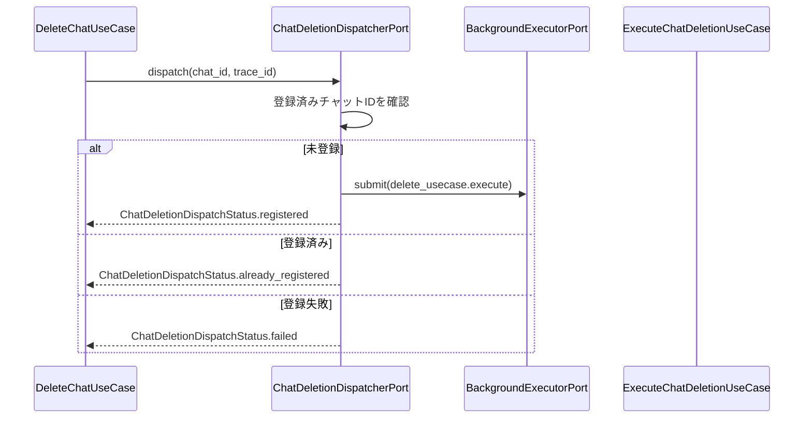

# ChatDeletionDispatcher IF

## 1. 文書の目的

本書は、チャット削除受付ユースケースとチャット物理削除ユースケースの間で、`application/ports/runtime/interface.py` を通じて利用する削除ジョブ登録IFの契約を定義することを目的とする。

## 2. 前提

- 呼出方式: PythonのProtocol相当のメソッド呼出。
- 呼出主体: `DeleteChatUseCase`、起動時実行回復処理。
- 呼出先: `ChatDeletionDispatcherPort`。具象実装は `src/backend/infrastructure/runtime` 配下に置く。
- 削除ジョブの実行本体は `ExecuteChatDeletionUseCase` が担当する。
- 外部キューは使用せず、アプリケーションプロセス内のバックグラウンド実行として登録する。
- 削除ジョブ登録は、run実行登録とは別の登録集合で管理する。

## 3. IF概要

| 項目 | 内容 |
| --- | --- |
| IF名 | ChatDeletionDispatcher IF |
| 呼出元 | `src/backend/application/chat`、`src/backend/app` |
| 呼出先 | `src/backend/application/ports/runtime/interface.py`。具象実装は `src/backend/infrastructure/runtime/ChatDeletionDispatcher` |
| 目的 | 削除対象チャットを物理削除の非同期実行へ登録し、重複登録を抑止する。 |
| 冪等性 | 同一チャットIDが登録済みの場合は `already_registered` を返し、二重実行を開始しない。 |

## 4. Port構成

| Port | 役割 |
| --- | --- |
| `ChatDeletionDispatcherPort` | チャットIDを削除ジョブとして登録し、登録結果を返す。 |
| `ChatDeletionExecutorPort` | 登録されたチャットIDを受け取り、`ExecuteChatDeletionUseCase` を呼び出す。 |
| `BackgroundExecutorPort` | アプリケーション内バックグラウンド実行へ関数を投入する。 |

## 5. 呼出シーケンス

## 6. 事前条件 / 事後条件 / 不変条件

### 6.1. 事前条件

- 呼出元は、対象チャットを`deleting`へ更新済みである。
- 呼出元は `chat_id` と `trace_id` を保持している。
- composition rootで `ChatDeletionExecutorPort` の具象実装が注入済みである。

### 6.2. 事後条件

- 未登録の場合、対象チャットIDが削除ジョブとして登録される。
- 登録済みの場合、新しいバックグラウンド実行を開始しない。
- 登録失敗の場合、呼出元がトレースログ出力できる診断情報を返す。

### 6.3. 不変条件

- DispatcherはDB、ファイル、codex execを直接操作しない。
- Dispatcherは削除対象チャットIDの重複登録を抑止する。
- Dispatcherは物理削除完了通知や進捗通知を提供しない。
- 削除ジョブの失敗時、対象チャットは`deleting`のまま維持され、起動時再登録の対象になる。

## 7. 入出力とデータ項目

### 7.1. 入力

| 項目 | 内容 |
| --- | --- |
| `chat_id` | 削除対象チャットID |
| `trace_id` | 削除受付APIから引き継ぐ障害調査用ID |

### 7.2. 出力

| 項目 | 内容 |
| --- | --- |
| `ChatDeletionDispatchResult.status` | `registered`、`already_registered`、`failed` のいずれか |
| `ChatDeletionDispatchResult.diagnostic_message` | 登録失敗時の内部調査用メッセージ |

### 7.3. 公開メソッド

| メソッド | 役割 | 主な入力 | 主な出力 |
| --- | --- | --- | --- |
| `dispatch_chat_deletion` | 削除対象チャットをバックグラウンド物理削除へ登録する | チャットID、trace_id | `ChatDeletionDispatchResult` |

## 8. 起動時再登録

- 起動時実行回復処理は、Repositoryから`deleting`のチャットIDを取得する。
- 取得したチャットIDを1件ずつ `dispatch_chat_deletion` へ渡す。
- 登録結果が `already_registered` の場合は正常扱いとする。
- 登録結果が `failed` の場合はトレースログ対象とし、次回起動または次回削除要求で再登録できる状態を維持する。

## 9. 例外処理

| 条件 | 扱い |
| --- | --- |
| 対象チャットIDが空 | 呼出元の入力不備として `ErrorType.SYSTEM` のトレース対象にする |
| バックグラウンド登録失敗 | `ChatDeletionDispatchStatus.failed` を返し、呼出元がトレースログへ記録する |
| 削除ジョブ実行中の例外 | Dispatcherでは握りつぶさず、`ExecuteChatDeletionUseCase` 側でトレースログへ記録する |
