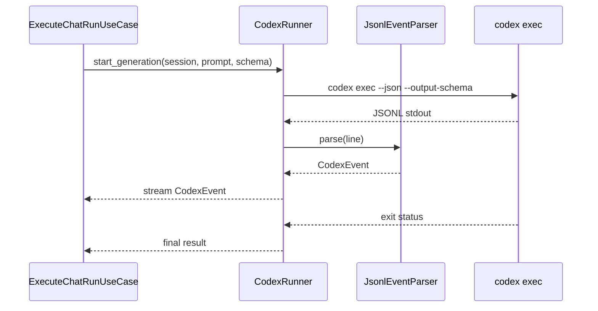

# Codex実行IF

## 1. 文書の目的

本書は、`application/execution`、`application/validation` と `infrastructure/codex` の間で利用する内部IFの契約を定義することを目的とする。

## 2. 前提

- 呼出方式: 非同期メソッド呼出と非同期イベントストリーム。
- 呼出主体: `ExecuteChatRunUseCase`、`ValidateAnswerUseCase`、`CancelChatRunUseCase`。
- 生成用と検証用でCodexホーム、作業ディレクトリ、出力スキーマを分離する。

## 3. IF概要

| 項目 | 内容 |
| --- | --- |
| IF名 | Codex実行IF |
| 呼出元 | 実行、検証、キャンセルのユースケース |
| 呼出先 | `CodexRunner`、`JsonlEventParser` |
| 目的 | codex exec起動、resume、JSONLイベント解析、タイムアウト、終了要求をapplication層から抽象化する。 |
| 冪等性 | codex exec起動は非冪等。JSONL解析は同一行に対して冪等。終了要求は対象プロセスが生存している場合に限り効果を持つ。 |

## 4. 呼出シーケンス

## 5. 事前条件 / 事後条件 / 不変条件

### 5.1. 事前条件

- Codexホーム、作業ディレクトリ、出力スキーマパスが設定済みである。
- 生成用は対象チャットのsession IDを保持している。
- 検証用は検証対象回答、参照元、検証プロンプトが揃っている。

### 5.2. 事後条件

- 生成用は中間メッセージイベントと最終回答候補を返す。
- 検証用は検証合否と指摘内容を返す。
- タイムアウトまたはキャンセル時はプロセス終了要求を行い、終端状態へ変換可能な結果を返す。

### 5.3. 不変条件

- JSONLの生文字列はinfrastructure内に閉じ、applicationへは構造化イベントだけを返す。
- 生成用Codexホームと検証用Codexホームを混在させない。
- codex exec作業領域から許可外のファイルを採用済み成果物として扱わない。

## 6. 入出力とデータ項目

### 6.1. 入力

| 項目 | 内容 |
| --- | --- |
| `session_id` | codex exec会話継続と作業領域を識別する内部ID |
| `prompt` | 生成または検証に渡す指示本文 |
| `output_schema_path` | codex execに渡すJSON Schemaファイルパス |
| `timeout_seconds` | 実行タイムアウト秒数 |
| `trace_id` | 実行ログとAPI呼出を関連付けるID |
| `run_id` | キャンセル対象プロセスを特定する実行処理ID |

### 6.2. 出力

| 項目 | 内容 |
| --- | --- |
| `CodexEvent` | 中間メッセージ、最終回答候補、検証結果、エラーを表す構造化イベント |
| `exit_status` | codex exec終了コードと終了理由 |
| `session_continuation_id` | 必要に応じて次回resumeに使う継続識別子 |
| `artifact_candidates` | 生成結果が参照したCodex成果物候補 |

## 7. 例外処理

| 条件 | 扱い |
| --- | --- |
| codex exec起動失敗 | 生成失敗または検証失敗分類の `AppError` へ変換する |
| JSONL解析失敗 | 解析失敗行をtraceログ対象にし、実行をエラー終端へ変換する |
| タイムアウト | プロセスへ終了要求を送り、run状態を `タイムアウト` へ更新できる結果を返す |
| キャンセル要求 | プロセスへ終了要求を送り、run状態を `キャンセル済み` へ更新できる結果を返す |
| 検証用Codex資産不足 | 設定不備分類として起動前に失敗させる |

## 8. 留意事項

- `codex/.codex_validator/AGENTS.md` など検証用Codex資産は、実装前に配置されている必要がある。
