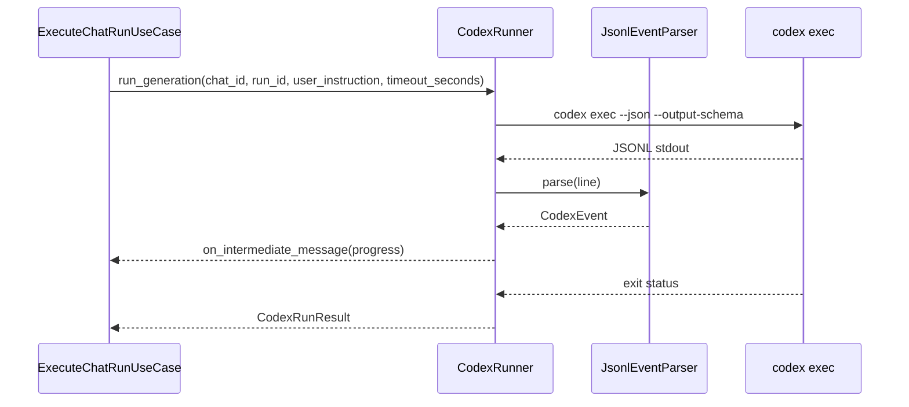

# Codex実行IF

## 1. 文書の目的

本書は、`application/execution`、`application/validation`、`application/chat` と `infrastructure/codex` の間で、`application/ports/codex/interface.py` を通じて利用する内部IFの契約を定義することを目的とする。

## 2. 前提

- 呼出方式: 非同期メソッド呼出と非同期イベントストリーム。
- 呼出主体: `ExecuteChatRunUseCase`、`ValidateAnswerUseCase`、`CancelChatRunUseCase`、`ExecuteChatDeletionUseCase`。
- 生成用Codex実行、参照元検証、終了要求、作業領域解決、作業領域削除は別々のProtocolとして定義する。
- 生成用と検証用でCodexホーム、作業ディレクトリ、出力スキーマ、Codex側resume用IDを分離する。
- 生成用Codexは `codex/sessions/<user-id>/<session-id>/` を作業領域とし、検証用Codexは `codex/sessions_validator/<user-id>/<session-id>/` を作業領域とする。
- `session_id` はD-Conciergeが作業領域を決定するための内部IDであり、Codex側resume用IDは `codex_conversation_id` として別に受け渡す。
- `timeout_seconds` は設定ファイル値そのものではなく、呼出元が全体deadlineから算出した当該codex execの残り秒数である。
- Codex JSONLイベント種別、Codex出力 `payload.kind`、キャンセル要求結果は内部では通常Enumとして扱い、Codex JSONL、Codex出力JSON、プロセス終了要求結果の境界で文字列へ変換する。

## 3. IF概要

| 項目 | 内容 |
| --- | --- |
| IF名 | Codex実行IF |
| 呼出元 | 実行、検証、キャンセル、チャット物理削除のユースケース |
| 呼出先 | `src/backend/application/ports/codex/interface.py`。具象実装は `CodexGenerationRunnerAdapter`、`CodexReferenceFileValidator`、`CodexValidationRunnerAdapter`、`CodexCancelRequester`、`CodexSessionWorkdirResolver`、`CodexSessionWorkdirCleaner` |
| 目的 | 生成用Codex実行、参照元PDF固定検証、検証用Codex 1回実行、resume、JSONLイベント解析、タイムアウト、終了要求、作業領域解決、作業領域削除をapplication層から抽象化する。 |
| 冪等性 | codex exec起動は非冪等。JSONL解析は同一行に対して冪等。終了要求は対象プロセスが生存している場合に限り効果を持つ。作業領域削除は対象ディレクトリが存在しない場合も削除済みとして扱う。 |

### 3.1. Port構成

| Port | 役割 |
| --- | --- |
| `CodexGenerationRunnerPort` | 生成用codex execを起動し、中間メッセージと最終回答JSONを返す。 |
| `ReferenceFileValidatorPort` | 検証用codex exec起動前に参照元PDFの存在、読込可否、ページ範囲を固定検証する。 |
| `ValidatorCodexRunnerPort` | 検証用codex execを1回起動し、中間メッセージとrawな最終検証結果JSONを返す。 |
| `CancelRequesterPort` | 実行中codex execへ終了要求を送る。 |
| `SessionWorkdirResolverPort` | 生成用Codex作業領域をチャットIDから解決する。 |
| `SessionWorkdirCleanupPort` | 生成用・検証用Codex作業領域をローカル利用者IDとセッションIDから解決し、安全に削除する。 |

## 4. 呼出シーケンス



## 5. 事前条件 / 事後条件 / 不変条件

### 5.1. 事前条件

- Codexホーム、作業ディレクトリ、出力スキーマパスが設定済みである。
- 生成用は対象チャットの作業領域IDと、継続指示時に利用する生成用Codex側resume用IDを保持している。
- 検証用は元のユーザ指示、検証対象回答、参照元を含む `ValidatorCodexInput` 形式の検証プロンプトが揃っている。

### 5.2. 事後条件

- 生成用は中間メッセージイベントと最終回答候補を返す。
- 検証用は中間メッセージイベントとrawな最終検証結果JSONを返す。最終検証結果JSONの固定検証はapplication層で行う。
- `thread.started.thread_id` を受信した場合、生成用は `generation_conversation_id`、検証用は `validation_conversation_id` として保存できる値を返す。
- 正常終了時はJSONL上の最新 `item.completed.agent_message.text` を最終出力候補として返す。
- 生成用の最終回答候補に含まれるPDF参照元pathは、Codex作業領域上の `readonly/` から始まる実PDFファイルへの相対パスである。
- タイムアウトまたはキャンセル時はプロセス終了要求を行い、終端状態へ変換可能な結果を返す。

### 5.3. 不変条件

- JSONLの生文字列はinfrastructure内に閉じ、applicationへは構造化イベントだけを返す。
- 生成用Codexホームと検証用Codexホームを混在させない。
- codex exec作業領域から許可外のファイルを採用済み成果物として扱わない。
- 生成用の最終回答候補では、`readonly\...` の区切り文字差分を `readonly/...` へ標準化したうえで、絶対パス、UNC、URL、`codex/` から始まるパス、`readonly/` 配下以外のパス、HTML/メタデータファイルをPDF参照元pathとして扱わない。
- `turn.failed`、プロセス異常終了、キャンセル要求後の `agent_message` は最終回答候補として返さない。
- `item.completed.agent_message.text` が `payload.kind="progress"` のJSONである場合だけ、`payload.text` を利用者向け中間メッセージとして返す。
- `payload.kind="final"` の生成結果JSONまたは検証結果JSONは利用者向け中間メッセージとして返さない。
- コマンド、標準出力、絶対パスは利用者向け中間メッセージとして返さない。
- 作業領域削除は、生成用と検証用それぞれの設定済みworkdir配下にある `<user-id>/<session-id>` ディレクトリだけを対象にする。
- 作業領域削除では `readonly/` シンボリックリンク自体を削除対象に含めるが、リンク先の共有データソース実体は削除しない。
- 作業領域削除は、対象runが終端状態になってから実行する。

## 6. 入出力とデータ項目

### 6.1. 入力

| 項目 | 内容 |
| --- | --- |
| `chat_id` | 対象チャットID |
| `run_id` | 対象チャット実行処理ID。キャンセル対象プロセスの特定にも使う |
| `user_instruction` | 利用者が送信した元のユーザ指示本文。生成用Codex promptの `<ユーザ指示>` ブロックと、検証用 `ValidatorCodexInput.instruction` に入れる |
| `candidate` | 検証対象の回答候補 |
| `codex_conversation_id` | `codex exec resume` に渡すCodex側resume用ID。初回起動時は未指定 |
| `timeout_seconds` | 全体deadlineから算出した当該codex execの残り秒数 |
| `trace_id` | 実行ログとAPI呼出を関連付けるID |
| `session_workdir` | 生成用または検証用のセッション作業領域 |
| `local_user_id` | 削除対象作業領域のローカル利用者ID |
| `session_id` | 削除対象作業領域のセッションID |
| `on_intermediate_message` | 生成用または検証用Codex由来の中間メッセージを即時配信するコールバック |

### 6.2. 生成用Codex入力

生成用Codexへ渡す `prompt` は、初回生成時はユーザ指示だけをタグで囲む。検証不合格後の再生成時は、再生成であることを説明する文、元のユーザ指示、検証による修正指示を分けて渡す。

初回生成時:

```text
<ユーザ指示>
[ユーザの指示文]
</ユーザ指示>
```

再生成時:

```text
以下のユーザ指示に対する前回回答は検証で不採用になりました。
ユーザ指示には完全に回答しつつ、検証による修正指示を反映して回答を再出力してください。

<ユーザ指示>
[ユーザの指示文]
</ユーザ指示>

<検証による修正指示>
[検証の修正指示文]
</検証による修正指示>
```

### 6.3. 検証用Codex入力

検証用Codexへ渡す `prompt` は、以下の `ValidatorCodexInput` JSONとする。DB保存用の共有データソース相対パスは含めず、検証用Codexが実際に読む作業領域上の `readonly/` 付きPDFパスだけを渡す。

| 項目 | 内容 |
| --- | --- |
| `instruction` | 利用者が送信した元のユーザ指示本文。再生成指示は含めない |
| `answers[].text` | 検証対象の回答本文 |
| `answers[].references[].label` | 参照元表示名 |
| `answers[].references[].path` | 検証用作業領域上の `readonly/` から始まるPDF相対パス |
| `answers[].references[].page_start` | 検証対象PDF開始ページ |
| `answers[].references[].page_end` | 検証対象PDF終了ページ |

### 6.4. 出力

| 項目 | 内容 |
| --- | --- |
| `CodexRunResult` | 生成用CodexのCodex側resume用ID、中間メッセージ一覧、最終回答JSON |
| `ValidatorCodexRunResult` | 検証用CodexのCodex側resume用ID、中間メッセージ一覧、rawな最終検証結果JSON |
| `ReferenceValidationResult` | 検証用Codexの合否と指摘コメント、または検証用Codex起動前の固定検証で得た構造化失敗理由 |
| `CancelRequestResult` | 終了要求結果。内部では通常Enum、境界では `sent`、`already_exited`、`not_registered` のいずれか |
| `Path` | `SessionWorkdirResolverPort` が返す生成用Codex作業領域 |
| `deleted_workdirs` | 削除済みとして扱った生成用・検証用作業領域 |

### 6.4. Codex作業領域

| 用途 | 作業領域 | 内容 |
| --- | --- | --- |
| 生成用 | `codex/sessions/<user-id>/<session-id>/readonly/` | 共有データソースディレクトリへのシンボリックリンクとして作成し、生成用Codexへ読み取り専用データを提示する。 |
| 生成用 | `codex/sessions/<user-id>/<session-id>/tmp/` | 生成用Codexがresumeをまたいで使う中間作業ファイルを配置する。 |
| 生成用 | `codex/sessions/<user-id>/<session-id>/artifacts/` | 採用前のCodex成果物候補を一時配置する。 |
| 検証用 | `codex/sessions_validator/<user-id>/<session-id>/readonly/` | 共有データソースディレクトリへのシンボリックリンクとして作成し、検証用Codexへ生成用と同じ読み取り専用データを提示する。回答候補は `ValidatorCodexInput` として検証プロンプト本文で渡す。 |
| 検証用 | `codex/sessions_validator/<user-id>/<session-id>/tmp/` | 検証用Codexがresumeをまたいで使う中間作業ファイルを配置する。 |
| 削除対象 | `codex/sessions/<user-id>/<session-id>/` | チャット物理削除時に、生成用作業領域としてディレクトリごと削除する。 |
| 削除対象 | `codex/sessions_validator/<user-id>/<session-id>/` | チャット物理削除時に、検証用作業領域としてディレクトリごと削除する。 |

### 6.5. JSONLイベント採用規則

| イベント | 扱い |
| --- | --- |
| `thread.started` | `thread_id` をCodex側resume用IDとして保持する。 |
| `item.completed` の `agent_message` | `item.text` をJSONとして解析し、`payload.kind="progress"` の場合は `payload.text` を利用者向け中間メッセージへ変換する。`payload.kind="final"` の場合は中間メッセージへ変換しない。 |
| `turn.completed` | 最新の `item.completed.agent_message.text` を最終回答候補または検証結果候補として返す。生成用最終回答と検証用最終結果の固定検証はapplication層で行う。 |
| `turn.failed` または `error` | 最終回答候補を返さない。 |

## 7. 例外処理

| 条件 | 扱い |
| --- | --- |
| codex exec起動失敗 | `ErrorType.SYSTEM` かつ `trace=True` の `AppError` へ変換し、Application層が生成フェーズまたは検証フェーズの利用者向けメッセージへ変換する |
| JSONL解析失敗 | 解析失敗行をtraceログ対象にし、実行をエラー終端へ変換する |
| タイムアウト | プロセスへ終了要求を送り、run状態を `タイムアウト` へ更新できる結果を返す |
| キャンセル要求 | ユーザキャンセル要求、`sent` / `already_exited` / `not_registered` の終了要求結果、プロセス終了結果を合わせて判定し、run状態を `キャンセル済み` へ更新できる結果を返す |
| 検証用Codex資産不足 | 設定不備分類として起動前に失敗させる |
| 検証用Codex最終出力形式不正 | application層が `validator.max_retries` の範囲で同じ検証用Codex会話へ最終検証結果JSONだけの再出力を依頼し、上限後も不正な場合は検証フェーズのシステムエラーへ変換する |
| 作業領域削除対象が存在しない | 冪等な削除済みとして扱う |
| 作業領域削除時のパストラバーサル検知 | `ErrorType.SYSTEM` かつ `trace=True` の `AppError` とし、DB削除へ進まない |
| 作業領域削除失敗 | `ErrorType.SYSTEM` かつ `trace=True` の `AppError` として上位へ返し、対象チャットは`削除中`のまま維持する |

## 8. 留意事項

- `codex/.codex_validator/AGENTS.md` など検証用Codex資産は、実装前に配置されている必要がある。
