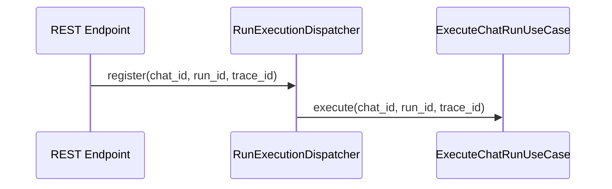

# RunExecutionDispatcher IF

## 1. 文書の目的

本書は、REST受付処理、アプリ起動処理とバックグラウンド実行基盤の間で、`application/ports/runtime/interface.py` を通じて利用する内部IFの契約を定義することを目的とする。

## 2. 前提

- 呼出方式: Pythonメソッド呼出。
- 呼出主体: `StartChatUseCase`、`AppendChatRunUseCase`、アプリ起動時の回復処理。
- 呼出先: アプリ内バックグラウンド実行基盤。具象実装は `InProcessRunExecutionDispatcher`。
- 本システムでは外部の永続ジョブキューを導入せず、アプリ内dispatcherで受付済みrunを `ExecuteChatRunUseCase.execute` へ登録する。
- dispatcher登録結果は内部では通常Enumの `DispatchStatus` として扱う。

## 3. IF概要

| 項目 | 内容 |
| --- | --- |
| IF名 | RunExecutionDispatcher IF |
| 呼出元 | `application/chat`、`app` |
| 呼出先 | `src/backend/application/ports/runtime/interface.py`。具象実装は `src/backend/infrastructure/runtime/run_execution_dispatcher.py` |
| 目的 | HTTP受付完了後のチャット実行処理をバックグラウンドへ登録し、起動時に未完了runを整合させる。 |
| 冪等性 | 同一runの多重登録は拒否または単一実行へ集約する。起動時回復は同一DB状態に対して冪等。 |

### 3.1. Port構成

| Port | 役割 |
| --- | --- |
| `RunExecutionDispatcherPort` | 受付済みrunをバックグラウンド実行へ登録し、登録結果を返す。 |
| `ChatRunExecutorPort` | dispatcherが呼び出すチャット実行処理の抽象IF。 |
| `BackgroundExecutorPort` | 実行関数をバックグラウンドへ投入する抽象IF。 |

## 4. 呼出シーケンス

## 5. 事前条件 / 事後条件 / 不変条件

### 5.1. 事前条件

- 対象runがDBへ `accepted` 状態で保存済みである。
- 対象チャットID、run ID、trace_idが確定している。
- `ExecuteChatRunUseCase` とRepository、Codex実行IF、SSE配信IFがDI済みである。

### 5.2. 事後条件

- 登録成功時は、対象runを処理するバックグラウンドタスクが1件登録される。
- 登録失敗時は、呼出元が対象runを `error` に更新できる失敗結果を返す。
- アプリ起動時回復では、残存runが再登録または終端状態へ整合される。

### 5.3. 不変条件

- 同一run IDを同時に複数の `ExecuteChatRunUseCase.execute` へ渡さない。
- dispatcher登録の失敗を無視して `accepted` のまま放置しない。
- dispatcherはHTTP応答を直接生成しない。

## 6. 入出力とデータ項目

### 6.1. 入力

| 項目 | 内容 |
| --- | --- |
| `chat_id` | 対象チャットID |
| `run_id` | 対象チャット実行処理ID |
| `trace_id` | 受付APIから引き継ぐtrace_id |

### 6.2. 出力

| 項目 | 内容 |
| --- | --- |
| `dispatch_result` | 内部では `DispatchStatus`。値は `registered`、`already_registered`、`failed` のいずれか |
| `failure_reason` | 登録失敗時の調査用要約 |

## 7. 起動時回復

| 残存状態 | 回復処理 |
| --- | --- |
| `accepted` | dispatcherへ再登録する。再登録失敗時は `error` へ更新する。 |
| `running` | アプリ再起動により対応するcodexプロセスを失っているため `error` へ更新する。 |
| `validating` | アプリ再起動により対応するcodexプロセスを失っているため `error` へ更新する。 |
| `cancel_requested` | プロセス終了要求が不要または継続不能な状態として `canceled` へ更新する。 |

## 8. 例外処理

| 条件 | 扱い |
| --- | --- |
| dispatcher登録失敗 | 対象runを `error` に更新できる失敗結果を返す |
| 同一run登録済み | `already_registered` を返し、呼出元は受付成功として扱える |
| 回復対象run取得失敗 | 起動時エラーとしてトレースログへ記録し、アプリ起動失敗または管理者対応対象にする |
