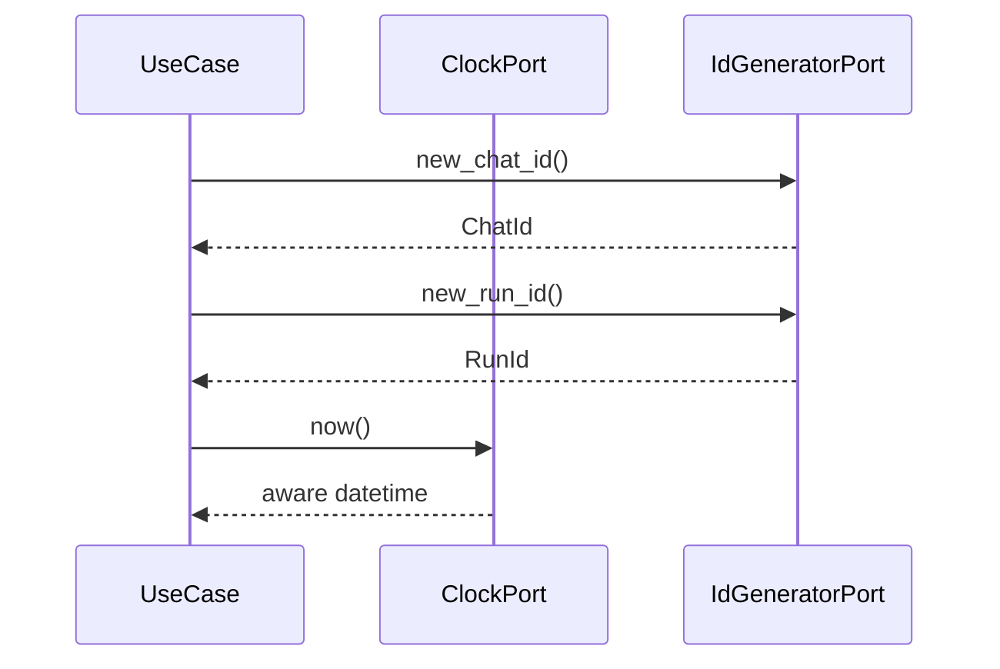

# Runtime Provider IF

## 1. 文書の目的

本書は、`application`、`domain` と `infrastructure/runtime` の間で利用する内部IFの契約を定義することを目的とする。

## 2. 前提

- 呼出方式: application ports経由のメソッド呼出。
- 呼出主体: ID採番、タイムスタンプ付与、状態更新、テスト用固定値を必要とするユースケース。
- 本番実装は `infrastructure/runtime` に置き、抽象IFは `application/ports` に置く。

## 3. IF概要

| 項目 | 内容 |
| --- | --- |
| IF名 | Runtime Provider IF |
| 呼出元 | `application`、必要に応じてdomain service |
| 呼出先 | `SystemClock`、`UuidGenerator` |
| 目的 | 現在時刻とID発番を副作用として隔離し、実装とテスト支援を差し替え可能にする。 |
| 冪等性 | 現在時刻取得とID発番は非冪等。固定実装はテスト時のみ決定的に振る舞う。 |

## 4. 呼出シーケンス

## 5. 事前条件 / 事後条件 / 不変条件

### 5.1. 事前条件

- DIでClockとID Generatorの実装が注入済みである。
- 生成するID種別が呼出元の用途に一致している。

### 5.2. 事後条件

- ID発番は対象種別の値オブジェクトとして返る。
- 現在時刻はタイムゾーン付き日時として返る。

### 5.3. 不変条件

- application層は `datetime.now()` やUUID生成ライブラリを直接呼び出さない。
- DB主キー、SSE payload、traceログで同一ID値を使い回す。
- 時刻は内部でUTCまたは設定済み基準に統一し、画面表示用形式へ混在させない。

## 6. 入出力とデータ項目

### 6.1. 入力

| 項目 | 内容 |
| --- | --- |
| `id_kind` | チャット、run、参照元、成果物、traceなどのID種別 |
| `timezone` | 必要に応じた時刻基準 |

### 6.2. 出力

| 項目 | 内容 |
| --- | --- |
| `ChatId`、`RunId`、`ReferenceId`、`ArtifactId`、`TraceId` | 種別ごとのID値 |
| `now` | タイムゾーン付き現在日時 |

## 7. 例外処理

| 条件 | 扱い |
| --- | --- |
| ID生成失敗 | システムエラー分類として上位へ返す |
| タイムゾーン設定不備 | 設定不備分類として起動時またはDI時に失敗させる |

## 8. 留意事項

- テスト用固定時刻と固定IDは `src/backend/tests/support/` に置き、本番コードへ混入させない。
