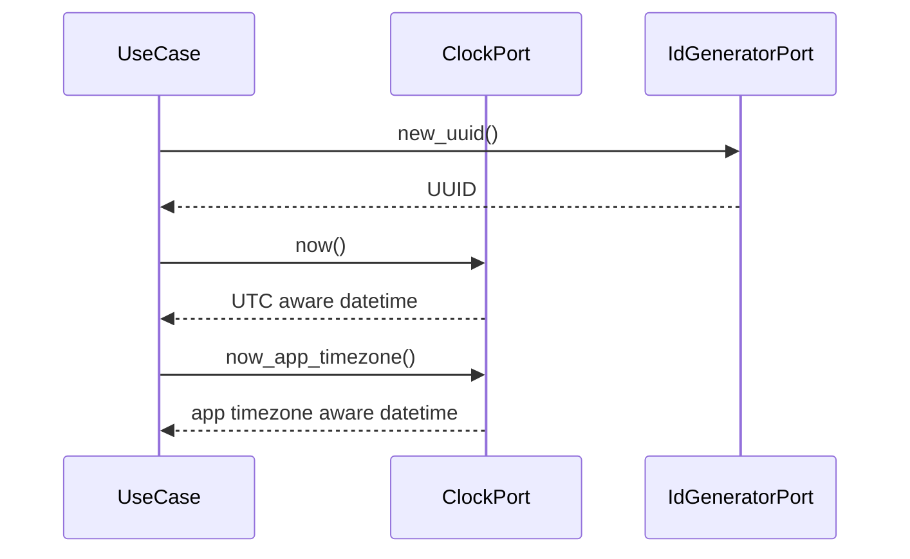

# Runtime Provider IF

## 1. 文書の目的

本書は、`application` と `infrastructure/runtime` の間で、`application/ports/runtime/interface.py` を通じて利用する現在時刻取得とID発番の内部IF契約を定義することを目的とする。

## 2. 前提

- 呼出方式: application ports経由のメソッド呼出。
- 呼出主体: ID採番、タイムスタンプ付与、状態更新、テスト用固定値を必要とするユースケース。
- 本番実装は `infrastructure/runtime` に置き、抽象IFは `application/ports/runtime/interface.py` に置く。

## 3. IF概要

| 項目 | 内容 |
| --- | --- |
| IF名 | Runtime Provider IF |
| 呼出元 | `application` |
| 呼出先 | `src/backend/application/ports/runtime/interface.py`。具象実装は `SystemClock`、`UuidGenerator` |
| 目的 | 現在時刻とID発番を副作用として隔離し、実装とテスト支援を差し替え可能にする。 |
| 冪等性 | 現在時刻取得とID発番は非冪等。固定実装はテスト時のみ決定的に振る舞う。 |

### 3.1. Port構成

| Port | 役割 |
| --- | --- |
| `ClockPort` | UTC現在日時とアプリ共通タイムゾーン現在日時を提供する。 |
| `IdGeneratorPort` | UUIDを新規発番する。 |
| `UuidGeneratorPort` | UUID発番IFの用途を明示する派生Protocol。 |

## 4. 呼出シーケンス

## 5. 事前条件 / 事後条件 / 不変条件

### 5.1. 事前条件

- DIでClockとID Generatorの実装が注入済みである。
- 呼出元は受け取ったUUIDを用途に応じたID値として扱う。

### 5.2. 事後条件

- ID発番はUUIDとして返る。
- `login_sessions.id` のようなDB内部連番IDはDB側のIDENTITYで発番し、本IFでは発番しない。
- 内部処理向け現在時刻はUTCのタイムゾーン付き日時として返る。
- 運用者向け日時が必要な場合はアプリ共通タイムゾーンのタイムゾーン付き日時として返る。

### 5.3. 不変条件

- application層は `datetime.now()` やUUID生成ライブラリを直接呼び出さない。
- DB主キー、SSE payload、traceログで用途の異なるID値を使い回さない。
- DB保存、実行deadline、タイムアウト計算はUTC基準に統一する。
- トレースログなど運用者向け日時は `app.timezone` のアプリ共通タイムゾーン基準で扱う。

## 6. 入出力とデータ項目

### 6.1. 入力

| 項目 | 内容 |
| --- | --- |
| `app.timezone` | 運用者向け日時に使用するIANA timezone名 |

### 6.2. 出力

| 項目 | 内容 |
| --- | --- |
| `UUID` | 呼出元がチャット、run、参照元、成果物、traceなどのIDへ割り当てるUUID |
| `now`、`now_utc` | UTCのタイムゾーン付き現在日時 |
| `now_app_timezone` | アプリ共通タイムゾーンのタイムゾーン付き現在日時 |

## 7. 例外処理

| 条件 | 扱い |
| --- | --- |
| ID生成失敗 | システムエラー分類として上位へ返す |
| タイムゾーン設定不備 | 設定不備分類として起動時またはDI時に失敗させる |

## 8. 留意事項

- テスト用固定時刻と固定IDは `src/backend/tests/support/` に置き、本番コードへ混入させない。
