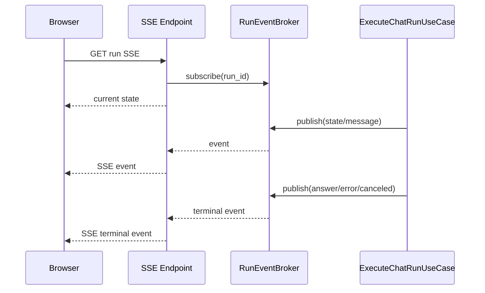

# SSEイベント配信IF

## 1. 文書の目的

本書は、`application/execution` と `presentation/sse` の間で利用する内部IFの契約を定義することを目的とする。

## 2. 前提

- 呼出方式: run ID単位のイベントpublish/subscribe。
- 呼出主体: 発行は実行ユースケース、購読はSSEエンドポイント。
- 外部へ送信するSSEイベント名とpayload形状は外部IF設計に従う。
- application内部のイベント種別は通常Enumの `RunEventType` として扱い、SSE送信時だけ `state`、`message`、`answer`、`error`、`canceled` の文字列へ変換する。
- SSE payloadは `presentation/sse/payload.py` のTypedDictで定義し、REST API用Pydanticスキーマとは分離する。
- SSE送信直前に、TypedDictで表したpayloadをJSON文字列へ直列化し、`event: ...` / `data: ...` のSSE wire形式へ変換する。
- 購読側はイベントキューを非ブロッキングで確認し、イベント未到着中も接続切断を検知できる。

## 3. IF概要

| 項目 | 内容 |
| --- | --- |
| IF名 | SSEイベント配信IF |
| 呼出元 | `ExecuteChatRunUseCase`、`CancelChatRunUseCase`、`SubscribeRunEventsUseCase` |
| 呼出先 | `presentation/sse` のイベントブローカー |
| 目的 | 非同期実行中の状態変化をSSE接続へ安全に配信する。 |
| 冪等性 | 同一イベントの重複publishは許容しない。購読開始時の現在状態通知は接続ごとに1回行う。 |

## 4. 呼出シーケンス

## 5. 事前条件 / 事後条件 / 不変条件

### 5.1. 事前条件

- 購読対象のチャットIDとrun IDが存在する。
- 実行ユースケースはpublish時にrun ID、状態、payloadを保持している。
- SSE接続はtrace_idを生成または受け渡せる。

### 5.2. 事後条件

- 購読開始時に現在状態が送信される。
- 購読開始時に保存済み中間メッセージがある場合、現在状態の直後に発生順で送信される。
- 中間メッセージは発生順に送信される。
- 実行ユースケースが生成・検証の節目で発行するシステム固定メッセージも、Codex由来の中間メッセージと同じ `message` イベントとして送信される。
- 終端イベント送信後、購読は解除される。
- ブラウザ切断時は次のpublishを待たずに購読が解除される。

### 5.3. 不変条件

- 1つのrunに対して終端イベントは1種類だけ送信する。
- `answer`、`error`、`canceled` は終端イベントとして扱う。
- 購読解除後の接続へイベントを送信しない。

## 6. 入出力とデータ項目

### 6.1. 入力

| 項目 | 内容 |
| --- | --- |
| `chat_id` | SSE購読対象チャットID |
| `run_id` | SSE購読またはpublish対象run ID |
| `event_name` | 内部では `RunEventType`。SSE送信時は `state`、`message`、`answer`、`error`、`canceled` |
| `payload` | イベント名に対応する送信データ |
| `trace_id` | 接続と実行を関連付けるID |
| `subscription.poll_event()` | イベントが未到着か、終端済みか、送信対象イベントがあるかを非ブロッキングで返す |

### 6.2. 出力

| 項目 | 内容 |
| --- | --- |
| `SseEvent` | ブラウザへ送信するイベント名とJSON payload |
| `subscription` | 購読解除可能な接続ハンドル |

### 6.3. SSE payload定義

| payload | 内容 |
| --- | --- |
| `StateEventPayload` | `state` イベントで送信するrun IDと状態文字列 |
| `MessageEventPayload` | `message` イベントで送信するrun IDと中間メッセージ本文 |
| `AnswerEventPayload` | `answer` イベントで送信するrun ID、完了状態、回答ブロック配列 |
| `EndEventPayload` | `error` と `canceled` イベントで送信するrun ID、終端状態、利用者向けメッセージ |
| `SsePayload` | 上記payloadのUnion型 |

### 6.4. システム固定中間メッセージ

| 本文 | 発行条件 |
| --- | --- |
| `作業を開始します。` | 初回の生成用Codex実行コンテナを起動する前。 |
| `作業が完了しました。` | 生成用Codex実行コンテナが最終回答候補を返した後。 |
| `回答の検証を開始します。` | 回答候補の検証を開始する前。 |
| `回答の検証を完了しました。` | 回答候補の検証結果が合格になった後。 |
| `回答を修正します。` | 検証結果が不合格で、次の生成用Codex実行コンテナを起動する前。 |

## 7. 例外処理

| 条件 | 扱い |
| --- | --- |
| 対象runが存在しない | HTTP 404へ変換可能な `AppError` を返す |
| 接続切断 | 購読を解除し、実行処理自体は継続する |
| publish時に購読者がいない | DB上のrun状態と履歴を正とし、エラーにはしない |
| 終端イベント後のpublish | traceログへ警告を出し、送信しない |

## 8. 留意事項

- SSEは永続化の代替ではない。再表示時はRepositoryからチャット詳細を取得する。
