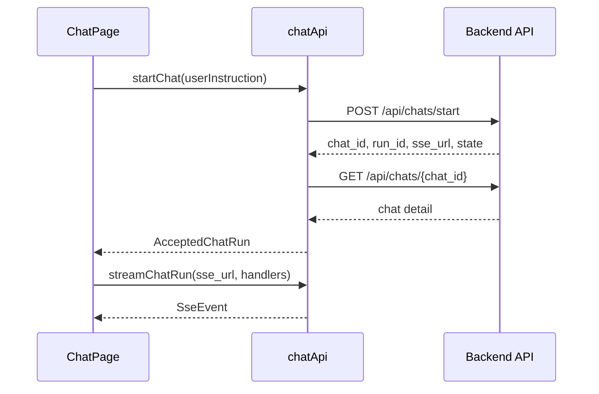

# チャットAPIクライアントIF

## 1. 文書の目的

本書は、`ChatPage` と `chatApi` の間で利用する内部IFの契約を定義することを目的とする。

## 2. 前提

- 呼出方式: TypeScript関数呼出と非同期Promise。
- 呼出主体: `ChatPage`。
- 本IFは画面内部の契約であり、画面バックエンドAPI仕様の再掲ではない。
- フロントエンド単体確認時も、Vite middlewareが `/api/...` を応答するだけで、本IFの呼出先パスは変更しない。

## 3. IF概要

| 項目 | 内容 |
| --- | --- |
| IF名 | チャットAPIクライアントIF |
| 呼出元 | `src/frontend/src/pages/chat/ChatPage.tsx` |
| 呼出先 | `src/frontend/src/features/chat/api/chatApi.ts` |
| 目的 | 画面状態管理からREST/SSE通信、応答変換、EventSource制御を分離する。 |
| 冪等性 | 取得系は同一入力で同一時点のサーバ状態を返す。開始、継続、キャンセルは非冪等として扱う。 |

## 4. 呼出シーケンス

## 5. 事前条件 / 事後条件 / 不変条件

### 5.1. 事前条件

- 送信系はtrim済み指示本文が空でない状態で呼び出す。
- 継続、詳細取得、キャンセルは対象チャットIDが空でない状態で呼び出す。
- SSE購読は受付応答に含まれるSSE URLを使用する。

### 5.2. 事後条件

- 取得系は画面モデルへ変換済みの値を返す。
- 開始、継続は受付応答と最新チャット詳細を合わせて返す。
- SSE購読は終端イベント、旧ストリーム化、または接続異常で終了する。

### 5.3. 不変条件

- UIコンポーネントは `src/frontend/backend_mock/` を直接参照しない。
- API応答のsnake_caseは、本IF内でcamelCase画面モデルへ変換する。
- 旧ストリーム判定がfalseになった後は、呼出元イベントハンドラを呼ばない。
- モック利用時も `src/frontend/backend_mock/` への依存はVite middleware側に閉じ、本IFは常に `/api/...` を通信境界とする。

## 6. 入出力とデータ項目

### 6.1. 入力

| 項目 | 内容 |
| --- | --- |
| `userInstruction` | 新規または継続のユーザ指示本文 |
| `chatId` | 継続、詳細取得、キャンセル対象のチャットID |
| `runId` | キャンセル対象のチャット実行処理ID |
| `sseUrl` | 受付応答で返却されたSSE購読URL |
| `isCurrent` | 購読中ストリームが現在も有効かを判定する関数 |
| `onEvent` | SSEイベントを画面状態へ反映する関数 |

### 6.2. 出力

| 項目 | 内容 |
| --- | --- |
| `AppConfigResponse` | 歓迎メッセージと入力候補 |
| `ChatHistoryItem[]` | 履歴一覧の画面モデル |
| `ChatSession` | チャット詳細の画面モデル |
| `AcceptedChatRun` | 受付応答と受付後チャット詳細 |
| `CancelChatRunResponse` | キャンセル受付状態と利用者向けメッセージ |
| `SseEvent` | 状態、中間メッセージ、回答、エラー、キャンセルイベント |

## 7. 例外処理

| 条件 | 扱い |
| --- | --- |
| REST応答が2xx以外 | Errorをthrowし、呼出元画面で必要に応じて状態を戻す |
| SSE接続が終端イベント前に切断 | Errorをthrowし、呼出元でエラー表示または再読込判断を行う |
| SSEイベントJSONが不正 | Errorをthrowし、EventSourceを閉じる |
| 旧ストリーム化 | 正常終了としてEventSourceを閉じ、画面状態を更新しない |

## 8. 留意事項

- バックエンド実装後も、フロントエンド単体確認用モックは `/api/...` 境界の内側でのみ差し替える。
