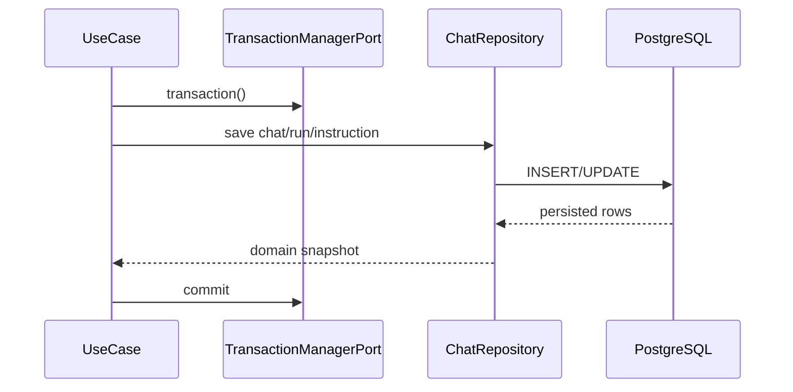

# チャットRepository IF

## 1. 文書の目的

本書は、`application` と `infrastructure/database/repositories` の間で、`application/ports/database/interface.py` を通じて利用する内部IFの契約を定義することを目的とする。

## 2. 前提

- 呼出方式: PythonのProtocol相当の同期または非同期メソッド呼出。
- 呼出主体: チャット、履歴、実行、検証、成果物、参照元の各ユースケース。
- Repository抽象とDTOは `src/backend/application/ports/database/` に置く。
- 実装はSQLAlchemyを用いるが、application層はSQLAlchemyモデルやSQLAlchemy Sessionを直接扱わない。
- DBトランザクション境界は `TransactionManagerPort` で表し、Repositoryは現在のトランザクションSessionを使ってDB操作を行う。
- application層へ返す実行状態と参照元種別は通常Enumとして扱い、DBカラムでは物理データ設計どおり文字列として保存する。

## 3. IF概要

| 項目 | 内容 |
| --- | --- |
| IF名 | チャットRepository IF |
| 呼出元 | `src/backend/application/*` |
| 呼出先 | `src/backend/application/ports/database/interface.py`。具象実装は `src/backend/infrastructure/database/repositories/SqlAlchemyChatRepository` |
| 目的 | DB永続化と問い合わせをapplication層から抽象化し、状態条件付き更新を一貫させる。 |
| 冪等性 | 参照系は冪等。作成、状態更新、回答保存、成果物保存は非冪等。 |

### 3.1. Port構成

| Port | 役割 |
| --- | --- |
| `TransactionManagerPort` | ユースケース単位または短いDB操作単位のトランザクション境界を提供する。 |
| `StartChatRepositoryPort` | 新規チャット、初回run、初回指示を保存する。 |
| `AppendChatRunRepositoryPort` | 既存チャットへ継続runと指示を追加する。 |
| `AcceptedRunStateRepositoryPort` | dispatcher登録失敗時など、受付済みrunの状態を更新する。 |
| `RecoveryRepositoryPort` | 起動時回復対象runの取得と状態整合を行う。 |
| `ChatExecutionRepositoryPort` | チャット実行中の指示取得、状態取得/更新、中間メッセージ追加、回答保存を行う。 |
| `CancelChatRunRepositoryPort` | キャンセル要求時の状態取得、キャンセル状態更新、条件付き状態更新を行う。 |
| `ChatRuntimeRepositoryPort` | 生成用/検証用Codex側resume用IDと実行時コンテキストを扱う。 |
| `ChatReadRepositoryPort` | 履歴一覧、履歴詳細、参照元、成果物メタ情報を取得する。 |
| `ChatRepositoryPort` | 上記Repository Protocolを束ねる集約Protocol。 |

## 4. 呼出シーケンス

## 5. 事前条件 / 事後条件 / 不変条件

### 5.1. 事前条件

- 呼出元はtrace_idとローカル利用者IDを保持している。
- 更新系は対象ID、期待状態、更新後状態を明確にして呼び出す。
- DBトランザクション境界はユースケース単位または短いDB操作単位で決める。

### 5.2. 事後条件

- 作成系は採番済みIDを含む永続化結果を返す。
- 状態条件付き更新は、期待状態と一致する場合だけ更新済みとして返す。
- 生成用/検証用Codex側resume用IDの保存は、対象チャットが存在する場合だけ成立する。
- 参照系は表示に必要な関連データを欠落なく返す。
- チャット詳細取得では、runを開始日時とIDの安定順、中間メッセージを作成日時とIDの安定順で返す。
- 回答ブロックと参照元はDB上に表示順を持ち、履歴再表示ではその順序で返す。
- Codex成果物メタ情報はDB上の表示順を持たず、回答ブロック本文内の参照位置に従う。

### 5.3. 不変条件

- RepositoryはHTTP応答スキーマを返さない。
- Repositoryはcodex exec、ファイル、SSE、トレースログを直接呼び出さない。
- 更新系Repositoryは有効なトランザクション内でのみ呼び出す。
- 途中失敗時に一部だけcommitしない。
- 同一チャットに未完了runを複数保存しない。Repositoryの事前確認に加え、DBの部分UNIQUE制約違反も競合として扱う。
- `session_id` はD-Conciergeの作業領域IDとして扱い、Codex側resume用IDと混同しない。

## 6. 入出力とデータ項目

### 6.1. 入力

| 項目 | 内容 |
| --- | --- |
| `local_user_id` | 共有利用するローカル利用者ID |
| `chat_id` | チャットID |
| `run_id` | チャット実行処理ID |
| `user_instruction` | 利用者指示本文 |
| `expected_state` | 状態条件付き更新で要求する現在状態 |
| `next_state` | 更新後状態 |
| `execution_deadline_at` | `実行中` 遷移時に保存する実行全体deadline |
| `answer` | 採用済み回答ブロック、ブロックごとの参照元、Codex成果物メタ情報 |
| `artifacts` | 保存済み成果物のメタ情報 |
| `generation_conversation_id` | 生成用Codex側のresume用ID |
| `validation_conversation_id` | 検証用Codex側のresume用ID |

### 6.2. 出力

| 項目 | 内容 |
| --- | --- |
| `AcceptedRun` | 受付済みrunのチャットID、run ID、状態、trace_id |
| `UnfinishedRun` | 起動時回復対象runのチャットID、run ID、状態、trace_id |
| `ChatRuntimeContext` | 実行に必要なチャットID、run ID、指示、resume用ID、作業領域ID |
| `HistoryItem` | 履歴一覧に表示するチャット概要 |
| `ChatDetail` | 履歴再表示に必要なチャット詳細 |
| `AnswerData` | 採用済み回答ブロック、表示用参照元、成果物メタ情報 |
| `DisplayReferenceData` | 画面表示と参照元取得に使う参照元DTO |
| `ArtifactData` | 画面表示と成果物取得に使う成果物DTO |
| `updated` | 状態条件付き更新が成立したか |
| `not_found` | 対象IDが存在しないことを示す結果または例外 |

### 6.3. 公開メソッド

| メソッド | 役割 | 主な入力 | 主な出力 |
| --- | --- | --- | --- |
| `transaction` | DBトランザクション境界を開始する | なし | コンテキストマネージャ |
| `create_chat_with_first_run` | 新規チャット、初回run、初回指示を同一トランザクションで保存する | チャットID、run ID、trace_id、ユーザ指示、受付日時 | `AcceptedRun` |
| `append_run` | 既存チャットへrunと指示を追加する | チャットID、run ID、trace_id、ユーザ指示、受付日時 | `AcceptedRun` |
| `list_unfinished_runs_for_recovery` | 起動時回復対象の未完了runを取得する | なし | `UnfinishedRun` 一覧 |
| `get_run_instruction` | 実行対象runのユーザ指示を取得する | run ID | ユーザ指示本文 |
| `get_run_state` | run状態を取得する | run ID | `RunState` |
| `set_run_state` | run状態を無条件に更新する | run ID、更新後状態、利用者向けメッセージ | なし |
| `update_run_state_if_current` | 状態条件付き更新を行う | run ID、期待状態、更新後状態、利用者向けメッセージ、任意の `execution_deadline_at` | 更新成否 |
| `add_intermediate_message` | 中間メッセージを追加する | run ID、メッセージ本文、作成日時 | なし |
| `save_completed_answer` | 検証済み回答と関連データを保存する | 回答ブロック、ブロックごとの参照元、Codex成果物メタ情報 | 保存結果 |
| `cancel_run` | キャンセル要求を保存する | run ID、更新日時 | 更新成否 |
| `get_chat_runtime_context` | 実行・検証に必要なコンテキストを取得する | chat ID、run ID | `ChatRuntimeContext` |
| `save_generation_conversation_id` | 生成用Codex側resume用IDを保存する | チャットID、生成用Codex側resume用ID | 更新成否 |
| `save_validation_conversation_id` | 検証用Codex側resume用IDを保存する | チャットID、検証用Codex側resume用ID | 更新成否 |
| `list_histories` | 履歴一覧を取得する | ローカル利用者ID | `HistoryItem` 一覧 |
| `get_chat_detail` | 履歴詳細を取得する | チャットID | `ChatDetail` |
| `get_reference` | 参照元IDから参照元メタ情報を取得する | 参照元ID | `DisplayReferenceData` |
| `get_artifact` | 成果物IDから成果物メタ情報を取得する | 成果物ID | `ArtifactData` |

## 7. 例外処理

| 条件 | 扱い |
| --- | --- |
| 対象チャットまたはrunが存在しない | `AppError` の対象なし分類へ変換できる例外を返す |
| 状態条件付き更新が不成立 | 例外ではなく不成立結果を返し、呼出元がキャンセル済み等の扱いを判断する |
| 未完了run一意制約違反 | トランザクションをrollbackし、競合分類の `AppError` へ変換する |
| その他のDB制約違反 | トランザクションをrollbackし、`ErrorType.SYSTEM` かつ `trace=True` の `AppError` へ変換する |
| DB接続失敗 | rollbackし、`ErrorType.SYSTEM` かつ `trace=True` の `AppError` として上位へ返す |
| DB上の状態値または参照元種別が未定義 | `ErrorType.SYSTEM` かつ `trace=True` の `AppError` へ変換する |

## 8. 留意事項

- 物理テーブルや索引は `docs/03_内部設計/05_データ設計/物理データ設計.md` を正とする。
