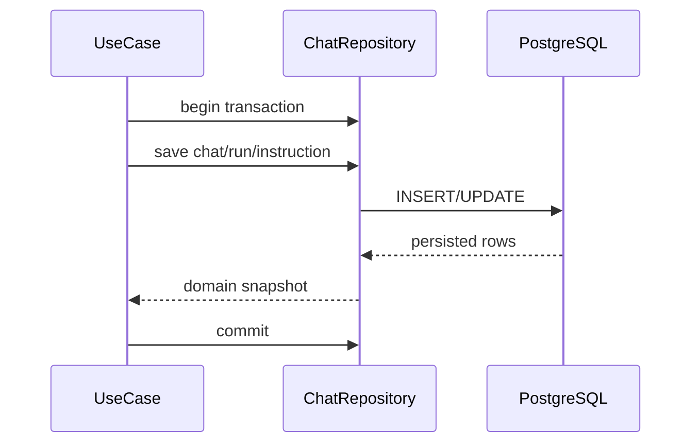

# チャットRepository IF

## 1. 文書の目的

本書は、`application` と `infrastructure/database/repositories` の間で利用する内部IFの契約を定義することを目的とする。

## 2. 前提

- 呼出方式: PythonのProtocol相当の同期または非同期メソッド呼出。
- 呼出主体: チャット、履歴、実行、検証、成果物、参照元の各ユースケース。
- 実装はSQLAlchemyを用いるが、application層はSQLAlchemyモデルを直接扱わない。

## 3. IF概要

| 項目 | 内容 |
| --- | --- |
| IF名 | チャットRepository IF |
| 呼出元 | `src/backend/application/*` |
| 呼出先 | `src/backend/infrastructure/database/repositories/SqlAlchemyChatRepository` |
| 目的 | DB永続化と問い合わせをapplication層から抽象化し、状態条件付き更新を一貫させる。 |
| 冪等性 | 参照系は冪等。作成、状態更新、回答保存、成果物保存は非冪等。 |

## 4. 呼出シーケンス

## 5. 事前条件 / 事後条件 / 不変条件

### 5.1. 事前条件

- 呼出元はtrace_idとローカル利用者IDを保持している。
- 更新系は対象ID、期待状態、更新後状態を明確にして呼び出す。
- DBトランザクション境界はユースケース単位で決める。

### 5.2. 事後条件

- 作成系は採番済みIDを含む永続化結果を返す。
- 状態条件付き更新は、期待状態と一致する場合だけ更新済みとして返す。
- 参照系は表示に必要な関連データを欠落なく返す。

### 5.3. 不変条件

- RepositoryはHTTP応答スキーマを返さない。
- Repositoryはcodex exec、ファイル、SSE、トレースログを直接呼び出さない。
- 途中失敗時に一部だけcommitしない。

## 6. 入出力とデータ項目

### 6.1. 入力

| 項目 | 内容 |
| --- | --- |
| `local_user_id` | 共有利用するローカル利用者ID |
| `chat_id` | チャットID |
| `run_id` | チャット実行処理ID |
| `user_instruction` | 利用者指示本文 |
| `expected_state` | 状態条件付き更新で要求する現在状態 |
| `next_state` | 更新後状態 |
| `answer` | 採用済み回答本文と参照元 |
| `artifact_metadata` | 保存済み成果物のメタ情報 |

### 6.2. 出力

| 項目 | 内容 |
| --- | --- |
| `Chat` | チャットの永続化スナップショット |
| `ChatRun` | 実行処理の永続化スナップショット |
| `ChatSession`相当 | 履歴再表示に必要なチャット詳細 |
| `updated` | 状態条件付き更新が成立したか |
| `not_found` | 対象IDが存在しないことを示す結果または例外 |

## 7. 例外処理

| 条件 | 扱い |
| --- | --- |
| 対象チャットまたはrunが存在しない | `AppError` の対象なし分類へ変換できる例外を返す |
| 状態条件付き更新が不成立 | 例外ではなく不成立結果を返し、呼出元がキャンセル済み等の扱いを判断する |
| DB制約違反 | トランザクションをrollbackし、データ不整合分類の `AppError` へ変換する |
| DB接続失敗 | rollbackし、システムエラー分類として上位へ返す |

## 8. 留意事項

- 物理テーブルや索引は `docs/03_内部設計/05_データ設計/物理データ設計.md` を正とする。
